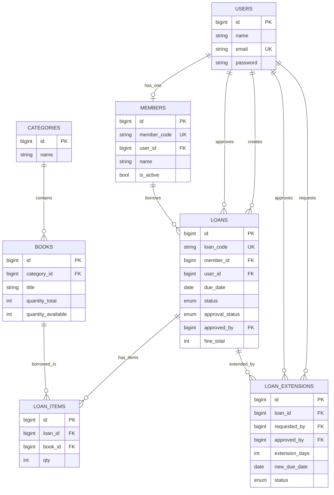
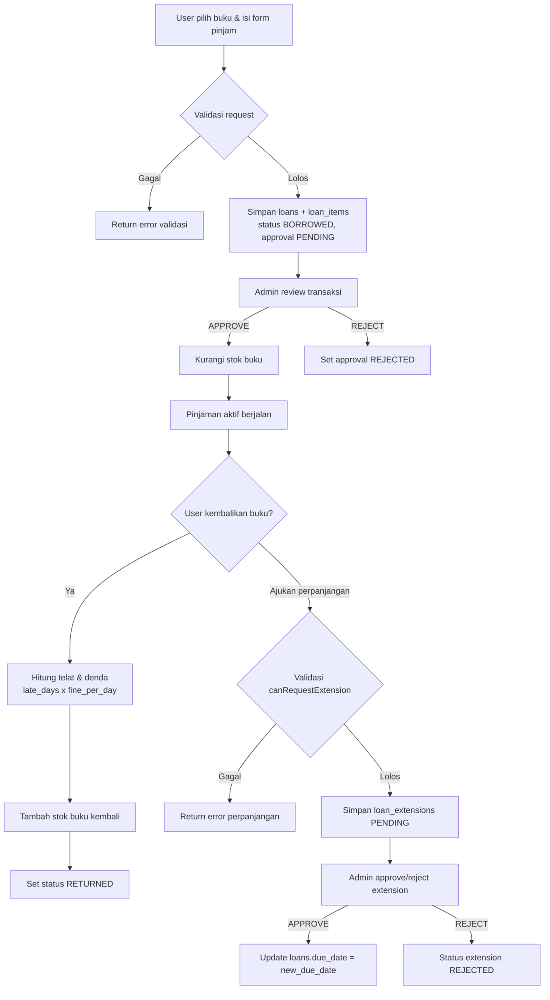

# Sistem Informasi Perpustakaan (Laravel)

Dokumentasi ini menjelaskan **alur sistem**, **desain database**, **model**, **controller**, **library yang digunakan**, dan **fitur utama** pada project `perpus`.

---

## 1. Gambaran Umum

Aplikasi ini adalah sistem perpustakaan berbasis Laravel dengan 2 peran utama:

-   **Admin**: mengelola master data, persetujuan peminjaman/perpanjangan, laporan PDF, serta konfigurasi aplikasi.
-   **User (anggota)**: registrasi/login, melihat katalog, meminjam buku, mengembalikan buku, dan mengajukan perpanjangan.

Konsep utama sistem peminjaman:

1. User membuat transaksi peminjaman.
2. Status approval awal: `PENDING`.
3. Admin `APPROVE` atau `REJECT`.
4. Stok buku **hanya dikurangi saat APPROVE**.
5. Saat pengembalian, stok dikembalikan dan denda dihitung jika terlambat.

---

## 2. Tech Stack & Library

### Backend

-   **Laravel Framework 12**
-   **PHP 8.2+**
-   **MySQL/MariaDB**

### Library Composer (Utama)

-   `spatie/laravel-permission`

    -   Manajemen Role & Permission (RBAC).
    -   Digunakan pada middleware seperti `permission:books.index`, `permission:users.edit`, dll.

-   `yajra/laravel-datatables-oracle`

    -   Server-side DataTables (JSON response untuk tabel interaktif).
    -   Dipakai pada modul Users, Roles, Permissions, Categories, Books, Members, Loans.

-   `maatwebsite/excel`

    -   Export template import buku.
    -   Import data buku dari file Excel (`xlsx/xls`) dengan validasi header dan validasi per-baris.

-   `barryvdh/laravel-dompdf`

    -   Export laporan transaksi peminjaman dalam format PDF.

-   `laravel/ui`

    -   Dukungan scaffolding UI/auth berbasis Bootstrap pada ekosistem Laravel.

-   `laravel/tinker`
    -   Tool debugging/interaksi data dari CLI.

### Frontend Build Tools

-   `vite` + `laravel-vite-plugin`
-   `bootstrap` + `@popperjs/core`
-   `tailwindcss`, `postcss`, `autoprefixer`, `sass`
-   `axios`

### Library Dev

-   `phpunit/phpunit` (testing)
-   `laravel/pint` (formatter)
-   `fruitcake/laravel-debugbar` (debug lokal)

---

## 3. Arsitektur Singkat

Pola yang dipakai mengikuti MVC Laravel:

-   **Model (`app/Models`)**

    -   Menangani representasi tabel, relasi, fillable, cast, dan helper domain tertentu (misal generate kode).

-   **Controller (`app/Http/Controllers`)**

    -   Menangani alur request, validasi, authorization role/permission, transaksi database, dan response view/JSON.

-   **Migration (`database/migrations`)**
    -   Mendefinisikan skema tabel, foreign key, enum status, unique key, default value.

---

## 4. Desain Database (Tabel & Relasi)

## 4.1 Entitas Inti

### `users`

-   Data akun login.
-   Kolom utama: `name`, `email (unique)`, `password`.

### `members`

-   Profil anggota perpustakaan.
-   Relasi 1:1 ke `users` melalui `user_id`.
-   Kolom penting:
    -   `member_code (unique)`
    -   `class`, `type` (`student|teacher`), `phone`, `address`
    -   `is_active` (default `true`)

### `categories`

-   Master kategori buku (`name`).

### `books`

-   Data buku dan stok.
-   FK: `category_id -> categories.id`.
-   Kolom penting:
    -   bibliografi: `isbn`, `title`, `author`, `publisher`, `year`
    -   lokasi: `rack_location`
    -   stok: `quantity_total`, `quantity_available`
    -   media: `cover_path`

### `loans`

-   Header transaksi peminjaman.
-   FK:
    -   `member_id -> members.id`
    -   `user_id -> users.id` (pemilik transaksi)
    -   `approved_by -> users.id` (admin approver, nullable)
-   Kolom penting:
    -   `loan_code (unique)`
    -   tanggal: `loaned_at`, `due_date`, `returned_at`
    -   status transaksi: `status` (`BORROWED|RETURNED`)
    -   status persetujuan: `approval_status` (`PENDING|APPROVED|REJECTED`)
    -   `approved_at`, `approval_note`, `fine_total`

### `loan_items`

-   Detail item buku dalam satu transaksi peminjaman.
-   FK:
    -   `loan_id -> loans.id`
    -   `book_id -> books.id`
-   Kolom: `qty`.

### `loan_extensions`

-   Request perpanjangan masa pinjam.
-   FK:
    -   `loan_id -> loans.id`
    -   `requested_by -> users.id`
    -   `approved_by -> users.id` (nullable)
-   Kolom penting:
    -   `extension_days`
    -   `new_due_date`
    -   `status` (`PENDING|APPROVED|REJECTED`)
    -   `reason`, `admin_note`, `approved_at`

### `setting_apps`

-   Konfigurasi aplikasi (single row setting).
-   Kolom:
    -   `name_app`, `short_cut_app`, `image`
    -   `fine_per_day` (default 1000)
    -   `extension_days` (default 7)

---

## 4.2 Tabel RBAC (Spatie Permission)

Library `spatie/laravel-permission` membuat tabel:

-   `permissions`
-   `roles`
-   `model_has_permissions`
-   `model_has_roles`
-   `role_has_permissions`

Seeder default membuat role:

-   `admin`
-   `user`

Admin mendapat seluruh permission, user mendapat permission terbatas sesuai kebutuhan modul user.

---

## 4.3 Ringkasan Relasi

-   `User` **hasOne** `Member`
-   `Member` **belongsTo** `User`
-   `Category` **hasMany** `Book`
-   `Book` **belongsTo** `Category`
-   `Member` **hasMany** `Loan`
-   `Loan` **belongsTo** `Member`
-   `Loan` **belongsTo** `User` (creator)
-   `Loan` **belongsTo** `User` (approvedBy via `approved_by`)
-   `Loan` **hasMany** `LoanItem`
-   `LoanItem` **belongsTo** `Loan`
-   `LoanItem` **belongsTo** `Book`
-   `Loan` **hasMany** `LoanExtension`
-   `LoanExtension` **belongsTo** `Loan`
-   `LoanExtension` **belongsTo** `User` (requestedBy)
-   `LoanExtension` **belongsTo** `User` (approvedBy)

## 4.4 Diagram ERD (Mermaid)



---

## 5. Desain Model (Ringkas per Model)

### `App\Models\User`

-   Extend `Authenticatable`.
-   Trait: `HasRoles` (Spatie), `HasFactory`, `Notifiable`.
-   Relasi: `member()`.

### `App\Models\Member`

-   Fillable profil anggota.
-   Relasi: `user()`, `loans()`.
-   Logic domain: `generateNextMemberCode()` menghasilkan format `MBR-0001`.

### `App\Models\Category`

-   Master kategori.
-   Relasi: `books()`.

### `App\Models\Book`

-   Fillable bibliografi + stok.
-   Relasi: `category()`, `loanItems()`.

### `App\Models\Loan`

-   Fillable transaksi + approval.
-   Cast date/datetime.
-   Relasi: `member()`, `user()`, `approvedBy()`, `loanItems()`, `extensions()`.
-   Logic domain: `generateLoanCode()` dengan format `LN-0001`.

### `App\Models\LoanItem`

-   Detail buku dalam transaksi.
-   Relasi: `loan()`, `book()`.

### `App\Models\LoanExtension`

-   Data request perpanjangan.
-   Relasi: `loan()`, `requestedBy()`, `approvedBy()`.
-   Logic domain: `canRequestExtension($loanId)` dengan aturan:
    -   pinjaman harus `BORROWED`
    -   masih dalam window keterlambatan maksimum
    -   maksimal 2 kali extension disetujui per transaksi

### `App\Models\SettingApp`

-   Menyimpan konfigurasi global (nama app, logo, denda/hari, default extension days).

> Catatan: `Transaction` model ada di repository namun belum menjadi bagian alur utama perpustakaan saat ini.

---

## 6. Desain Controller & Tanggung Jawab

### `AuthController`

-   Login (`authenticate`) dengan validasi email/password.
-   Register (`register`):
    -   buat `User`
    -   assign role `user`
    -   buat `Member`
    -   dibungkus `DB::transaction()`
-   Logout dan reset session.

### `HomeController`

-   Dashboard dinamis berdasar role:
    -   `admin`: statistik sistem (buku, member, pinjaman, denda, approval, stok menipis, dll)
    -   `user`: ringkasan pinjaman aktif dan histori pinjaman pribadi

### `PermissionsController`, `RoleController`, `UserController`

-   CRUD RBAC (permission, role, user).
-   Integrasi DataTables untuk listing.
-   `UserController` mengelola assign role user.

### `CategoryController`

-   CRUD kategori buku.
-   Proteksi middleware permission dan listing DataTables.

### `BookController`

-   CRUD buku + upload cover.
-   Katalog buku untuk role `user` (`catalog`).
-   Import buku via Excel (`import`) dengan:
    -   validasi tipe file
    -   validasi header template
    -   validasi setiap baris
    -   transaksi DB saat insert
-   Export template import (`downloadImportTemplate`).

### `MemberController`

-   Menampilkan data member (read-only di modul ini).

### `LoanController`

-   `index`: daftar pinjaman (admin semua, user milik sendiri).
-   `create/store`: user membuat pinjaman (status approval `PENDING`).
-   `approve/reject`: admin proses persetujuan.
-   `returnLoan`: proses pengembalian + hitung denda + restore stok.
-   `exportPdf`: export laporan PDF dengan filter status, approval, dan rentang tanggal.
-   `destroy`: hapus pinjaman `PENDING` (admin only).

### `LoanExtensionController`

-   User:
    -   list request sendiri (`index`)
    -   form request (`create`)
    -   submit request (`store`)
-   Admin:
    -   list request pending (`adminIndex`)
    -   approve/reject request
-   Saat approve extension: `due_date` pada `loans` diperbarui.

### `SettingAppController`

-   Manajemen pengaturan aplikasi (nama, shortcut, logo, denda/hari, default extension).
-   Aturan data tunggal (single setting row).

### `ErrorTestController`

-   Endpoint testing halaman error sesuai kode HTTP (khusus saat `APP_DEBUG=true`).

---

## 7. Alur Bisnis Utama

## 7.1 Alur Registrasi

1. User isi form register.
2. Sistem validasi input.
3. Sistem membuat akun `users`.
4. Sistem assign role `user`.
5. Sistem membuat data `members` otomatis.
6. User login otomatis dan diarahkan ke `/home`.

## 7.2 Alur Peminjaman Buku

1. User memilih buku (katalog) dan membuat transaksi.
2. Sistem validasi:
    - member aktif
    - maksimal 5 pinjaman aktif
    - tidak ada duplikasi judul dalam satu transaksi
    - stok tersedia
3. Sistem simpan `loans` (`approval_status=PENDING`) + `loan_items`.
4. Admin review:
    - **APPROVE**: stok buku dikurangi sesuai `qty`.
    - **REJECT**: tidak ada perubahan stok.

## 7.3 Alur Pengembalian Buku

1. Pengembalian hanya untuk pinjaman `APPROVED` dan `BORROWED`.
2. Sistem hitung keterlambatan terhadap `due_date`.
3. Denda dihitung: `late_days * fine_per_day`.
4. Stok buku dikembalikan (`quantity_available` bertambah).
5. Status pinjaman menjadi `RETURNED`.

## 7.4 Alur Perpanjangan Peminjaman

1. User ajukan extension pada pinjaman miliknya.
2. Sistem cek kelayakan via `LoanExtension::canRequestExtension()`.
3. Request disimpan `PENDING`.
4. Admin `APPROVE/REJECT`:
    - jika approve, `loans.due_date` diupdate ke `new_due_date`.

## 7.5 Alur Laporan PDF

1. Admin/user memanggil endpoint export PDF.
2. Filter opsional:
    - status transaksi (`BORROWED/RETURNED`)
    - status approval (`PENDING/APPROVED/REJECTED`)
    - rentang tanggal pinjam
3. Sistem generate PDF via DomPDF.

## 7.6 Diagram Alur Proses (Mermaid)



---

## 8. Fitur Aplikasi (Checklist)

-   [x] Autentikasi login/register/logout.
-   [x] Role & Permission berbasis Spatie.
-   [x] Dashboard admin dan dashboard user.
-   [x] CRUD Users, Roles, Permissions.
-   [x] CRUD Kategori buku.
-   [x] CRUD Buku + upload cover.
-   [x] Katalog buku untuk user.
-   [x] Import buku dari Excel + template import.
-   [x] Manajemen data member.
-   [x] Transaksi peminjaman multi-item.
-   [x] Approval pinjaman oleh admin.
-   [x] Pengembalian buku + perhitungan denda.
-   [x] Perpanjangan peminjaman + approval admin.
-   [x] Export laporan pinjaman ke PDF.
-   [x] Pengaturan aplikasi (logo, nama, denda/hari, default extension).

---

## 9. Route Utama

### Public

-   `/login`, `/register`

### Protected (`auth`)

-   `/home`
-   `/settings`
-   `/catalog`
-   Resource: `/users`, `/roles`, `/permissions`, `/categories`, `/books`
-   `/members`
-   `/loans` + action approve/reject/return/export pdf
-   `/loan-extensions` + admin endpoint approval

---

## 10. Seeder Default

Seeder yang dijalankan:

-   `PermissionTableSeeder`
-   `RoleTableSeeder`
-   `UserTableSeeder`

Default akun admin:

-   Email: `admin@gmail.com`
-   Password: `123456`

---

## 11. Instalasi & Menjalankan Project

## 11.1 Prasyarat

-   PHP 8.2+
-   Composer 2+
-   Node.js 18+
-   MySQL/MariaDB


# API Documentation - Import/Export Books

## 📚 Complete Reference Guide

---

## Endpoint 1: Download Import Template

### Request

```
GET /books/import/template
```

### cURL Example

```bash
curl -X GET "http://localhost:8000/books/import/template" \
  --output "template_import_buku.xlsx"
```

### PowerShell Example

```powershell
$url = "http://localhost:8000/books/import/template"
$outputFile = "C:\Downloads\template_import_buku.xlsx"
Invoke-WebRequest -Uri $url -OutFile $outputFile
```

### JavaScript/Fetch Example

```javascript
fetch("http://localhost:8000/books/import/template")
    .then((response) => response.blob())
    .then((blob) => {
        const url = window.URL.createObjectURL(blob);
        const a = document.createElement("a");
        a.href = url;
        a.download = "template_import_buku.xlsx";
        a.click();
    });
```

### Response

-   **Content-Type**: application/vnd.openxmlformats-officedocument.spreadsheetml.sheet
-   **Status Code**: 200 OK
-   **Body**: Binary Excel file (.xlsx)

### Sample Output (Baris 1-3):

```
category_id | isbn         | title           | author        | publisher     | year | rack_location | quantity_total | quantity_available
1           | 9786020324781| Laskar Pelangi  | Andrea Hirata | Bentang Pustaka| 2005 | A1-03         | 10             | 10
2           | 9786230001112| Belajar Laravel | John Developer| Informatika   | 2024 | T2-01         | 5              | 5
```

---

## Endpoint 2: Import Data Books

### Request

```
POST /books/import
Content-Type: multipart/form-data
```

### Form Data

| Field       | Type | Required | Notes                    |
| ----------- | ---- | -------- | ------------------------ |
| import_file | File | Yes      | .xlsx atau .xls, max 5MB |

### cURL Example

```bash
curl -X POST "http://localhost:8000/books/import" \
  -F "import_file=@/path/to/template_import_buku.xlsx" \
  -H "X-CSRF-TOKEN: your_csrf_token"
```

### JavaScript Fetch Example

```javascript
const formData = new FormData();
formData.append("import_file", fileInput.files[0]);

fetch("/books/import", {
    method: "POST",
    body: formData,
    headers: {
        "X-CSRF-TOKEN": document.querySelector('meta[name="csrf-token"]')
            .content,
    },
})
    .then((response) => response.json())
    .then((data) => console.log(data));
```

### jQuery AJAX Example

```javascript
$("#importForm").on("submit", function (e) {
    e.preventDefault();

    const formData = new FormData(this);

    $.ajax({
        url: "/books/import",
        type: "POST",
        data: formData,
        processData: false,
        contentType: false,
        success: function (response) {
            console.log("Success:", response);
            // Reload halaman atau tampilkan success message
        },
        error: function (response) {
            console.log("Error:", response);
            // Tampilkan error message
        },
    });
});
```

### Response Success (302 Redirect)

```
Location: /books
Set-Cookie: laravel_session=...
Message: 5 buku berhasil diimport.
```

### Response Error Examples

**Error 1: Invalid File Format**

```
HTTP 422 Unprocessable Entity

Error: "The import file must be a file of type: xlsx, xls"
```

**Error 2: Invalid Headers**

```
HTTP 302 Redirect
Location: /books
Message: "Format header file Excel tidak sesuai template default."
```

**Error 3: Validation Error on Rows**

```
HTTP 302 Redirect
Location: /books
Message: "Import dibatalkan karena ada data tidak valid. Perbaiki lalu upload ulang."

Details:
- Baris 3: category_id field is required
- Baris 5: quantity_available tidak boleh lebih besar dari quantity total
- Baris 7: isbn field must be a string
```

**Error 4: No Valid Data**

```
HTTP 302 Redirect
Location: /books
Message: "Tidak ada data yang bisa diimport."
```

---

## Data Validation Rules per Field

### category_id

```
Rules: required|integer|exists:categories,id

Error Messages:
- "The category_id field is required"
- "The category_id field must be an integer"
- "The selected category_id is invalid"

Valid Values: ID dari kategori yang ada di tabel categories
Invalid Values: 999 (jika tidak ada), "ABC" (bukan integer)
```

### isbn

```
Rules: nullable|string|max:50

Error Messages:
- "The isbn field must be a string"
- "The isbn field may not be greater than 50 characters"

Valid Values: "9786020324781", "" (kosong), null
Invalid Values: 9786020324781123456 (>50 char)
```

### title

```
Rules: required|string|max:255

Error Messages:
- "The title field is required"
- "The title field must be a string"
- "The title field may not be greater than 255 characters"

Valid Values: "Laskar Pelangi", "Buku dengan Judul Panjang"
Invalid Values: "" (kosong), 123 (bukan string)
```

### author

```
Rules: required|string|max:255

Error Messages:
- "The author field is required"
- "The author field must be a string"
- "The author field may not be greater than 255 characters"

Valid Values: "Andrea Hirata", "John Developer"
Invalid Values: "" (kosong)
```

### publisher

```
Rules: nullable|string|max:255

Error Messages:
- "The publisher field must be a string"
- "The publisher field may not be greater than 255 characters"

Valid Values: "Bentang Pustaka", "" (kosong), null
```

### year

```
Rules: nullable|integer|digits:4

Error Messages:
- "The year field must be an integer"
- "The year field must be exactly 4 characters"

Valid Values: 2005, 2024, 2025, "" (kosong), null
Invalid Values: "2024" (string), 24 (2 digit), 202 (3 digit)
```

### rack_location

```
Rules: nullable|string|max:100

Error Messages:
- "The rack_location field must be a string"
- "The rack_location field may not be greater than 100 characters"

Valid Values: "A1-03", "T2-01", "Rak A Baris 1", "" (kosong)
```

### quantity_total

```
Rules: required|integer|min:0

Error Messages:
- "The quantity_total field is required"
- "The quantity_total field must be an integer"
- "The quantity_total field must be at least 0"

Valid Values: 0, 1, 10, 100
Invalid Values: "" (kosong), -5 (negatif), "10" (string)
```

### quantity_available

```
Rules: required|integer|min:0|<=quantity_total

Error Messages:
- "The quantity_available field is required"
- "The quantity_available field must be an integer"
- "The quantity_available field must be at least 0"
- "quantity_available tidak boleh lebih besar dari quantity total"

Valid Values: 0, 5, 10 (jika total >= 10)
Invalid Values: -1 (negatif), 15 (jika total = 10)
```

---

## Example Import Data

### Valid Data

**Example 1 - Complete Data**

```
category_id: 1
isbn: 9786020324781
title: Laskar Pelangi
author: Andrea Hirata
publisher: Bentang Pustaka
year: 2005
rack_location: A1-03
quantity_total: 10
quantity_available: 8
```

**Example 2 - Minimal (Required Only)**

```
category_id: 1
isbn: (kosong)
title: Novel Indonesia
author: Nama Penulis
publisher: (kosong)
year: (kosong)
rack_location: (kosong)
quantity_total: 5
quantity_available: 3
```

**Example 3 - Multiple Books**

```
[
  {
    "category_id": 1,
    "isbn": "9786020324781",
    "title": "Laskar Pelangi",
    "author": "Andrea Hirata",
    "publisher": "Bentang",
    "year": 2005,
    "rack_location": "A1-03",
    "quantity_total": 10,
    "quantity_available": 8
  },
  {
    "category_id": 2,
    "isbn": "9786230001112",
    "title": "Laravel Programming",
    "author": "John Developer",
    "publisher": "Tech Publisher",
    "year": 2024,
    "rack_location": "T2-01",
    "quantity_total": 5,
    "quantity_available": 4
  }
]
```

---

## Excel Template Format

### Column Order (PENTING - JANGAN UBAH)

1. category_id
2. isbn
3. title
4. author
5. publisher
6. year
7. rack_location
8. quantity_total
9. quantity_available

### Excel Sample

```
Row 1 (Header):
category_id | isbn | title | author | publisher | year | rack_location | quantity_total | quantity_available

Row 2 (Data):
1 | 9786020324781 | Laskar Pelangi | Andrea Hirata | Bentang | 2005 | A1-03 | 10 | 8

Row 3 (Data):
2 | 9786230001112 | Laravel 11 | John Developer | Tech | 2024 | T2-01 | 5 | 4
```

---

## Success Response Flow

```
User Upload File
       ↓
[Validate file format]
  ├─ Valid → Continue
  └─ Invalid → Error: File must be .xlsx or .xls
       ↓
[Check header structure]
  ├─ Valid → Continue
  └─ Invalid → Error: Header format not matceed
       ↓
[Read Excel data]
       ↓
[Validate each row]
  ├─ Row valid → Add to payloads
  └─ Row invalid → Add to errors
       ↓
[Check payloads]
  ├─ Has valid data → Continue to step below
  ├─ No valid data → Error: No data to import
  └─ Has errors → Error: Invalid data in some rows
       ↓
[Database Transaction]
  ├─ Success → Commit
  └─ Failed → Rollback all
       ↓
[Redirect to /books]
  └─ Success: X buku berhasil diimport
```

---

## Error Flow

```
User Upload File
       ↓
File Format Error?
  ├─ YES → Redirect with error message
  └─ NO → Continue
       ↓
Header Mismatch?
  ├─ YES → Redirect with error message
  └─ NO → Continue
       ↓
Process All Rows
  ├─ All valid → Process insert
  ├─ All invalid → Redirect with error list
  └─ Mix valid/invalid → Reject all, redirect with error list
       ↓
Database Error?
  ├─ YES → Rollback transaction, error message
  └─ NO → Success message
```

---

## Performance Metrics

| File Size | Rows      | Estimated Time | Status         |
| --------- | --------- | -------------- | -------------- |
| < 1MB     | < 500     | < 1s           | ✅ Optimal     |
| 1-3MB     | 500-2000  | 1-3s           | ✅ Good        |
| 3-5MB     | 2000-5000 | 3-5s           | ⚠️ Acceptable  |
| > 5MB     | > 5000    | N/A            | ❌ Not Allowed |

---

## Database Transaction Details

```php
// Semua data diinsert dalam satu transaction
DB::transaction(function () use ($payloads) {
    foreach ($payloads as $payload) {
        Book::create($payload);
    }
});

// Jika ADA ERROR di tengah proses:
// - Semua data yang sudah diinsert akan di-ROLLBACK
// - Database state kembali seperti sebelum import
// - User mendapat error message

// Jika SEMUA BERHASIL:
// - Semua data di-COMMIT ke database
// - User mendapat success message
```

---

## Custom Implementation

### Extend BooksImportTemplateExport untuk Export Semua Buku

```php
<?php

namespace App\Exports;

use App\Models\Book;
use Maatwebsite\Excel\Concerns\FromCollection;
use Maatwebsite\Excel\Concerns\WithHeadings;
use Maatwebsite\Excel\Concerns\WithMapping;

class BooksExport implements FromCollection, WithHeadings, WithMapping
{
    public function collection()
    {
        // Ambil semua buku dari database
        return Book::with('category')->get();
    }

    public function headings(): array
    {
        return [
            'ID',
            'Category',
            'ISBN',
            'Title',
            'Author',
            'Publisher',
            'Year',
            'Rack Location',
            'Total Quantity',
            'Available Quantity',
            'Created At',
        ];
    }

    public function map($book): array
    {
        return [
            $book->id,
            $book->category->name,
            $book->isbn,
            $book->title,
            $book->author,
            $book->publisher,
            $book->year,
            $book->rack_location,
            $book->quantity_total,
            $book->quantity_available,
            $book->created_at->format('Y-m-d H:i:s'),
        ];
    }
}
```

### Add Route untuk Export Semua Buku

```php
// routes/web.php
Route::get('books/export/excel', [BookController::class, 'exportBooks'])
    ->name('books.export');

// BookController.php
public function exportBooks()
{
    return Excel::download(new BooksExport(), 'books_' . now()->format('Y-m-d_His') . '.xlsx');
}
```
