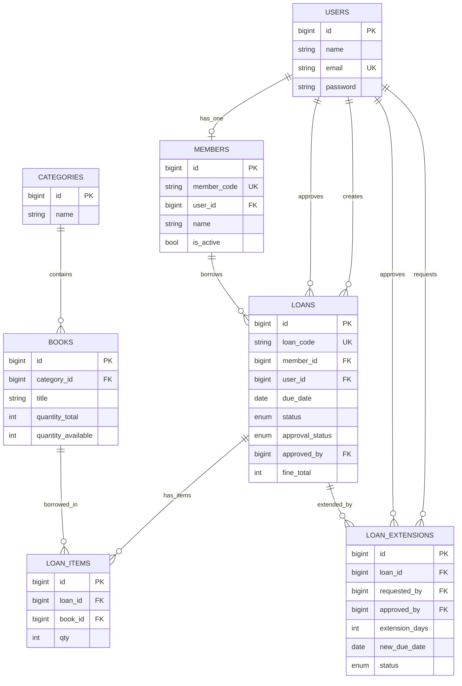
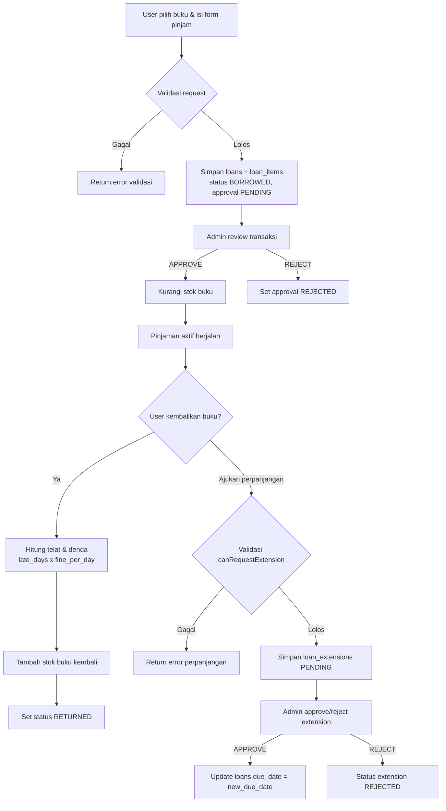

# Sistem Informasi Perpustakaan (Laravel)

Dokumentasi ini menjelaskan **alur sistem**, **desain database**, **model**, **controller**, **library yang digunakan**, dan **fitur utama** pada project `perpus`.

---

## 1. Gambaran Umum

Aplikasi ini adalah sistem perpustakaan berbasis Laravel dengan 2 peran utama:

-   **Admin**: mengelola master data, persetujuan peminjaman/perpanjangan, laporan PDF, serta konfigurasi aplikasi.
-   **User (anggota)**: registrasi/login, melihat katalog, meminjam buku, mengembalikan buku, dan mengajukan perpanjangan.

Konsep utama sistem peminjaman:

1. User membuat transaksi peminjaman.
2. Status approval awal: `PENDING`.
3. Admin `APPROVE` atau `REJECT`.
4. Stok buku **hanya dikurangi saat APPROVE**.
5. Saat pengembalian, stok dikembalikan dan denda dihitung jika terlambat.

---

## 2. Tech Stack & Library

### Backend

-   **Laravel Framework 12**
-   **PHP 8.2+**
-   **MySQL/MariaDB**

### Library Composer (Utama)

-   `spatie/laravel-permission`

    -   Manajemen Role & Permission (RBAC).
    -   Digunakan pada middleware seperti `permission:books.index`, `permission:users.edit`, dll.

-   `yajra/laravel-datatables-oracle`

    -   Server-side DataTables (JSON response untuk tabel interaktif).
    -   Dipakai pada modul Users, Roles, Permissions, Categories, Books, Members, Loans.

-   `maatwebsite/excel`

    -   Export template import buku.
    -   Import data buku dari file Excel (`xlsx/xls`) dengan validasi header dan validasi per-baris.

-   `barryvdh/laravel-dompdf`

    -   Export laporan transaksi peminjaman dalam format PDF.

-   `laravel/ui`

    -   Dukungan scaffolding UI/auth berbasis Bootstrap pada ekosistem Laravel.

-   `laravel/tinker`
    -   Tool debugging/interaksi data dari CLI.

### Frontend Build Tools

-   `vite` + `laravel-vite-plugin`
-   `bootstrap` + `@popperjs/core`
-   `tailwindcss`, `postcss`, `autoprefixer`, `sass`
-   `axios`

### Library Dev

-   `phpunit/phpunit` (testing)
-   `laravel/pint` (formatter)
-   `fruitcake/laravel-debugbar` (debug lokal)

---

## 3. Arsitektur Singkat

Pola yang dipakai mengikuti MVC Laravel:

-   **Model (`app/Models`)**

    -   Menangani representasi tabel, relasi, fillable, cast, dan helper domain tertentu (misal generate kode).

-   **Controller (`app/Http/Controllers`)**

    -   Menangani alur request, validasi, authorization role/permission, transaksi database, dan response view/JSON.

-   **Migration (`database/migrations`)**
    -   Mendefinisikan skema tabel, foreign key, enum status, unique key, default value.

---

## 4. Desain Database (Tabel & Relasi)

## 4.1 Entitas Inti

### `users`

-   Data akun login.
-   Kolom utama: `name`, `email (unique)`, `password`.

### `members`

-   Profil anggota perpustakaan.
-   Relasi 1:1 ke `users` melalui `user_id`.
-   Kolom penting:
    -   `member_code (unique)`
    -   `class`, `type` (`student|teacher`), `phone`, `address`
    -   `is_active` (default `true`)

### `categories`

-   Master kategori buku (`name`).

### `books`

-   Data buku dan stok.
-   FK: `category_id -> categories.id`.
-   Kolom penting:
    -   bibliografi: `isbn`, `title`, `author`, `publisher`, `year`
    -   lokasi: `rack_location`
    -   stok: `quantity_total`, `quantity_available`
    -   media: `cover_path`

### `loans`

-   Header transaksi peminjaman.
-   FK:
    -   `member_id -> members.id`
    -   `user_id -> users.id` (pemilik transaksi)
    -   `approved_by -> users.id` (admin approver, nullable)
-   Kolom penting:
    -   `loan_code (unique)`
    -   tanggal: `loaned_at`, `due_date`, `returned_at`
    -   status transaksi: `status` (`BORROWED|RETURNED`)
    -   status persetujuan: `approval_status` (`PENDING|APPROVED|REJECTED`)
    -   `approved_at`, `approval_note`, `fine_total`

### `loan_items`

-   Detail item buku dalam satu transaksi peminjaman.
-   FK:
    -   `loan_id -> loans.id`
    -   `book_id -> books.id`
-   Kolom: `qty`.

### `loan_extensions`

-   Request perpanjangan masa pinjam.
-   FK:
    -   `loan_id -> loans.id`
    -   `requested_by -> users.id`
    -   `approved_by -> users.id` (nullable)
-   Kolom penting:
    -   `extension_days`
    -   `new_due_date`
    -   `status` (`PENDING|APPROVED|REJECTED`)
    -   `reason`, `admin_note`, `approved_at`

### `setting_apps`

-   Konfigurasi aplikasi (single row setting).
-   Kolom:
    -   `name_app`, `short_cut_app`, `image`
    -   `fine_per_day` (default 1000)
    -   `extension_days` (default 7)

---

## 4.2 Tabel RBAC (Spatie Permission)

Library `spatie/laravel-permission` membuat tabel:

-   `permissions`
-   `roles`
-   `model_has_permissions`
-   `model_has_roles`
-   `role_has_permissions`

Seeder default membuat role:

-   `admin`
-   `user`

Admin mendapat seluruh permission, user mendapat permission terbatas sesuai kebutuhan modul user.

---

## 4.3 Ringkasan Relasi

-   `User` **hasOne** `Member`
-   `Member` **belongsTo** `User`
-   `Category` **hasMany** `Book`
-   `Book` **belongsTo** `Category`
-   `Member` **hasMany** `Loan`
-   `Loan` **belongsTo** `Member`
-   `Loan` **belongsTo** `User` (creator)
-   `Loan` **belongsTo** `User` (approvedBy via `approved_by`)
-   `Loan` **hasMany** `LoanItem`
-   `LoanItem` **belongsTo** `Loan`
-   `LoanItem` **belongsTo** `Book`
-   `Loan` **hasMany** `LoanExtension`
-   `LoanExtension` **belongsTo** `Loan`
-   `LoanExtension` **belongsTo** `User` (requestedBy)
-   `LoanExtension` **belongsTo** `User` (approvedBy)

## 4.4 Diagram ERD (Mermaid)



---

## 5. Desain Model (Ringkas per Model)

### `App\Models\User`

-   Extend `Authenticatable`.
-   Trait: `HasRoles` (Spatie), `HasFactory`, `Notifiable`.
-   Relasi: `member()`.

### `App\Models\Member`

-   Fillable profil anggota.
-   Relasi: `user()`, `loans()`.
-   Logic domain: `generateNextMemberCode()` menghasilkan format `MBR-0001`.

### `App\Models\Category`

-   Master kategori.
-   Relasi: `books()`.

### `App\Models\Book`

-   Fillable bibliografi + stok.
-   Relasi: `category()`, `loanItems()`.

### `App\Models\Loan`

-   Fillable transaksi + approval.
-   Cast date/datetime.
-   Relasi: `member()`, `user()`, `approvedBy()`, `loanItems()`, `extensions()`.
-   Logic domain: `generateLoanCode()` dengan format `LN-0001`.

### `App\Models\LoanItem`

-   Detail buku dalam transaksi.
-   Relasi: `loan()`, `book()`.

### `App\Models\LoanExtension`

-   Data request perpanjangan.
-   Relasi: `loan()`, `requestedBy()`, `approvedBy()`.
-   Logic domain: `canRequestExtension($loanId)` dengan aturan:
    -   pinjaman harus `BORROWED`
    -   masih dalam window keterlambatan maksimum
    -   maksimal 2 kali extension disetujui per transaksi

### `App\Models\SettingApp`

-   Menyimpan konfigurasi global (nama app, logo, denda/hari, default extension days).

> Catatan: `Transaction` model ada di repository namun belum menjadi bagian alur utama perpustakaan saat ini.

---

## 6. Desain Controller & Tanggung Jawab

### `AuthController`

-   Login (`authenticate`) dengan validasi email/password.
-   Register (`register`):
    -   buat `User`
    -   assign role `user`
    -   buat `Member`
    -   dibungkus `DB::transaction()`
-   Logout dan reset session.

### `HomeController`

-   Dashboard dinamis berdasar role:
    -   `admin`: statistik sistem (buku, member, pinjaman, denda, approval, stok menipis, dll)
    -   `user`: ringkasan pinjaman aktif dan histori pinjaman pribadi

### `PermissionsController`, `RoleController`, `UserController`

-   CRUD RBAC (permission, role, user).
-   Integrasi DataTables untuk listing.
-   `UserController` mengelola assign role user.

### `CategoryController`

-   CRUD kategori buku.
-   Proteksi middleware permission dan listing DataTables.

### `BookController`

-   CRUD buku + upload cover.
-   Katalog buku untuk role `user` (`catalog`).
-   Import buku via Excel (`import`) dengan:
    -   validasi tipe file
    -   validasi header template
    -   validasi setiap baris
    -   transaksi DB saat insert
-   Export template import (`downloadImportTemplate`).

### `MemberController`

-   Menampilkan data member (read-only di modul ini).

### `LoanController`

-   `index`: daftar pinjaman (admin semua, user milik sendiri).
-   `create/store`: user membuat pinjaman (status approval `PENDING`).
-   `approve/reject`: admin proses persetujuan.
-   `returnLoan`: proses pengembalian + hitung denda + restore stok.
-   `exportPdf`: export laporan PDF dengan filter status, approval, dan rentang tanggal.
-   `destroy`: hapus pinjaman `PENDING` (admin only).

### `LoanExtensionController`

-   User:
    -   list request sendiri (`index`)
    -   form request (`create`)
    -   submit request (`store`)
-   Admin:
    -   list request pending (`adminIndex`)
    -   approve/reject request
-   Saat approve extension: `due_date` pada `loans` diperbarui.

### `SettingAppController`

-   Manajemen pengaturan aplikasi (nama, shortcut, logo, denda/hari, default extension).
-   Aturan data tunggal (single setting row).

### `ErrorTestController`

-   Endpoint testing halaman error sesuai kode HTTP (khusus saat `APP_DEBUG=true`).

---

## 7. Alur Bisnis Utama

## 7.1 Alur Registrasi

1. User isi form register.
2. Sistem validasi input.
3. Sistem membuat akun `users`.
4. Sistem assign role `user`.
5. Sistem membuat data `members` otomatis.
6. User login otomatis dan diarahkan ke `/home`.

## 7.2 Alur Peminjaman Buku

1. User memilih buku (katalog) dan membuat transaksi.
2. Sistem validasi:
    - member aktif
    - maksimal 5 pinjaman aktif
    - tidak ada duplikasi judul dalam satu transaksi
    - stok tersedia
3. Sistem simpan `loans` (`approval_status=PENDING`) + `loan_items`.
4. Admin review:
    - **APPROVE**: stok buku dikurangi sesuai `qty`.
    - **REJECT**: tidak ada perubahan stok.

## 7.3 Alur Pengembalian Buku

1. Pengembalian hanya untuk pinjaman `APPROVED` dan `BORROWED`.
2. Sistem hitung keterlambatan terhadap `due_date`.
3. Denda dihitung: `late_days * fine_per_day`.
4. Stok buku dikembalikan (`quantity_available` bertambah).
5. Status pinjaman menjadi `RETURNED`.

## 7.4 Alur Perpanjangan Peminjaman

1. User ajukan extension pada pinjaman miliknya.
2. Sistem cek kelayakan via `LoanExtension::canRequestExtension()`.
3. Request disimpan `PENDING`.
4. Admin `APPROVE/REJECT`:
    - jika approve, `loans.due_date` diupdate ke `new_due_date`.

## 7.5 Alur Laporan PDF

1. Admin/user memanggil endpoint export PDF.
2. Filter opsional:
    - status transaksi (`BORROWED/RETURNED`)
    - status approval (`PENDING/APPROVED/REJECTED`)
    - rentang tanggal pinjam
3. Sistem generate PDF via DomPDF.

## 7.6 Diagram Alur Proses (Mermaid)



---

## 8. Fitur Aplikasi (Checklist)

-   [x] Autentikasi login/register/logout.
-   [x] Role & Permission berbasis Spatie.
-   [x] Dashboard admin dan dashboard user.
-   [x] CRUD Users, Roles, Permissions.
-   [x] CRUD Kategori buku.
-   [x] CRUD Buku + upload cover.
-   [x] Katalog buku untuk user.
-   [x] Import buku dari Excel + template import.
-   [x] Manajemen data member.
-   [x] Transaksi peminjaman multi-item.
-   [x] Approval pinjaman oleh admin.
-   [x] Pengembalian buku + perhitungan denda.
-   [x] Perpanjangan peminjaman + approval admin.
-   [x] Export laporan pinjaman ke PDF.
-   [x] Pengaturan aplikasi (logo, nama, denda/hari, default extension).

---

## 9. Route Utama

### Public

-   `/login`, `/register`

### Protected (`auth`)

-   `/home`
-   `/settings`
-   `/catalog`
-   Resource: `/users`, `/roles`, `/permissions`, `/categories`, `/books`
-   `/members`
-   `/loans` + action approve/reject/return/export pdf
-   `/loan-extensions` + admin endpoint approval

---

## 10. Seeder Default

Seeder yang dijalankan:

-   `PermissionTableSeeder`
-   `RoleTableSeeder`
-   `UserTableSeeder`

Default akun admin:

-   Email: `admin@gmail.com`
-   Password: `123456`

---

## 11. Instalasi & Menjalankan Project

## 11.1 Prasyarat

-   PHP 8.2+
-   Composer 2+
-   Node.js 18+
-   MySQL/MariaDB


# 📚 TUTORIAL SEDERHANA EXPORT & IMPORT BUKU

**Versi Simpel** | Fokus pada kode yang dipakai | Tanpa teori berlebihan

---

## 📌 QUICK START - 3 File Utama

Ada 3 file utama yang perlu dimengerti:

1. **BooksImportTemplateExport.php** → Generate template Excel
2. **BooksTemplateReadImport.php** → Baca file Excel
3. **BookController.php** (2 method) → Proses download & import

---

# 1. FILE: BooksImportTemplateExport.php

**Lokasi**: `app/Exports/BooksImportTemplateExport.php`

**Tujuan**: Generate file Excel template kosong untuk user isi

```php
<?php

namespace App\Exports;

use Maatwebsite\Excel\Concerns\FromArray;
use Maatwebsite\Excel\Concerns\WithHeadings;

class BooksImportTemplateExport implements FromArray, WithHeadings
{
    // Cara pakai:
    // 1. Definisikan header (nama kolom di baris 1)
    // 2. Berikan sample data (contoh isi untuk user follow)

    /**
     * Header: Nama kolom di row 1
     * Penting: Urutan harus sama dengan saat import!
     */
    public function headings(): array
    {
        return [
            'category_id',          // Kolom A
            'isbn',                 // Kolom B
            'title',                // Kolom C
            'author',               // Kolom D
            'publisher',            // Kolom E
            'year',                 // Kolom F
            'rack_location',        // Kolom G
            'quantity_total',       // Kolom H
            'quantity_available',   // Kolom I
        ];
    }

    /**
     * Sample data: Baris data contoh untuk user pahami
     * Ini akan muncul di baris 2-3 setelah header
     */
    public function array(): array
    {
        return [
            // Contoh buku 1
            ['1', '9786020324781', 'Laskar Pelangi', 'Andrea Hirata', 'Bentang Pustaka', '2005', 'A1-03', '10', '10'],

            // Contoh buku 2
            ['2', '9786230001112', 'Belajar Laravel Dasar', 'Developer', 'Informatika', '2024', 'T2-01', '5', '5'],
        ];
    }
}
```

**Penjelasan Singkat**:

-   `headings()` → Memberikan nama kolom (header)
-   `array()` → Memberikan sample data (2 baris contoh)
-   Saat user download, file akan berisi header + sample data ini

---

# 2. FILE: BooksTemplateReadImport.php

**Lokasi**: `app/Imports/BooksTemplateReadImport.php`

**Tujuan**: Membaca file Excel yang di-upload oleh user

```php
<?php

namespace App\Imports;

use Illuminate\Support\Collection;
use Maatwebsite\Excel\Concerns\ToCollection;
use Maatwebsite\Excel\Concerns\WithHeadingRow;

class BooksTemplateReadImport implements ToCollection, WithHeadingRow
{
    // Cara paxa:
    // 1. File Excel dibaca jadi Collection
    // 2. Row pertama otomatis jadi header/key
    // 3. Data disimpan di property $rows untuk diproses di controller

    /**
     * Property untuk simpan semua data dari Excel
     * Nanti diakses di controller: $import->rows
     */
    public Collection $rows;

    public function __construct()
    {
        $this->rows = collect();
    }

    /**
     * Method dipanggil otomatis saat file dibaca
     * $collection = semua baris data dari Excel (tanpa header)
     */
    public function collection(Collection $collection): void
    {
        // Simpan data ke property $rows
        // Setiap row jadi Collection dengan header sebagai key
        $this->rows = $collection;

        // Contoh:
        // $this->rows[0]['title'] → 'Laskar Pelangi'
        // $this->rows[0]['author'] → 'Andrea Hirata'
        // $this->rows[0]['category_id'] → '1'
    }
}
```

**Penjelasan Singkat**:

-   Membaca file Excel
-   `WithHeadingRow` → Row pertama dianggap sebagai header/key
-   Data disimpan di `$rows` (Collection)
-   Nanti di-loop di controller untuk cek validasi

---

# 3. CONTROLLER: BookController.php - 2 Method

**Lokasi**: `app/Http/Controllers/BookController.php`

## 3.1 Method: downloadImportTemplate()

**Tujuan**: User download file template kosong

```php
/**
 * USER DOWNLOAD TEMPLATE
 * Endpoint: GET /books/import/template
 * Response: File Excel (.xlsx)
 */
public function downloadImportTemplate()
{
    // Pakai Excel facade untuk download
    // Parameter:
    // 1. BooksImportTemplateExport() = instance class export
    // 2. 'template_import_buku.xlsx' = nama file saat didownload

    return Excel::download(
        new BooksImportTemplateExport(),
        'template_import_buku.xlsx'
    );

    // Hasil: File akan di-download otomatis ke komputer user
}
```

**Yang Terjadi**:

1. User klik tombol "Download Template"
2. Sistem generate file dari `BooksImportTemplateExport`
3. File `template_import_buku.xlsx` di-download
4. User buka di Excel dan isi data

---

## 3.2 Method: import(Request $request)

**Tujuan**: User upload file Excel yang sudah diisi, simpan ke database

```php
/**
 * USER UPLOAD FILE EXCEL
 * Endpoint: POST /books/import
 * Body: form-data dengan key "import_file" (file Excel)
 * Response: Redirect ke /books dengan message success/error
 */
public function import(Request $request): RedirectResponse
{
    // ========== STEP 1: VALIDASI FILE ==========
    $request->validate([
        'import_file' => 'required|file|mimes:xlsx,xls|max:5120',
    ]);
    // Cek: File harus ada, format xlsx/xls, max 5MB

    $file = $request->file('import_file');

    // ========== STEP 2: VALIDASI HEADER ==========
    // Header HARUS cocok dengan template, jika tidak akan error
    $expectedHeaders = [
        'category_id',
        'isbn',
        'title',
        'author',
        'publisher',
        'year',
        'rack_location',
        'quantity_total',
        'quantity_available',
    ];

    // Baca header dari file Excel (baris 1 saja)
    $headerRows = (new HeadingRowImport())->toArray($file);
    $normalizedHeader = $headerRows[0][0] ?? [];

    // Cek apakah header cocok
    if ($normalizedHeader !== $expectedHeaders) {
        return redirect()->route('books.index')
            ->with('error', 'Format header file Excel tidak sesuai template default.');
    }

    // ========== STEP 3: BACA FILE EXCEL ==========
    // Import file ke dalam object, nanti ambil data dari $rows
    $import = new BooksTemplateReadImport();
    Excel::import($import, $file);
    $rows = $import->rows; // Collection berisi semua data buku

    // ========== STEP 4: PROSES SETIAP BARIS ==========
    $rowErrors = [];  // Tempat simpan error per baris
    $payloads = [];   // Tempat simpan data yang valid

    foreach ($rows as $index => $row) {
        $rowNumber = $index + 2; // Baris di Excel (header = baris 1)

        // Skip baris kosong
        if (count(array_filter($row->toArray(), fn ($value) => trim((string) $value) !== '')) === 0) {
            continue;
        }

        // Extract data dari setiap kolom, buang spasi
        $rowData = [
            'category_id' => trim((string) $row->get('category_id', '')),
            'isbn' => trim((string) $row->get('isbn', '')),
            'title' => trim((string) $row->get('title', '')),
            'author' => trim((string) $row->get('author', '')),
            'publisher' => trim((string) $row->get('publisher', '')),
            'year' => trim((string) $row->get('year', '')),
            'rack_location' => trim((string) $row->get('rack_location', '')),
            'quantity_total' => trim((string) $row->get('quantity_total', '')),
            'quantity_available' => trim((string) $row->get('quantity_available', '')),
        ];

        // ========== VALIDASI FIELD ==========
        $validator = Validator::make($rowData, [
            'category_id' => 'required|integer|exists:categories,id',
            // Wajib diisi, harus angka, harus ada di tabel categories

            'isbn' => 'nullable|string|max:50',
            // Opsional, boleh kosong

            'title' => 'required|string|max:255',
            // Wajib diisi

            'author' => 'required|string|max:255',
            // Wajib diisi

            'publisher' => 'nullable|string|max:255',
            // Opsional

            'year' => 'nullable|integer|digits:4',
            // Opsional, format 4 digit (YYYY)

            'rack_location' => 'nullable|string|max:100',
            // Opsional

            'quantity_total' => 'required|integer|min:0',
            // Wajib diisi, harus angka

            'quantity_available' => 'required|integer|min:0',
            // Wajib diisi, harus angka
        ]);

        // ========== VALIDASI CUSTOM ==========
        // quantity_available tidak boleh lebih besar dari quantity_total
        $validator->after(function ($validator) use ($rowData) {
            if (
                isset($rowData['quantity_total'], $rowData['quantity_available']) &&
                is_numeric($rowData['quantity_total']) &&
                is_numeric($rowData['quantity_available']) &&
                (int) $rowData['quantity_available'] > (int) $rowData['quantity_total']
            ) {
                $validator->errors()->add(
                    'quantity_available',
                    'Quantity available tidak boleh lebih besar dari quantity total.'
                );
            }
        });

        // Jika ada error, catat tapi lanjut ke baris berikutnya
        if ($validator->fails()) {
            $rowErrors[] = 'Baris ' . $rowNumber . ': ' . implode(' | ', $validator->errors()->all());
            continue;
        }

        // Data valid, simpan untuk nanti di-insert ke DB
        $payloads[] = [
            'category_id' => (int) $rowData['category_id'],
            'isbn' => $rowData['isbn'] ?: null,
            'title' => $rowData['title'],
            'author' => $rowData['author'],
            'publisher' => $rowData['publisher'] ?: null,
            'year' => $rowData['year'] !== '' && $rowData['year'] !== null ? (int) $rowData['year'] : null,
            'rack_location' => $rowData['rack_location'] ?: null,
            'quantity_total' => (int) $rowData['quantity_total'],
            'quantity_available' => (int) $rowData['quantity_available'],
        ];
    }

    // ========== STEP 5: CEK HASIL VALIDASI ==========

    // Jika tidak ada data valid sama sekali
    if (empty($payloads)) {
        if (!empty($rowErrors)) {
            return redirect()->route('books.index')
                ->with('error', 'Import gagal. Periksa detail error per baris.')
                ->with('import_errors', $rowErrors);
        }
        return redirect()->route('books.index')
            ->with('error', 'Tidak ada data yang bisa diimport.');
    }

    // Jika ada data valid tapi juga ada error di baris lain, reject semua
    if (!empty($rowErrors)) {
        return redirect()->route('books.index')
            ->with('error', 'Import dibatalkan karena ada data tidak valid. Perbaiki lalu upload ulang.')
            ->with('import_errors', $rowErrors);
    }

    // ========== STEP 6: SIMPAN KE DATABASE ==========
    // Gunakan transaction: jika ada error, rollback semua
    DB::transaction(function () use ($payloads) {
        foreach ($payloads as $payload) {
            Book::create($payload);
        }
    });

    // ========== STEP 7: RETURN RESPONSE ==========
    return redirect()->route('books.index')
        ->with('success', count($payloads) . ' buku berhasil diimport.');
}
```

**Alur Kerja Simplified**:

```
1. User upload file Excel
   ↓
2. Cek: File valid? (format, size)
   ↓
3. Cek: Header cocok dengan template?
   ↓
4. Baca semua baris dari Excel
   ↓
5. Loop setiap baris:
   - Extract data
   - Validasi field
   - Jika valid → simpan ke payloads
   - Jika error → catat di rowErrors
   ↓
6. Cek hasil:
   - Ada error? → Reject semua, tampilkan error detail
   - Semua valid? → Insert ke database
   ↓
7. Return: Success atau error message
```

---

# 4. ROUTE CONFIGURATION

**Lokasi**: `routes/web.php`

```php
<?php

Route::middleware(['auth'])->group(function () {

    // ===== ROUTE 1: DOWNLOAD TEMPLATE =====
    // Method: GET
    // URL: /books/import/template
    // Controller Method: downloadImportTemplate()
    Route::get(
        'books/import/template',
        [App\Http\Controllers\BookController::class, 'downloadImportTemplate']
    )->name('books.import.template');

    // ===== ROUTE 2: UPLOAD FILE =====
    // Method: POST
    // URL: /books/import
    // Body: form-data dengan "import_file"
    // Controller Method: import()
    Route::post(
        'books/import',
        [App\Http\Controllers\BookController::class, 'import']
    )->name('books.import');

    // ===== ROUTE 3: CRUD BOOKS (Standard Resource) =====
    Route::resource('books', App\Http\Controllers\BookController::class);
});
```

**Penjelasan**:

-   Route 1: User klik "Download Template" → file di-download
-   Route 2: User upload file via form → proses import
-   Route 3: Standar CRUD routes untuk list/create/edit/delete buku

---

# 5. MODAL VIEW (FORM UPLOAD)

**Lokasi**: `resources/views/books/modals/import.blade.php`

```blade
<!-- Modal Upload Import -->
<div class="modal fade" id="modalImportBook" tabindex="-1" role="dialog">
    <div class="modal-dialog" role="document">
        <div class="modal-content">
            <!-- Modal Header -->
            <div class="modal-header bg-success text-white">
                <h5 class="modal-title">
                    📥 Import Buku (Excel)
                </h5>
                <button type="button" class="close text-white" data-dismiss="modal">
                    <span>&times;</span>
                </button>
            </div>

            <!-- Modal Body -->
            <form method="POST" action="{{ route('books.import') }}" enctype="multipart/form-data">
                @csrf

                <div class="modal-body">
                    <!-- Info -->
                    <div class="alert alert-light border mb-3 small">
                        <strong>Catatan:</strong><br>
                        1. Download template terlebih dahulu<br>
                        2. Isi data buku di file Excel<br>
                        3. Upload kembali file tersebut
                    </div>

                    <!-- File Input -->
                    <div class="form-group mb-2">
                        <label class="font-weight-bold mb-1">Pilih File Excel</label>
                        <input
                            type="file"
                            name="import_file"
                            class="form-control-file"
                            accept=".xlsx,.xls"
                            required
                        >
                        <small class="text-muted">
                            Format: .xlsx atau .xls | Max: 5MB
                        </small>
                    </div>
                </div>

                <!-- Modal Footer -->
                <div class="modal-footer">
                    <button type="button" class="btn btn-secondary" data-dismiss="modal">
                        Batal
                    </button>
                    <button type="submit" class="btn btn-success">
                        <i class="fa fa-check"></i> Upload & Import
                    </button>
                </div>
            </form>
        </div>
    </div>
</div>
```

**Penjelasan Modal**:

-   Form submit ke route: `books.import` (POST)
-   Input name: `import_file` (harus sama dengan di controller)
-   Accept: `.xlsx` atau `.xls` files saja
-   Max size: 5MB

---

# 6. MAIN VIEW - TOMBOL

**Lokasi**: `resources/views/books/index.blade.php` (bagian button)

```blade
<div class="d-flex flex-wrap justify-content-end" style="gap:.4rem;">

    <!-- Tombol 1: Download Template -->
    <a href="{{ route('books.import.template') }}" class="btn btn-success btn-sm">
        <i class="fas fa-file-download mr-1"></i> Download Template Import
    </a>

    <!-- Tombol 2: Upload Import (buka modal) -->
    <button type="button" class="btn btn-outline-success btn-sm" data-toggle="modal" data-target="#modalImportBook">
        <i class="fas fa-file-upload mr-1"></i> Upload Import
    </button>

    <!-- Tombol 3: Create New Book -->
    <button type="button" class="btn btn-primary btn-sm" data-toggle="modal" data-target="#modalCreateBook">
        Create New Book
    </button>

</div>

<!-- Include Modal Import -->
@include('books.modals.import')
```
