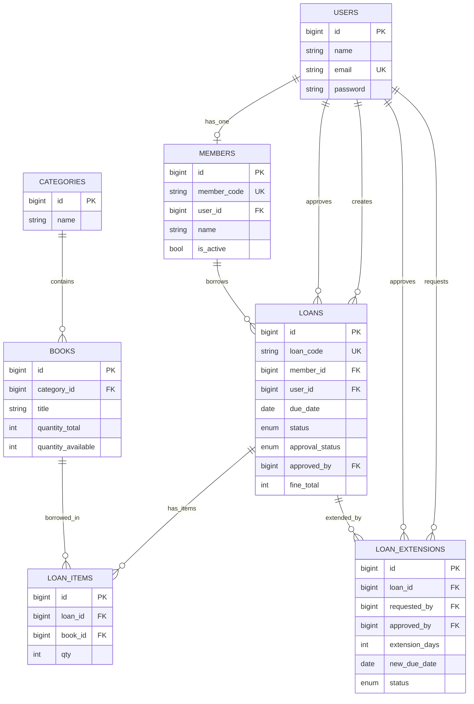
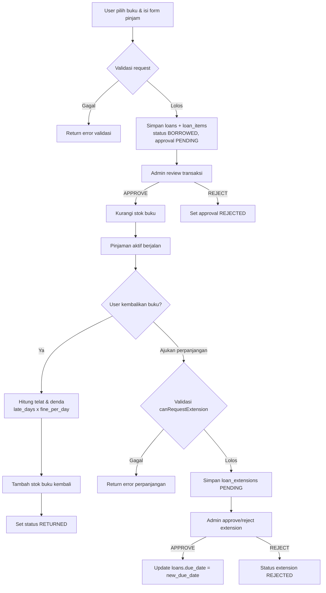

# Sistem Informasi Perpustakaan (Laravel)

Dokumentasi ini menjelaskan **alur sistem**, **desain database**, **model**, **controller**, **library yang digunakan**, dan **fitur utama** pada project `perpus`.

---

## 1. Gambaran Umum

Aplikasi ini adalah sistem perpustakaan berbasis Laravel dengan 2 peran utama:

-   **Admin**: mengelola master data, persetujuan peminjaman/perpanjangan, laporan PDF, serta konfigurasi aplikasi.
-   **User (anggota)**: registrasi/login, melihat katalog, meminjam buku, mengembalikan buku, dan mengajukan perpanjangan.

Konsep utama sistem peminjaman:

1. User membuat transaksi peminjaman.
2. Status approval awal: `PENDING`.
3. Admin `APPROVE` atau `REJECT`.
4. Stok buku **hanya dikurangi saat APPROVE**.
5. Saat pengembalian, stok dikembalikan dan denda dihitung jika terlambat.

---

## 2. Tech Stack & Library

### Backend

-   **Laravel Framework 12**
-   **PHP 8.2+**
-   **MySQL/MariaDB**

### Library Composer (Utama)

-   `spatie/laravel-permission`

    -   Manajemen Role & Permission (RBAC).
    -   Digunakan pada middleware seperti `permission:books.index`, `permission:users.edit`, dll.

-   `yajra/laravel-datatables-oracle`

    -   Server-side DataTables (JSON response untuk tabel interaktif).
    -   Dipakai pada modul Users, Roles, Permissions, Categories, Books, Members, Loans.

-   `maatwebsite/excel`

    -   Export template import buku.
    -   Import data buku dari file Excel (`xlsx/xls`) dengan validasi header dan validasi per-baris.

-   `barryvdh/laravel-dompdf`

    -   Export laporan transaksi peminjaman dalam format PDF.

-   `laravel/ui`

    -   Dukungan scaffolding UI/auth berbasis Bootstrap pada ekosistem Laravel.

-   `laravel/tinker`
    -   Tool debugging/interaksi data dari CLI.

### Frontend Build Tools

-   `vite` + `laravel-vite-plugin`
-   `bootstrap` + `@popperjs/core`
-   `tailwindcss`, `postcss`, `autoprefixer`, `sass`
-   `axios`

### Library Dev

-   `phpunit/phpunit` (testing)
-   `laravel/pint` (formatter)
-   `fruitcake/laravel-debugbar` (debug lokal)

---

## 3. Arsitektur Singkat

Pola yang dipakai mengikuti MVC Laravel:

-   **Model (`app/Models`)**

    -   Menangani representasi tabel, relasi, fillable, cast, dan helper domain tertentu (misal generate kode).

-   **Controller (`app/Http/Controllers`)**

    -   Menangani alur request, validasi, authorization role/permission, transaksi database, dan response view/JSON.

-   **Migration (`database/migrations`)**
    -   Mendefinisikan skema tabel, foreign key, enum status, unique key, default value.

---

## 4. Desain Database (Tabel & Relasi)

## 4.1 Entitas Inti

### `users`

-   Data akun login.
-   Kolom utama: `name`, `email (unique)`, `password`.

### `members`

-   Profil anggota perpustakaan.
-   Relasi 1:1 ke `users` melalui `user_id`.
-   Kolom penting:
    -   `member_code (unique)`
    -   `class`, `type` (`student|teacher`), `phone`, `address`
    -   `is_active` (default `true`)

### `categories`

-   Master kategori buku (`name`).

### `books`

-   Data buku dan stok.
-   FK: `category_id -> categories.id`.
-   Kolom penting:
    -   bibliografi: `isbn`, `title`, `author`, `publisher`, `year`
    -   lokasi: `rack_location`
    -   stok: `quantity_total`, `quantity_available`
    -   media: `cover_path`

### `loans`

-   Header transaksi peminjaman.
-   FK:
    -   `member_id -> members.id`
    -   `user_id -> users.id` (pemilik transaksi)
    -   `approved_by -> users.id` (admin approver, nullable)
-   Kolom penting:
    -   `loan_code (unique)`
    -   tanggal: `loaned_at`, `due_date`, `returned_at`
    -   status transaksi: `status` (`BORROWED|RETURNED`)
    -   status persetujuan: `approval_status` (`PENDING|APPROVED|REJECTED`)
    -   `approved_at`, `approval_note`, `fine_total`

### `loan_items`

-   Detail item buku dalam satu transaksi peminjaman.
-   FK:
    -   `loan_id -> loans.id`
    -   `book_id -> books.id`
-   Kolom: `qty`.

### `loan_extensions`

-   Request perpanjangan masa pinjam.
-   FK:
    -   `loan_id -> loans.id`
    -   `requested_by -> users.id`
    -   `approved_by -> users.id` (nullable)
-   Kolom penting:
    -   `extension_days`
    -   `new_due_date`
    -   `status` (`PENDING|APPROVED|REJECTED`)
    -   `reason`, `admin_note`, `approved_at`

### `setting_apps`

-   Konfigurasi aplikasi (single row setting).
-   Kolom:
    -   `name_app`, `short_cut_app`, `image`
    -   `fine_per_day` (default 1000)
    -   `extension_days` (default 7)

---

## 4.2 Tabel RBAC (Spatie Permission)

Library `spatie/laravel-permission` membuat tabel:

-   `permissions`
-   `roles`
-   `model_has_permissions`
-   `model_has_roles`
-   `role_has_permissions`

Seeder default membuat role:

-   `admin`
-   `user`

Admin mendapat seluruh permission, user mendapat permission terbatas sesuai kebutuhan modul user.

---

## 4.3 Ringkasan Relasi

-   `User` **hasOne** `Member`
-   `Member` **belongsTo** `User`
-   `Category` **hasMany** `Book`
-   `Book` **belongsTo** `Category`
-   `Member` **hasMany** `Loan`
-   `Loan` **belongsTo** `Member`
-   `Loan` **belongsTo** `User` (creator)
-   `Loan` **belongsTo** `User` (approvedBy via `approved_by`)
-   `Loan` **hasMany** `LoanItem`
-   `LoanItem` **belongsTo** `Loan`
-   `LoanItem` **belongsTo** `Book`
-   `Loan` **hasMany** `LoanExtension`
-   `LoanExtension` **belongsTo** `Loan`
-   `LoanExtension` **belongsTo** `User` (requestedBy)
-   `LoanExtension` **belongsTo** `User` (approvedBy)

## 4.4 Diagram ERD (Mermaid)


```mermaid
erDiagram
        USERS ||--o| MEMBERS : has_one
        USERS ||--o{ LOANS : creates
        USERS ||--o{ LOANS : approves
        USERS ||--o{ LOAN_EXTENSIONS : requests
        USERS ||--o{ LOAN_EXTENSIONS : approves

        CATEGORIES ||--o{ BOOKS : contains

        MEMBERS ||--o{ LOANS : borrows
        LOANS ||--o{ LOAN_ITEMS : has_items
        BOOKS ||--o{ LOAN_ITEMS : borrowed_in

        LOANS ||--o{ LOAN_EXTENSIONS : extended_by

        USERS {
            bigint id PK
            string name
            string email UK
            string password
        }

        MEMBERS {
            bigint id PK
            string member_code UK
            bigint user_id FK
            string name
            bool is_active
        }

        CATEGORIES {
            bigint id PK
            string name
        }

        BOOKS {
            bigint id PK
            bigint category_id FK
            string title
            int quantity_total
            int quantity_available
        }

        LOANS {
            bigint id PK
            string loan_code UK
            bigint member_id FK
            bigint user_id FK
            date due_date
            enum status
            enum approval_status
            bigint approved_by FK
            int fine_total
        }

        LOAN_ITEMS {
            bigint id PK
            bigint loan_id FK
            bigint book_id FK
            int qty
        }

        LOAN_EXTENSIONS {
            bigint id PK
            bigint loan_id FK
            bigint requested_by FK
            bigint approved_by FK
            int extension_days
            date new_due_date
            enum status
        }
```

---

## 5. Desain Model (Ringkas per Model)

### `App\Models\User`

-   Extend `Authenticatable`.
-   Trait: `HasRoles` (Spatie), `HasFactory`, `Notifiable`.
-   Relasi: `member()`.

### `App\Models\Member`

-   Fillable profil anggota.
-   Relasi: `user()`, `loans()`.
-   Logic domain: `generateNextMemberCode()` menghasilkan format `MBR-0001`.

### `App\Models\Category`

-   Master kategori.
-   Relasi: `books()`.

### `App\Models\Book`

-   Fillable bibliografi + stok.
-   Relasi: `category()`, `loanItems()`.

### `App\Models\Loan`

-   Fillable transaksi + approval.
-   Cast date/datetime.
-   Relasi: `member()`, `user()`, `approvedBy()`, `loanItems()`, `extensions()`.
-   Logic domain: `generateLoanCode()` dengan format `LN-0001`.

### `App\Models\LoanItem`

-   Detail buku dalam transaksi.
-   Relasi: `loan()`, `book()`.

### `App\Models\LoanExtension`

-   Data request perpanjangan.
-   Relasi: `loan()`, `requestedBy()`, `approvedBy()`.
-   Logic domain: `canRequestExtension($loanId)` dengan aturan:
    -   pinjaman harus `BORROWED`
    -   masih dalam window keterlambatan maksimum
    -   maksimal 2 kali extension disetujui per transaksi

### `App\Models\SettingApp`

-   Menyimpan konfigurasi global (nama app, logo, denda/hari, default extension days).

> Catatan: `Transaction` model ada di repository namun belum menjadi bagian alur utama perpustakaan saat ini.

---

## 6. Desain Controller & Tanggung Jawab

### `AuthController`

-   Login (`authenticate`) dengan validasi email/password.
-   Register (`register`):
    -   buat `User`
    -   assign role `user`
    -   buat `Member`
    -   dibungkus `DB::transaction()`
-   Logout dan reset session.

### `HomeController`

-   Dashboard dinamis berdasar role:
    -   `admin`: statistik sistem (buku, member, pinjaman, denda, approval, stok menipis, dll)
    -   `user`: ringkasan pinjaman aktif dan histori pinjaman pribadi

### `PermissionsController`, `RoleController`, `UserController`

-   CRUD RBAC (permission, role, user).
-   Integrasi DataTables untuk listing.
-   `UserController` mengelola assign role user.

### `CategoryController`

-   CRUD kategori buku.
-   Proteksi middleware permission dan listing DataTables.

### `BookController`

-   CRUD buku + upload cover.
-   Katalog buku untuk role `user` (`catalog`).
-   Import buku via Excel (`import`) dengan:
    -   validasi tipe file
    -   validasi header template
    -   validasi setiap baris
    -   transaksi DB saat insert
-   Export template import (`downloadImportTemplate`).

### `MemberController`

-   Menampilkan data member (read-only di modul ini).

### `LoanController`

-   `index`: daftar pinjaman (admin semua, user milik sendiri).
-   `create/store`: user membuat pinjaman (status approval `PENDING`).
-   `approve/reject`: admin proses persetujuan.
-   `returnLoan`: proses pengembalian + hitung denda + restore stok.
-   `exportPdf`: export laporan PDF dengan filter status, approval, dan rentang tanggal.
-   `destroy`: hapus pinjaman `PENDING` (admin only).

### `LoanExtensionController`

-   User:
    -   list request sendiri (`index`)
    -   form request (`create`)
    -   submit request (`store`)
-   Admin:
    -   list request pending (`adminIndex`)
    -   approve/reject request
-   Saat approve extension: `due_date` pada `loans` diperbarui.

### `SettingAppController`

-   Manajemen pengaturan aplikasi (nama, shortcut, logo, denda/hari, default extension).
-   Aturan data tunggal (single setting row).

### `ErrorTestController`

-   Endpoint testing halaman error sesuai kode HTTP (khusus saat `APP_DEBUG=true`).

---

## 7. Alur Bisnis Utama

## 7.1 Alur Registrasi

1. User isi form register.
2. Sistem validasi input.
3. Sistem membuat akun `users`.
4. Sistem assign role `user`.
5. Sistem membuat data `members` otomatis.
6. User login otomatis dan diarahkan ke `/home`.

## 7.2 Alur Peminjaman Buku

1. User memilih buku (katalog) dan membuat transaksi.
2. Sistem validasi:
    - member aktif
    - maksimal 5 pinjaman aktif
    - tidak ada duplikasi judul dalam satu transaksi
    - stok tersedia
3. Sistem simpan `loans` (`approval_status=PENDING`) + `loan_items`.
4. Admin review:
    - **APPROVE**: stok buku dikurangi sesuai `qty`.
    - **REJECT**: tidak ada perubahan stok.

## 7.3 Alur Pengembalian Buku

1. Pengembalian hanya untuk pinjaman `APPROVED` dan `BORROWED`.
2. Sistem hitung keterlambatan terhadap `due_date`.
3. Denda dihitung: `late_days * fine_per_day`.
4. Stok buku dikembalikan (`quantity_available` bertambah).
5. Status pinjaman menjadi `RETURNED`.

## 7.4 Alur Perpanjangan Peminjaman

1. User ajukan extension pada pinjaman miliknya.
2. Sistem cek kelayakan via `LoanExtension::canRequestExtension()`.
3. Request disimpan `PENDING`.
4. Admin `APPROVE/REJECT`:
    - jika approve, `loans.due_date` diupdate ke `new_due_date`.

## 7.5 Alur Laporan PDF

1. Admin/user memanggil endpoint export PDF.
2. Filter opsional:
    - status transaksi (`BORROWED/RETURNED`)
    - status approval (`PENDING/APPROVED/REJECTED`)
    - rentang tanggal pinjam
3. Sistem generate PDF via DomPDF.

## 7.6 Diagram Alur Proses (Mermaid)


```mermaid
flowchart TD
    A[User pilih buku & isi form pinjam] --> B{Validasi request}
    B -- Gagal --> B1[Return error validasi]
    B -- Lolos --> C[Simpan loans + loan_items\nstatus BORROWED, approval PENDING]
    C --> D[Admin review transaksi]
    D -->|APPROVE| E[Kurangi stok buku]
    D -->|REJECT| F[Set approval REJECTED]
    E --> G[Pinjaman aktif berjalan]

    G --> H{User kembalikan buku?}
    H -- Ya --> I[Hitung telat & denda\nlate_days x fine_per_day]
    I --> J[Tambah stok buku kembali]
    J --> K[Set status RETURNED]

    H -- Ajukan perpanjangan --> L{Validasi canRequestExtension}
    L -- Gagal --> L1[Return error perpanjangan]
    L -- Lolos --> M[Simpan loan_extensions PENDING]
    M --> N[Admin approve/reject extension]
    N -->|APPROVE| O[Update loans.due_date = new_due_date]
    N -->|REJECT| P[Status extension REJECTED]
```

---

## 8. Fitur Aplikasi (Checklist)

-   [x] Autentikasi login/register/logout.
-   [x] Role & Permission berbasis Spatie.
-   [x] Dashboard admin dan dashboard user.
-   [x] CRUD Users, Roles, Permissions.
-   [x] CRUD Kategori buku.
-   [x] CRUD Buku + upload cover.
-   [x] Katalog buku untuk user.
-   [x] Import buku dari Excel + template import.
-   [x] Manajemen data member.
-   [x] Transaksi peminjaman multi-item.
-   [x] Approval pinjaman oleh admin.
-   [x] Pengembalian buku + perhitungan denda.
-   [x] Perpanjangan peminjaman + approval admin.
-   [x] Export laporan pinjaman ke PDF.
-   [x] Pengaturan aplikasi (logo, nama, denda/hari, default extension).

---

## 9. Route Utama

### Public

-   `/login`, `/register`

### Protected (`auth`)

-   `/home`
-   `/settings`
-   `/catalog`
-   Resource: `/users`, `/roles`, `/permissions`, `/categories`, `/books`
-   `/members`
-   `/loans` + action approve/reject/return/export pdf
-   `/loan-extensions` + admin endpoint approval

---

## 10. Seeder Default

Seeder yang dijalankan:

-   `PermissionTableSeeder`
-   `RoleTableSeeder`
-   `UserTableSeeder`

Default akun admin:

-   Email: `admin@gmail.com`
-   Password: `123456`

---

## 11. Instalasi & Menjalankan Project

## 11.1 Prasyarat

-   PHP 8.2+
-   Composer 2+
-   Node.js 18+
-   MySQL/MariaDB


## 📌 QUICK START - 3 File Utama

Ada 3 file utama yang perlu dimengerti:

1. **BooksImportTemplateExport.php** → Generate template Excel
2. **BooksTemplateReadImport.php** → Baca file Excel
3. **BookController.php** (2 method) → Proses download & import

---

# 1. FILE: BooksImportTemplateExport.php

**Lokasi**: `app/Exports/BooksImportTemplateExport.php`

**Tujuan**: Generate file Excel template kosong untuk user isi

```php
<?php

namespace App\Exports;

use Maatwebsite\Excel\Concerns\FromArray;
use Maatwebsite\Excel\Concerns\WithHeadings;

class BooksImportTemplateExport implements FromArray, WithHeadings
{
    // Cara pakai:
    // 1. Definisikan header (nama kolom di baris 1)
    // 2. Berikan sample data (contoh isi untuk user follow)

    /**
     * Header: Nama kolom di row 1
     * Penting: Urutan harus sama dengan saat import!
     */
    public function headings(): array
    {
        return [
            'category_id',          // Kolom A
            'isbn',                 // Kolom B
            'title',                // Kolom C
            'author',               // Kolom D
            'publisher',            // Kolom E
            'year',                 // Kolom F
            'rack_location',        // Kolom G
            'quantity_total',       // Kolom H
            'quantity_available',   // Kolom I
        ];
    }

    /**
     * Sample data: Baris data contoh untuk user pahami
     * Ini akan muncul di baris 2-3 setelah header
     */
    public function array(): array
    {
        return [
            // Contoh buku 1
            ['1', '9786020324781', 'Laskar Pelangi', 'Andrea Hirata', 'Bentang Pustaka', '2005', 'A1-03', '10', '10'],

            // Contoh buku 2
            ['2', '9786230001112', 'Belajar Laravel Dasar', 'Developer', 'Informatika', '2024', 'T2-01', '5', '5'],
        ];
    }
}
```

**Penjelasan Singkat**:

-   `headings()` → Memberikan nama kolom (header)
-   `array()` → Memberikan sample data (2 baris contoh)
-   Saat user download, file akan berisi header + sample data ini

---

# 2. FILE: BooksTemplateReadImport.php

**Lokasi**: `app/Imports/BooksTemplateReadImport.php`

**Tujuan**: Membaca file Excel yang di-upload oleh user

```php
<?php

namespace App\Imports;

use Illuminate\Support\Collection;
use Maatwebsite\Excel\Concerns\ToCollection;
use Maatwebsite\Excel\Concerns\WithHeadingRow;

class BooksTemplateReadImport implements ToCollection, WithHeadingRow
{
    // Cara paxa:
    // 1. File Excel dibaca jadi Collection
    // 2. Row pertama otomatis jadi header/key
    // 3. Data disimpan di property $rows untuk diproses di controller

    /**
     * Property untuk simpan semua data dari Excel
     * Nanti diakses di controller: $import->rows
     */
    public Collection $rows;

    public function __construct()
    {
        $this->rows = collect();
    }

    /**
     * Method dipanggil otomatis saat file dibaca
     * $collection = semua baris data dari Excel (tanpa header)
     */
    public function collection(Collection $collection): void
    {
        // Simpan data ke property $rows
        // Setiap row jadi Collection dengan header sebagai key
        $this->rows = $collection;

        // Contoh:
        // $this->rows[0]['title'] → 'Laskar Pelangi'
        // $this->rows[0]['author'] → 'Andrea Hirata'
        // $this->rows[0]['category_id'] → '1'
    }
}
```

**Penjelasan Singkat**:

-   Membaca file Excel
-   `WithHeadingRow` → Row pertama dianggap sebagai header/key
-   Data disimpan di `$rows` (Collection)
-   Nanti di-loop di controller untuk cek validasi

---

# 3. CONTROLLER: BookController.php - 2 Method

**Lokasi**: `app/Http/Controllers/BookController.php`

## 3.1 Method: downloadImportTemplate()

**Tujuan**: User download file template kosong

```php
/**
 * USER DOWNLOAD TEMPLATE
 * Endpoint: GET /books/import/template
 * Response: File Excel (.xlsx)
 */
public function downloadImportTemplate()
{
    // Pakai Excel facade untuk download
    // Parameter:
    // 1. BooksImportTemplateExport() = instance class export
    // 2. 'template_import_buku.xlsx' = nama file saat didownload

    return Excel::download(
        new BooksImportTemplateExport(),
        'template_import_buku.xlsx'
    );

    // Hasil: File akan di-download otomatis ke komputer user
}
```

**Yang Terjadi**:

1. User klik tombol "Download Template"
2. Sistem generate file dari `BooksImportTemplateExport`
3. File `template_import_buku.xlsx` di-download
4. User buka di Excel dan isi data

---

## 3.2 Method: import(Request $request)

**Tujuan**: User upload file Excel yang sudah diisi, simpan ke database

```php
/**
 * USER UPLOAD FILE EXCEL
 * Endpoint: POST /books/import
 * Body: form-data dengan key "import_file" (file Excel)
 * Response: Redirect ke /books dengan message success/error
 */
public function import(Request $request): RedirectResponse
{
    // ========== STEP 1: VALIDASI FILE ==========
    $request->validate([
        'import_file' => 'required|file|mimes:xlsx,xls|max:5120',
    ]);
    // Cek: File harus ada, format xlsx/xls, max 5MB

    $file = $request->file('import_file');

    // ========== STEP 2: VALIDASI HEADER ==========
    // Header HARUS cocok dengan template, jika tidak akan error
    $expectedHeaders = [
        'category_id',
        'isbn',
        'title',
        'author',
        'publisher',
        'year',
        'rack_location',
        'quantity_total',
        'quantity_available',
    ];

    // Baca header dari file Excel (baris 1 saja)
    $headerRows = (new HeadingRowImport())->toArray($file);
    $normalizedHeader = $headerRows[0][0] ?? [];

    // Cek apakah header cocok
    if ($normalizedHeader !== $expectedHeaders) {
        return redirect()->route('books.index')
            ->with('error', 'Format header file Excel tidak sesuai template default.');
    }

    // ========== STEP 3: BACA FILE EXCEL ==========
    // Import file ke dalam object, nanti ambil data dari $rows
    $import = new BooksTemplateReadImport();
    Excel::import($import, $file);
    $rows = $import->rows; // Collection berisi semua data buku

    // ========== STEP 4: PROSES SETIAP BARIS ==========
    $rowErrors = [];  // Tempat simpan error per baris
    $payloads = [];   // Tempat simpan data yang valid

    foreach ($rows as $index => $row) {
        $rowNumber = $index + 2; // Baris di Excel (header = baris 1)

        // Skip baris kosong
        if (count(array_filter($row->toArray(), fn ($value) => trim((string) $value) !== '')) === 0) {
            continue;
        }

        // Extract data dari setiap kolom, buang spasi
        $rowData = [
            'category_id' => trim((string) $row->get('category_id', '')),
            'isbn' => trim((string) $row->get('isbn', '')),
            'title' => trim((string) $row->get('title', '')),
            'author' => trim((string) $row->get('author', '')),
            'publisher' => trim((string) $row->get('publisher', '')),
            'year' => trim((string) $row->get('year', '')),
            'rack_location' => trim((string) $row->get('rack_location', '')),
            'quantity_total' => trim((string) $row->get('quantity_total', '')),
            'quantity_available' => trim((string) $row->get('quantity_available', '')),
        ];

        // ========== VALIDASI FIELD ==========
        $validator = Validator::make($rowData, [
            'category_id' => 'required|integer|exists:categories,id',
            // Wajib diisi, harus angka, harus ada di tabel categories

            'isbn' => 'nullable|string|max:50',
            // Opsional, boleh kosong

            'title' => 'required|string|max:255',
            // Wajib diisi

            'author' => 'required|string|max:255',
            // Wajib diisi

            'publisher' => 'nullable|string|max:255',
            // Opsional

            'year' => 'nullable|integer|digits:4',
            // Opsional, format 4 digit (YYYY)

            'rack_location' => 'nullable|string|max:100',
            // Opsional

            'quantity_total' => 'required|integer|min:0',
            // Wajib diisi, harus angka

            'quantity_available' => 'required|integer|min:0',
            // Wajib diisi, harus angka
        ]);

        // ========== VALIDASI CUSTOM ==========
        // quantity_available tidak boleh lebih besar dari quantity_total
        $validator->after(function ($validator) use ($rowData) {
            if (
                isset($rowData['quantity_total'], $rowData['quantity_available']) &&
                is_numeric($rowData['quantity_total']) &&
                is_numeric($rowData['quantity_available']) &&
                (int) $rowData['quantity_available'] > (int) $rowData['quantity_total']
            ) {
                $validator->errors()->add(
                    'quantity_available',
                    'Quantity available tidak boleh lebih besar dari quantity total.'
                );
            }
        });

        // Jika ada error, catat tapi lanjut ke baris berikutnya
        if ($validator->fails()) {
            $rowErrors[] = 'Baris ' . $rowNumber . ': ' . implode(' | ', $validator->errors()->all());
            continue;
        }

        // Data valid, simpan untuk nanti di-insert ke DB
        $payloads[] = [
            'category_id' => (int) $rowData['category_id'],
            'isbn' => $rowData['isbn'] ?: null,
            'title' => $rowData['title'],
            'author' => $rowData['author'],
            'publisher' => $rowData['publisher'] ?: null,
            'year' => $rowData['year'] !== '' && $rowData['year'] !== null ? (int) $rowData['year'] : null,
            'rack_location' => $rowData['rack_location'] ?: null,
            'quantity_total' => (int) $rowData['quantity_total'],
            'quantity_available' => (int) $rowData['quantity_available'],
        ];
    }

    // ========== STEP 5: CEK HASIL VALIDASI ==========

    // Jika tidak ada data valid sama sekali
    if (empty($payloads)) {
        if (!empty($rowErrors)) {
            return redirect()->route('books.index')
                ->with('error', 'Import gagal. Periksa detail error per baris.')
                ->with('import_errors', $rowErrors);
        }
        return redirect()->route('books.index')
            ->with('error', 'Tidak ada data yang bisa diimport.');
    }

    // Jika ada data valid tapi juga ada error di baris lain, reject semua
    if (!empty($rowErrors)) {
        return redirect()->route('books.index')
            ->with('error', 'Import dibatalkan karena ada data tidak valid. Perbaiki lalu upload ulang.')
            ->with('import_errors', $rowErrors);
    }

    // ========== STEP 6: SIMPAN KE DATABASE ==========
    // Gunakan transaction: jika ada error, rollback semua
    DB::transaction(function () use ($payloads) {
        foreach ($payloads as $payload) {
            Book::create($payload);
        }
    });

    // ========== STEP 7: RETURN RESPONSE ==========
    return redirect()->route('books.index')
        ->with('success', count($payloads) . ' buku berhasil diimport.');
}
```

**Alur Kerja Simplified**:

```
1. User upload file Excel
   ↓
2. Cek: File valid? (format, size)
   ↓
3. Cek: Header cocok dengan template?
   ↓
4. Baca semua baris dari Excel
   ↓
5. Loop setiap baris:
   - Extract data
   - Validasi field
   - Jika valid → simpan ke payloads
   - Jika error → catat di rowErrors
   ↓
6. Cek hasil:
   - Ada error? → Reject semua, tampilkan error detail
   - Semua valid? → Insert ke database
   ↓
7. Return: Success atau error message
```

---

# 4. ROUTE CONFIGURATION

**Lokasi**: `routes/web.php`

```php
<?php

Route::middleware(['auth'])->group(function () {

    // ===== ROUTE 1: DOWNLOAD TEMPLATE =====
    // Method: GET
    // URL: /books/import/template
    // Controller Method: downloadImportTemplate()
    Route::get(
        'books/import/template',
        [App\Http\Controllers\BookController::class, 'downloadImportTemplate']
    )->name('books.import.template');

    // ===== ROUTE 2: UPLOAD FILE =====
    // Method: POST
    // URL: /books/import
    // Body: form-data dengan "import_file"
    // Controller Method: import()
    Route::post(
        'books/import',
        [App\Http\Controllers\BookController::class, 'import']
    )->name('books.import');

    // ===== ROUTE 3: CRUD BOOKS (Standard Resource) =====
    Route::resource('books', App\Http\Controllers\BookController::class);
});
```

**Penjelasan**:

-   Route 1: User klik "Download Template" → file di-download
-   Route 2: User upload file via form → proses import
-   Route 3: Standar CRUD routes untuk list/create/edit/delete buku

---

# 5. MODAL VIEW (FORM UPLOAD)

**Lokasi**: `resources/views/books/modals/import.blade.php`

```blade
<!-- Modal Upload Import -->
<div class="modal fade" id="modalImportBook" tabindex="-1" role="dialog">
    <div class="modal-dialog" role="document">
        <div class="modal-content">
            <!-- Modal Header -->
            <div class="modal-header bg-success text-white">
                <h5 class="modal-title">
                    📥 Import Buku (Excel)
                </h5>
                <button type="button" class="close text-white" data-dismiss="modal">
                    <span>&times;</span>
                </button>
            </div>

            <!-- Modal Body -->
            <form method="POST" action="{{ route('books.import') }}" enctype="multipart/form-data">
                @csrf

                <div class="modal-body">
                    <!-- Info -->
                    <div class="alert alert-light border mb-3 small">
                        <strong>Catatan:</strong><br>
                        1. Download template terlebih dahulu<br>
                        2. Isi data buku di file Excel<br>
                        3. Upload kembali file tersebut
                    </div>

                    <!-- File Input -->
                    <div class="form-group mb-2">
                        <label class="font-weight-bold mb-1">Pilih File Excel</label>
                        <input
                            type="file"
                            name="import_file"
                            class="form-control-file"
                            accept=".xlsx,.xls"
                            required
                        >
                        <small class="text-muted">
                            Format: .xlsx atau .xls | Max: 5MB
                        </small>
                    </div>
                </div>

                <!-- Modal Footer -->
                <div class="modal-footer">
                    <button type="button" class="btn btn-secondary" data-dismiss="modal">
                        Batal
                    </button>
                    <button type="submit" class="btn btn-success">
                        <i class="fa fa-check"></i> Upload & Import
                    </button>
                </div>
            </form>
        </div>
    </div>
</div>
```

**Penjelasan Modal**:

-   Form submit ke route: `books.import` (POST)
-   Input name: `import_file` (harus sama dengan di controller)
-   Accept: `.xlsx` atau `.xls` files saja
-   Max size: 5MB

---

# 6. MAIN VIEW - TOMBOL

**Lokasi**: `resources/views/books/index.blade.php` (bagian button)

```blade
<div class="d-flex flex-wrap justify-content-end" style="gap:.4rem;">

    <!-- Tombol 1: Download Template -->
    <a href="{{ route('books.import.template') }}" class="btn btn-success btn-sm">
        <i class="fas fa-file-download mr-1"></i> Download Template Import
    </a>

    <!-- Tombol 2: Upload Import (buka modal) -->
    <button type="button" class="btn btn-outline-success btn-sm" data-toggle="modal" data-target="#modalImportBook">
        <i class="fas fa-file-upload mr-1"></i> Upload Import
    </button>

    <!-- Tombol 3: Create New Book -->
    <button type="button" class="btn btn-primary btn-sm" data-toggle="modal" data-target="#modalCreateBook">
        Create New Book
    </button>

</div>

<!-- Include Modal Import -->
@include('books.modals.import')
```


# Tutorial Lengkap Proses Loans (Peminjaman Buku)

## 📋 Daftar Isi

1. [Pengantar](#pengantar)
2. [Arsitektur & Database](#arsitektur--database)
3. [Models & Relationships](#models--relationships)
4. [Controllers & Methods](#controllers--methods)
5. [Routes](#routes)
6. [View & Blade Templates](#view--blade-templates)
7. [Sidebar Navigation](#sidebar-navigation)
8. [Workflow & Proses Bisnis](#workflow--proses-bisnis)
9. [Fitur Utama](#fitur-utama)
10. [API Endpoints](#api-endpoints)

---

## Pengantar

Sistem **Loans** (Peminjaman Buku) adalah modul inti dalam aplikasi perpustakaan yang mengatur:

-   ✅ Peminjaman buku oleh anggota (member)
-   ✅ Persetujuan peminjaman oleh admin
-   ✅ Pengembalian buku
-   ✅ Perhitungan denda keterlambatan
-   ✅ Perpanjangan waktu peminjaman
-   ✅ Ekspor laporan ke PDF

Sistem ini melibatkan 3 tabel utama: `loans`, `loan_items`, dan `loan_extensions`.

---

## Arsitektur & Database

### 1. Database Schema - Tabel `loans`

**File Migration:** [database/migrations/2026_03_17_120000_create_loans_table.php](database/migrations/2026_03_17_120000_create_loans_table.php)

```php
Schema::create('loans', function (Blueprint $table) {
    $table->id();
    $table->string('loan_code')->unique();                    // Kode pinjam unik (LN-0001)
    $table->foreignId('member_id')->constrained('members');   // FK ke tabel members
    $table->foreignId('user_id')->constrained('users');       // FK ke petugas (user yang mencatat)
    $table->date('loaned_at');                                // Tgl mulai peminjaman
    $table->date('due_date');                                 // Tgl tenggat pengembalian
    $table->date('returned_at')->nullable();                  // Tgl pengembalian aktual
    $table->enum('status', ['BORROWED', 'RETURNED'])
        ->default('BORROWED');                                // Status peminjaman
    $table->integer('fine_total')->default(0);               // Total denda (Rp)
    $table->timestamps();
});
```

**Kolom Tambahan (Migration: 2026_03_18_000000_add_approval_to_loans.php):**

```php
Schema::table('loans', function (Blueprint $table) {
    $table->enum('approval_status',
        ['PENDING', 'APPROVED', 'REJECTED'])
        ->default('PENDING')->after('status');               // Status persetujuan admin
    $table->foreignId('approved_by')->nullable()
        ->constrained('users')->onDelete('set null');        // FK ke user yang approve
    $table->timestamp('approved_at')->nullable();            // Waktu persetujuan
    $table->text('approval_note')->nullable();               // Catatan persetujuan
});
```

**Penjelasan Status:**
| Status Peminjaman | Keterangan |
|---|---|
| `BORROWED` | Buku sedang dipinjam |
| `RETURNED` | Buku sudah dikembalikan |

| Approval Status | Keterangan                           |
| --------------- | ------------------------------------ |
| `PENDING`       | Menunggu persetujuan admin           |
| `APPROVED`      | Disetujui admin, peminjaman aktif    |
| `REJECTED`      | Ditolak admin, peminjaman dibatalkan |

---

### 2. Database Schema - Tabel `loan_items`

**File Migration:** [database/migrations/2026_03_17_120100_create_loan_items_table.php](database/migrations/2026_03_17_120100_create_loan_items_table.php)

```php
Schema::create('loan_items', function (Blueprint $table) {
    $table->id();
    $table->foreignId('loan_id')
        ->constrained('loans')->cascadeOnDelete();          // FK ke loans
    $table->foreignId('book_id')
        ->constrained('books')->cascadeOnDelete();          // FK ke books
    $table->integer('qty')->default(1);                     // Jumlah buku yang dipinjam
    $table->timestamps();
});
```

**Fungsi:** Menyimpan detail buku-buku apa saja yang dipinjam dalam satu transaksi peminjaman.

-   1 Loan bisa memiliki banyak LoanItems
-   Contoh: Peminjaman LN-0001 bisa berisi 2 buku masing-masing berbeda

---

### 3. Database Schema - Tabel `loan_extensions`

**File Migration:** [database/migrations/2026_03_17_000000_create_loan_extensions_table.php](database/migrations/2026_03_17_000000_create_loan_extensions_table.php)

```php
Schema::create('loan_extensions', function (Blueprint $table) {
    $table->id();
    $table->foreignId('loan_id')
        ->constrained('loans')->onDelete('cascade');
    $table->integer('extension_days')
        ->default(7);                                       // Jumlah hari perpanjangan
    $table->date('new_due_date');                          // Tenggat baru jika disetujui
    $table->enum('status', ['PENDING', 'APPROVED', 'REJECTED'])
        ->default('PENDING');                              // Status permohonan
    $table->text('reason')->nullable();                    // Alasan perpanjangan
    $table->text('admin_note')->nullable();                // Catatan admin
    $table->foreignId('requested_by')
        ->constrained('users')->onDelete('cascade');       // User yang request
    $table->foreignId('approved_by')->nullable()
        ->constrained('users')->onDelete('set null');      // User yang approve
    $table->timestamp('approved_at')->nullable();
    $table->timestamps();
});
```

**Fungsi:** Mengelola permohonan perpanjangan waktu peminjaman oleh anggota.

-   Anggota bisa request perpanjangan maksimal 2 kali per peminjaman
-   Admin harus approve sebelum due date berlaku

---

## Models & Relationships

### 1. Model `Loan`

**File:** [app/Models/Loan.php](app/Models/Loan.php)

```php
<?php

namespace App\Models;

use Illuminate\Database\Eloquent\Model;
use Illuminate\Database\Eloquent\Relations\BelongsTo;
use Illuminate\Database\Eloquent\Relations\HasMany;

class Loan extends Model
{
    protected $fillable = [
        'loan_code',
        'member_id',
        'user_id',
        'loaned_at',
        'due_date',
        'returned_at',
        'status',
        'fine_total',
        'approval_status',
        'approved_by',
        'approved_at',
        'approval_note',
    ];

    protected $casts = [
        'loaned_at'   => 'date',
        'due_date'    => 'date',
        'returned_at' => 'date',
        'approved_at' => 'datetime',
    ];

    // ========== RELATIONSHIPS ==========

    /**
     * Anggota yang meminjam
     */
    public function member(): BelongsTo
    {
        return $this->belongsTo(Member::class);
    }

    /**
     * Petugas yang mencatat peminjaman
     */
    public function user(): BelongsTo
    {
        return $this->belongsTo(User::class);
    }

    /**
     * Admin yang approve/reject
     */
    public function approvedBy(): BelongsTo
    {
        return $this->belongsTo(User::class, 'approved_by');
    }

    /**
     * Item-item buku dalam peminjaman ini
     */
    public function loanItems(): HasMany
    {
        return $this->hasMany(LoanItem::class);
    }

    /**
     * History perpanjangan untuk peminjaman ini
     */
    public function extensions(): HasMany
    {
        return $this->hasMany(LoanExtension::class);
    }

    // ========== HELPER METHODS ==========

    /**
     * Generate kode pinjam otomatis (LN-0001, LN-0002, dst)
     */
    public static function generateLoanCode(): string
    {
        $lastCode = self::lockForUpdate()->orderByDesc('id')->value('loan_code');

        $lastNumber = 0;
        if (!empty($lastCode) && preg_match('/^LN-(\d+)$/', $lastCode, $matches)) {
            $lastNumber = (int) $matches[1];
        }

        return 'LN-' . str_pad((string) ($lastNumber + 1), 4, '0', STR_PAD_LEFT);
    }
}
```

**Penjelasan Relationships:**

```
Loan (1) ─────── (Many) LoanItems
  ├─── (1) Member
  ├─── (1) User (petugas)
  ├─── (1) User (approved_by - admin)
  └─── (Many) LoanExtensions
```

---

### 2. Model `LoanItem`

**File:** [app/Models/LoanItem.php](app/Models/LoanItem.php)

```php
<?php

namespace App\Models;

use Illuminate\Database\Eloquent\Model;
use Illuminate\Database\Eloquent\Relations\BelongsTo;

class LoanItem extends Model
{
    protected $fillable = [
        'loan_id',
        'book_id',
        'qty',
    ];

    /**
     * Relasi ke Loan
     */
    public function loan(): BelongsTo
    {
        return $this->belongsTo(Loan::class);
    }

    /**
     * Relasi ke Book
     */
    public function book(): BelongsTo
    {
        return $this->belongsTo(Book::class);
    }
}
```

**Penjelasan:**

-   Setiap LoanItem merepresentasikan 1 judul buku dalam 1 transaksi peminjaman
-   `qty` adalah jumlah kopian buku yang dipinjam

**Contoh Data:**

```
Loan ID: 1 (LN-0001)
├─ LoanItem 1: Book ID 5 (Laskar Pelangi) × 2 kopian
├─ LoanItem 2: Book ID 12 (Filosofi Teras) × 1 kopian
└─ LoanItem 3: Book ID 8 (Sapiens) × 3 kopian
```

---

### 3. Model `LoanExtension`

**File:** [app/Models/LoanExtension.php](app/Models/LoanExtension.php)

```php
<?php

namespace App\Models;

use Illuminate\Database\Eloquent\Model;
use Illuminate\Database\Eloquent\Relations\BelongsTo;

class LoanExtension extends Model
{
    protected $fillable = [
        'loan_id',
        'extension_days',
        'new_due_date',
        'status',
        'reason',
        'admin_note',
        'requested_by',
        'approved_by',
        'approved_at',
    ];

    protected $casts = [
        'new_due_date' => 'date',
        'approved_at'  => 'datetime',
    ];

    // ========== RELATIONSHIPS ==========

    public function loan(): BelongsTo
    {
        return $this->belongsTo(Loan::class);
    }

    public function requestedBy(): BelongsTo
    {
        return $this->belongsTo(User::class, 'requested_by');
    }

    public function approvedBy(): BelongsTo
    {
        return $this->belongsTo(User::class, 'approved_by');
    }

    // ========== BUSINESS LOGIC ==========

    /**
     * Validasi apakah peminjaman bisa request perpanjangan
     *
     * Syarat:
     * 1. Status peminjaman harus BORROWED
     * 2. Tidak boleh lebih dari 3 hari setelah due_date (kadaluarsa)
     * 3. Maksimal sudah 2 kali perpanjangan yang disetujui
     */
    public static function canRequestExtension($loanId): bool
    {
        $loan = Loan::find($loanId);

        // Cek status
        if (!$loan || $loan->status !== 'BORROWED') {
            return false;
        }

        // Cek deadline kadaluarsa (>3 hari)
        if (\Carbon\Carbon::today()->diffInDays($loan->due_date) < -3) {
            return false;
        }

        // Cek limit perpanjangan
        $approvedCount = self::where('loan_id', $loanId)
            ->where('status', 'APPROVED')
            ->count();

        return $approvedCount < 2;  // Maksimal 2 kali perpanjangan
    }
}
```

---

## Controllers & Methods

### 1. LoanController

**File:** [app/Http/Controllers/LoanController.php](app/Http/Controllers/LoanController.php)

#### Method: `index()`

```php
public function index(Request $request)
{
    $user = Auth::user();

    if ($request->ajax()) {
        // Ambil data dengan DataTables (AJAX)
        $query = Loan::with('member')->latest();

        // Filter berdasarkan role
        if ($user->hasRole('user')) {
            // User hanya lihat pinjaman mereka sendiri
            $query->where('user_id', $user->id);
        }

        $data = $query->get();

        return DataTables::of($data)
            ->addIndexColumn()
            // Tambah kolom nomor urut
            ->addColumn('nomor', function () {
                static $counter = 0;
                return ++$counter;
            })
            // Tampilkan nama member
            ->addColumn('member_name', fn (Loan $loan) =>
                $loan->member->name ?? '-')
            // Format tanggal pinjam
            ->addColumn('loaned_at', fn (Loan $loan) =>
                $loan->loaned_at->format('d/m/Y'))
            // Format tenggat
            ->addColumn('due_date', fn (Loan $loan) =>
                $loan->due_date->format('d/m/Y'))
            // Status dengan warna badge
            ->addColumn('status', function (Loan $loan) {
                $statusBadge = '';
                if ($loan->status === 'BORROWED') {
                    $isLate = Carbon::today()->gt($loan->due_date);
                    $statusBadge = $isLate
                        ? '<span class="badge badge-danger">TERLAMBAT</span>'
                        : '<span class="badge badge-warning">DIPINJAM</span>';
                } else {
                    $statusBadge = '<span class="badge badge-success">DIKEMBALIKAN</span>';
                }

                // Tambah badge approval status
                if ($loan->approval_status === 'PENDING') {
                    $statusBadge .= '<br><span class="badge badge-warning"
                        style="font-size:.7rem;margin-top:2px;">PENDING</span>';
                } elseif ($loan->approval_status === 'APPROVED') {
                    $statusBadge .= '<br><span class="badge badge-success"
                        style="font-size:.7rem;margin-top:2px;">APPROVED</span>';
                } elseif ($loan->approval_status === 'REJECTED') {
                    $statusBadge .= '<br><span class="badge badge-secondary"
                        style="font-size:.7rem;margin-top:2px;">REJECTED</span>';
                }

                return $statusBadge;
            })
            // Total denda
            ->addColumn('fine_total', fn (Loan $loan) =>
                $loan->status === 'RETURNED'
                    ? 'Rp ' . number_format($loan->fine_total, 0, ',', '.')
                    : '-')
            // Tombol aksi
            ->addColumn('action', function (Loan $loan) {
                $user = Auth::user();
                $btns = '<a href="' . route('loans.show', $loan->id) . '"
                    class="btn btn-info btn-sm">
                    <i class="fa fa-eye"></i>
                </a>';

                // Admin: approve/reject/delete jika PENDING
                if ($user->hasRole('admin') &&
                    $loan->approval_status === 'PENDING') {
                    $btns .= ' <form action="' .
                        route('loans.approve', $loan->id) . '"
                        method="POST" style="display:inline;margin-left:3px;">
                        <input type="hidden" name="_token" value="' .
                            csrf_token() . '">
                        <button type="submit" class="btn btn-success btn-sm">
                            <i class="fa fa-check"></i>
                        </button>
                    </form>';
                    // Tombol reject & delete...
                }

                return $btns;
            })
            ->rawColumns(['status', 'action'])
            ->make(true);
    }

    return view('loans.index');
}
```

**Fungsi:**

-   Menampilkan list semua peminjaman (admin) atau pinjaman user (user)
-   Menggunakan DataTables untuk pagination & filtering
-   User hanya bisa lihat pinjaman mereka sendiri

**Fitur:**

-   ✅ Filter berdasarkan role
-   ✅ Real-time status badge (DIPINJAM/TERLAMBAT/DIKEMBALIKAN)
-   ✅ Approval status badge (PENDING/APPROVED/REJECTED)
-   ✅ Aksi approval oleh admin

---

#### Method: `create()`

```php
public function create()
{
    $user = Auth::user();

    // Hanya role 'user' yang bisa buat pinjaman
    if (!$user->hasRole('user')) {
        abort(403, 'Hanya role user yang bisa meminjam dari katalog.');
    }

    // Cek member terdaftar & aktif
    $member = $user->member;
    if (!$member || !$member->is_active) {
        return redirect()->route('loans.index')
            ->with('error', 'Akun member tidak aktif / belum terdaftar.');
    }

    // Ambil buku yang tersedia
    $books = Book::where('quantity_available', '>', 0)
        ->orderBy('title')->get();

    // Support pre-select book dari query param
    $preselectedBookId = (int) request('book_id', 0);
    if ($preselectedBookId &&
        !$books->pluck('id')->contains($preselectedBookId)) {
        $preselectedBookId = null;
    }

    return view('loans.create', compact('books', 'member', 'preselectedBookId'));
}
```

**Validasi:**

-   ✅ Hanya user role yang bisa create
-   ✅ Member harus registered & active
-   ✅ Hanya tampilkan buku dengan stok > 0

---

#### Method: `store()`

```php
public function store(Request $request)
{
    $user = Auth::user();
    if (!$user->hasRole('user')) {
        abort(403, 'Hanya role user yang bisa membuat peminjaman.');
    }

    // Validasi input
    $request->validate([
        'due_date'        => 'required|date|after_or_equal:today',
        'books'           => 'required|array|min:1',
        'books.*.book_id' => 'required|exists:books,id',
        'books.*.qty'     => 'required|integer|min:1',
    ]);

    $member = $user->member;
    if (!$member) {
        return back()->withInput()
            ->withErrors(['books' => 'Data member tidak ditemukan.']);
    }

    // Mulai transaction
    DB::beginTransaction();

    try {
        // Create Loan
        $loan = Loan::create([
            'loan_code'       => Loan::generateLoanCode(),
            'member_id'       => $member->id,
            'user_id'         => $user->id,
            'loaned_at'       => Carbon::today(),
            'due_date'        => $request->due_date,
            'status'          => 'BORROWED',
            'approval_status' => 'PENDING',  // Menunggu approval admin
        ]);

        // Kurangi stok buku & create loan items
        foreach ($request->books as $bookData) {
            $book = Book::lockForUpdate()->find($bookData['book_id']);

            // Validasi stok
            if ($book->quantity_available < $bookData['qty']) {
                throw new \Exception(
                    "Stok {$book->title} tidak cukup"
                );
            }

            // Kurangi stok
            $book->decrement('quantity_available', $bookData['qty']);

            // Create loan item
            LoanItem::create([
                'loan_id' => $loan->id,
                'book_id' => $bookData['book_id'],
                'qty'     => $bookData['qty'],
            ]);
        }

        DB::commit();

        return redirect()->route('loans.show', $loan->id)
            ->with('success',
                'Peminjaman berhasil dibuat. Menunggu persetujuan admin.');

    } catch (\Exception $e) {
        DB::rollBack();
        return back()->withInput()
            ->withErrors(['books' => $e->getMessage()]);
    }
}
```

**Proses:**

1. Validasi input (due_date, books, qty)
2. Cek member valid
3. DB Transaction:
    - Create loan dengan `approval_status = PENDING`
    - Kurangi stok buku
    - Create loan items
4. Redirect ke detail pinjaman

**Status Awal:** `PENDING` (menunggu admin approve)

---

#### Method: `show()`

Menampilkan detail peminjaman lengkap:

-   Info transaksi (kode, member, tanggal, tenggat, denda)
-   Daftar buku yang dipinjam
-   History perpanjangan
-   Tombol aksi (approve/reject/return/extend)

---

#### Method: `approve()`

```php
public function approve(Request $request, Loan $loan)
{
    // Hanya admin
    if (!auth()->user()->hasRole('admin')) {
        abort(403);
    }

    // Hanya bisa approve jika PENDING
    if ($loan->approval_status !== 'PENDING') {
        return back()->with('error', 'Tidak bisa approve. Status tidak PENDING.');
    }

    $request->validate([
        'approval_note' => 'nullable|string|max:500',
    ]);

    // Update approval status
    $loan->update([
        'approval_status' => 'APPROVED',
        'approved_by'     => auth()->id(),
        'approved_at'     => now(),
        'approval_note'   => $request->input('approval_note'),
    ]);

    return back()->with('success', 'Peminjaman disetujui.');
}
```

---

#### Method: `reject()`

```php
public function reject(Request $request, Loan $loan)
{
    if (!auth()->user()->hasRole('admin')) {
        abort(403);
    }

    if ($loan->approval_status !== 'PENDING') {
        return back()->with('error', 'Status bukan PENDING.');
    }

    $request->validate([
        'approval_note' => 'nullable|string|max:500',
    ]);

    // Update status & return stok buku
    DB::beginTransaction();
    try {
        // Return stok ke buku
        foreach ($loan->loanItems as $item) {
            $item->book->increment('quantity_available', $item->qty);
        }

        // Update loan
        $loan->update([
            'approval_status' => 'REJECTED',
            'approved_by'     => auth()->id(),
            'approved_at'     => now(),
            'approval_note'   => $request->input('approval_note'),
        ]);

        DB::commit();
        return back()->with('success', 'Peminjaman ditolak. Stok buku dikembalikan.');

    } catch (\Exception $e) {
        DB::rollBack();
        return back()->with('error', $e->getMessage());
    }
}
```

---

#### Method: `returnLoan()`

```php
public function returnLoan(Request $request, Loan $loan)
{
    // Cek ownership & approval
    if ($loan->status !== 'BORROWED' ||
        $loan->approval_status !== 'APPROVED') {
        return back()->with('error', 'Tidak bisa return loan ini.');
    }

    DB::beginTransaction();
    try {
        // Hitung denda
        $setting = SettingApp::first();
        $finePerDay = $setting?->fine_per_day ?? 5000; // Default 5000/hari
        $today = Carbon::today();

        $lateDays = 0;
        if ($today->gt($loan->due_date)) {
            $lateDays = $today->diffInDays($loan->due_date);
        }

        $fineTotalAmount = $lateDays > 0 ? $lateDays * $finePerDay : 0;

        // Return stok buku
        foreach ($loan->loanItems as $item) {
            $item->book->increment('quantity_available', $item->qty);
        }

        // Update loan
        $loan->update([
            'status'     => 'RETURNED',
            'returned_at' => $today,
            'fine_total' => $fineTotalAmount,
        ]);

        DB::commit();

        $message = "Buku berhasil dikembalikan.";
        if ($fineTotalAmount > 0) {
            $message .= " Denda: Rp " .
                number_format($fineTotalAmount, 0, ',', '.');
        }

        return back()->with('success', $message);

    } catch (\Exception $e) {
        DB::rollBack();
        return back()->with('error', $e->getMessage());
    }
}
```

**Fitur:**

-   ✅ Kembalikan stok buku
-   ✅ Hitung denda otomatis berdasarkan hari keterlambatan
-   ✅ Update status jadi RETURNED

---

#### Method: `exportPdf()`

```php
public function exportPdf(Request $request)
{
    $authUser = Auth::user();

    $query = Loan::with('member')->latest();

    // User hanya bisa export data miliknya
    if ($authUser->hasRole('user')) {
        $query->where('user_id', $authUser->id);
    }

    // Optional filter status
    $filterStatus = strtoupper($request->input('status', ''));
    if (in_array($filterStatus, ['BORROWED', 'RETURNED'])) {
        $query->where('status', $filterStatus);
    } else {
        $filterStatus = null;
    }

    // Optional filter approval status
    $filterApprovalStatus = strtoupper($request->input('approval_status', ''));
    if (in_array($filterApprovalStatus, ['PENDING', 'APPROVED', 'REJECTED'])) {
        $query->where('approval_status', $filterApprovalStatus);
    } else {
        $filterApprovalStatus = null;
    }

    // Optional filter tanggal
    $startDate = $request->input('start_date');
    $endDate   = $request->input('end_date');

    if (!empty($startDate)) {
        $query->whereDate('loaned_at', '>=', $startDate);
    }
    if (!empty($endDate)) {
        $query->whereDate('loaned_at', '<=', $endDate);
    }

    $loans   = $query->get();
    $setting = SettingApp::first();

    // Generate PDF
    $pdf = Pdf::loadView('loans.pdf', compact(
        'loans', 'setting', 'filterStatus',
        'filterApprovalStatus', 'startDate', 'endDate'
    ))->setPaper('a4', 'landscape');

    $filename = 'loans_' . now()->format('Ymd_His') . '.pdf';

    return $pdf->download($filename);
}
```

---

### 2. LoanExtensionController

**File:** [app/Http/Controllers/LoanExtensionController.php](app/Http/Controllers/LoanExtensionController.php)

#### Method: `create()`

```php
public function create($loanId)
{
    $loan = Loan::with('loanItems.book')->findOrFail($loanId);

    // Validasi ownership
    if ($loan->user_id !== auth()->id()) {
        abort(403, 'Unauthorized');
    }

    // Cek bisa request extension
    if (!LoanExtension::canRequestExtension($loanId)) {
        return redirect()->route('loans.show', $loanId)
            ->with('error',
                'Tidak dapat mengajukan perpanjangan. Peminjaman sudah
                kadaluarsa atau sudah perpanjangan maksimal.');
    }

    $setting = SettingApp::first();
    $extensionDays = $setting?->extension_days ?? 7;

    return view('loan-extensions.create', compact('loan', 'extensionDays'));
}
```

---

#### Method: `store()`

```php
public function store(Request $request, $loanId)
{
    $loan = Loan::findOrFail($loanId);

    if ($loan->user_id !== auth()->id()) {
        abort(403, 'Unauthorized');
    }

    if (!LoanExtension::canRequestExtension($loanId)) {
        return redirect()->route('loans.show', $loanId)
            ->with('error', 'Tidak dapat mengajukan perpanjangan.');
    }

    $validated = $request->validate([
        'extension_days' => 'required|integer|min:1|max:14',
        'reason'         => 'required|string|max:500',
    ]);

    // Hitung due_date baru
    $newDueDate = \Carbon\Carbon::parse($loan->due_date)
        ->addDays((int)$validated['extension_days']);

    // Create extension request
    LoanExtension::create([
        'loan_id'       => $loanId,
        'extension_days' => $validated['extension_days'],
        'new_due_date'  => $newDueDate,
        'reason'        => $validated['reason'],
        'requested_by'  => auth()->id(),
        'status'        => 'PENDING',
    ]);

    return redirect()->route('loans.show', $loanId)
        ->with('success',
            'Permohonan perpanjangan berhasil diajukan.
            Menunggu persetujuan admin.');
}
```

**Alur:**

1. Cek validasi (ownership, bisa request)
2. Validasi input
3. Hitung new_due_date
4. Create extension record dengan status PENDING
5. Admin akan approve/reject kemudian

---

#### Method: `adminIndex()`

```php
public function adminIndex()
{
    // List perpanjangan PENDING
    $extensions = LoanExtension::with(['loan.member', 'requestedBy', 'approvedBy'])
        ->where('status', 'PENDING')
        ->latest()
        ->paginate(15);

    // Approved list (untuk history)
    $approved = LoanExtension::with(['loan.member', 'requestedBy', 'approvedBy'])
        ->where('status', 'APPROVED')
        ->latest()
        ->take(5)
        ->get();

    return view('loan-extensions.admin-index',
        compact('extensions', 'approved'));
}
```

---

#### Method: `approve()`

```php
public function approve(Request $request, $extensionId)
{
    $extension = LoanExtension::findOrFail($extensionId);

    if ($extension->status !== 'PENDING') {
        return back()->with('error',
            'Perpanjangan ini sudah diproses.');
    }

    $request->validate([
        'admin_note' => 'nullable|string|max:500',
    ]);

    // Update extension
    $extension->update([
        'status'      => 'APPROVED',
        'approved_by' => auth()->id(),
        'approved_at' => now(),
        'admin_note'  => $request->input('admin_note'),
    ]);

    // Update due_date di loan
    $extension->loan->update([
        'due_date' => $extension->new_due_date,
    ]);

    return back()->with('success',
        'Perpanjangan disetujui. Tenggat peminjaman diperbarui.');
}
```

---

#### Method: `reject()`

```php
public function reject(Request $request, $extensionId)
{
    $extension = LoanExtension::findOrFail($extensionId);

    if ($extension->status !== 'PENDING') {
        return back()->with('error',
            'Perpanjangan ini sudah diproses.');
    }

    $request->validate([
        'admin_note' => 'nullable|string|max:500',
    ]);

    $extension->update([
        'status'      => 'REJECTED',
        'approved_by' => auth()->id(),
        'approved_at' => now(),
        'admin_note'  => $request->input('admin_note'),
    ]);

    return back()->with('success',
        'Perpanjangan ditolak.');
}
```

---

## Routes

**File:** [routes/web.php](routes/web.php)

```php
// ========== LOANS ROUTES ==========
Route::resource('loans', App\Http\Controllers\LoanController::class)
    ->only(['index', 'create', 'store', 'show', 'destroy']);

// Return buku
Route::post('loans/{loan}/return',
    [App\Http\Controllers\LoanController::class, 'returnLoan'])
    ->name('loans.return');

// Approve by admin
Route::post('loans/{loan}/approve',
    [App\Http\Controllers\LoanController::class, 'approve'])
    ->name('loans.approve');

// Reject by admin
Route::post('loans/{loan}/reject',
    [App\Http\Controllers\LoanController::class, 'reject'])
    ->name('loans.reject');

// Export PDF
Route::get('loans/export/pdf',
    [App\Http\Controllers\LoanController::class, 'exportPdf'])
    ->name('loans.export.pdf');

// ========== LOAN EXTENSIONS ROUTES ==========
// User view extensions mereka
Route::get('loan-extensions',
    [App\Http\Controllers\LoanExtensionController::class, 'index'])
    ->name('loan-extensions.index');

// Form request extension
Route::get('loan-extensions/create/{loan}',
    [App\Http\Controllers\LoanExtensionController::class, 'create'])
    ->name('loan-extensions.create');

// Submit request extension
Route::post('loan-extensions/{loan}',
    [App\Http\Controllers\LoanExtensionController::class, 'store'])
    ->name('loan-extensions.store');

// Admin view pending requests
Route::get('loan-extensions/admin',
    [App\Http\Controllers\LoanExtensionController::class, 'adminIndex'])
    ->name('loan-extensions.admin-index');

// Admin approve
Route::post('loan-extensions/{extension}/approve',
    [App\Http\Controllers\LoanExtensionController::class, 'approve'])
    ->name('loan-extensions.approve');

// Admin reject
Route::post('loan-extensions/{extension}/reject',
    [App\Http\Controllers\LoanExtensionController::class, 'reject'])
    ->name('loan-extensions.reject');
```

**Route Request Method Summary:**

| Route                           | Method | Controller                     | Aksi            |
| ------------------------------- | ------ | ------------------------------ | --------------- |
| `/loans`                        | GET    | LoanController@index           | List loans      |
| `/loans`                        | POST   | LoanController@store           | Create loan     |
| `/loans/{id}`                   | GET    | LoanController@show            | Detail loan     |
| `/loans/{id}`                   | DELETE | LoanController@destroy         | Delete loan     |
| `/loans/create`                 | GET    | LoanController@create          | Form create     |
| `/loans/{id}/return`            | POST   | LoanController@returnLoan      | Return book     |
| `/loans/{id}/approve`           | POST   | LoanController@approve         | Approve (admin) |
| `/loans/{id}/reject`            | POST   | LoanController@reject          | Reject (admin)  |
| `/loans/export/pdf`             | GET    | LoanController@exportPdf       | Export PDF      |
| `/loan-extensions`              | GET    | ExtensionController@index      | User extensions |
| `/loan-extensions/create/{id}`  | GET    | ExtensionController@create     | Form request    |
| `/loan-extensions/{id}`         | POST   | ExtensionController@store      | Submit request  |
| `/loan-extensions/admin`        | GET    | ExtensionController@adminIndex | Admin list      |
| `/loan-extensions/{id}/approve` | POST   | ExtensionController@approve    | Approve (admin) |
| `/loan-extensions/{id}/reject`  | POST   | ExtensionController@reject     | Reject (admin)  |

---

## View & Blade Templates

### Folder Structure

```
resources/views/
├── loans/
│   ├── index.blade.php       # List semua loans (DataTables)
│   ├── create.blade.php      # Form buat pinjaman baru
│   ├── show.blade.php        # Detail loan + aksi
│   └── pdf.blade.php         # Template PDF export
│
├── loan-extensions/
│   ├── admin-index.blade.php # Admin melihat pending requests
│   ├── create.blade.php      # User request extension
│   └── user-index.blade.php  # User view extensions mereka
│
└── layouts/
    └── admin.blade.php       # Master layout
```

---

### 1. `loans/index.blade.php`

**Fitur:**

-   ✅ DataTables dengan pagination & search
-   ✅ Filter status (DIPINJAM/DIKEMBALIKAN)
-   ✅ Filter approval status (PENDING/APPROVED/REJECTED)
-   ✅ Filter tanggal pinjam (dari-sampai)
-   ✅ Export PDF dengan filter
-   ✅ Tombol "Buat Peminjaman Baru" (user only)
-   ✅ Aksi approve/reject/delete (admin)

**Struktur Tabel:**

```
No | Kode Pinjam | Anggota | Tgl Pinjam | Tenggat | Status | Denda | Aksi
```

**JavaScript:**

-   DataTables initialization dengan AJAX server-side processing
-   Dynamic approval modals
-   Export URL builder dengan filter params

---

### 2. `loans/create.blade.php`

**Form Input:**

1. **Informasi Peminjaman**

    - Nama Anggota (readonly)
    - Tenggat Pengembalian (date picker)

2. **Daftar Buku**
    - Tabel dinamis dengan tombol "Tambah Buku"
    - Setiap row:
        - Select2 book dropdown
        - Stok tersedia (live update)
        - Input jumlah pinjam
        - Tombol hapus row

**JavaScript Features:**

-   Select2 integration untuk book selection
-   Live stok display
-   Dynamic row management
-   Form validation

---

### 3. `loans/show.blade.php`

**Layout 2 Section:**

**LEFT: Loan Header**

-   Kode pinjam
-   Nama anggota
-   Petugas & tgl pinjam
-   Tenggat & indikator terlambat
-   Status peminjaman
-   Approval status
-   Denda (jika RETURNED)
-   Catatan approval

**Actions:**

-   Jika ADMIN & PENDING:
    -   Form approve (with optional note)
    -   Tombol reject (modal)
    -   Tombol delete
-   Jika USER & APPROVED & BORROWED:
    -   Tombol "Kembalikan Buku"
    -   Tombol "Perpanjang" (jika eligible)

**RIGHT: Loan Items**

-   Tabel buku dengan columns: No, Judul, Pengarang, Penerbit, Stok, Qty, Kondisi

---

### 4. `loans/pdf.blade.php`

Template PDF dengan:

-   Header: Nama aplikasi, tanggal cetak
-   Filter info: Status, approval status, date range
-   Tabel loans dengan kolom lengkap
-   Footer: Total pendapatan denda

---

### 5. `loan-extensions/admin-index.blade.php`

**Section 1: Pending Requests**

-   Cards list untuk tiap request pending
-   Info: kode, member, tenggat lama→baru, alasan
-   Textarea note (optional)
-   Tombol approve & reject

**Section 2: Recently Approved** (last 5)

-   Cards view untuk history

---

### 6. `loan-extensions/create.blade.php`

**LEFT: Loan Info**

-   Kode, anggota, tgl pinjam
-   Tenggat awal (merah)
-   Sisa hari (dengan indicator warna)
-   List buku dipinjam

**RIGHT: Request Form**

-   Input extension_days (slider atau number)
-   Input reason (textarea)
-   Preview new_due_date (live)
-   Tombol Submit

---

### 7. `loan-extensions/user-index.blade.php`

**List User Extensions:**

-   Pagination (15 per page)
-   Filter: PENDING, APPROVED, REJECTED
-   Cards display:
    -   Kode loan & member
    -   Tanggal request
    -   Status badge
    -   Tenggat lama & baru
    -   Alasan
    -   Catatan admin (jika ada)

---

## Sidebar Navigation

**File:** [resources/views/layouts/partials/sidebar.blade.php](resources/views/layouts/partials/sidebar.blade.php)

### Menu Structure

```
LIBRARY
├── Book Catalog
│   └── @can('books.catalog')
│
├── Members
│   └── @can('members.index')
│
└── Loans (Collapsed)
    ├── Data Peminjaman
    │   └── @can('loans.index')
    │       route('loans.index')
    │
    ├── Permohonan Perpanjangan
    │   └── @can('loan-extensions.admin-index')
    │       route('loan-extensions.admin-index')
    │
    └── Perpanjangan Saya
        └── @can('loan-extensions.index')
            route('loan-extensions.index')
```

### Blade Code

```blade
@can('loans.index')
    <li class="nav-item {{ request()->is('loans*') || request()->is('loan-extensions*') ? 'active' : '' }}">
        <a class="nav-link {{ request()->is('loans*') || request()->is('loan-extensions*') ? '' : 'collapsed' }}"
            href="#" data-toggle="collapse" data-target="#collapseLoans"
            aria-expanded="true" aria-controls="collapseLoans">
            <i class="fas fa-fw fa-exchange-alt"></i>
            <span>Loans</span>
        </a>

        <div id="collapseLoans"
            class="collapse {{ request()->is('loans*') || request()->is('loan-extensions*') ? 'show' : '' }}"
            aria-labelledby="headingLoans" data-parent="#accordionSidebar">
            <div class="bg-white py-2 collapse-inner rounded">

                {{-- User & Admin bisa lihat --}}
                <a class="collapse-item {{ request()->is('loans') ? 'active' : '' }}"
                    href="{{ route('loans.index') }}">
                    Data Peminjaman
                </a>

                {{-- Admin only --}}
                @can('loan-extensions.admin-index')
                    <a class="collapse-item {{ request()->is('loan-extensions/admin') ? 'active' : '' }}"
                        href="{{ route('loan-extensions.admin-index') }}">
                        Permohonan Perpanjangan
                    </a>
                @endcan

                {{-- User permohonan mereka --}}
                @can('loan-extensions.index')
                    <a class="collapse-item {{ request()->is('loan-extensions') && !request()->is('loan-extensions/admin') ? 'active' : '' }}"
                        href="{{ route('loan-extensions.index') }}">
                        Perpanjangan Saya
                    </a>
                @endcan
            </div>
        </div>
    </li>
@endcan
```

**Permission Based:**

-   `loans.index` → Data Peminjaman
-   `loan-extensions.admin-index` → Admin melihat requests
-   `loan-extensions.index` → User melihat requests mereka

---

## Complete View & Blade Code

### 1. View File: `loans/index.blade.php`

**Fungsi:** Menampilkan list semua peminjaman dengan DataTables, filter, dan export PDF.

```blade
@extends('layouts.admin')

@section('title', 'Peminjaman')

@push('styles')
    <link href="https://cdn.datatables.net/1.13.8/css/dataTables.bootstrap4.min.css" rel="stylesheet">
    <link href="https://cdn.datatables.net/responsive/2.5.0/css/responsive.bootstrap4.min.css" rel="stylesheet">
@endpush

@section('content')
    <div class="row mb-3">
        <div class="col-12 d-flex justify-content-between align-items-center flex-wrap">
            <div class="mb-2 mb-lg-0">
                <h4 class="text-dark">Data Peminjaman</h4>
            </div>
            <div class="d-flex flex-wrap align-items-center" style="gap:.4rem;">
                {{-- Export PDF with optional status filter --}}
                <select id="exportStatus" class="form-control form-control-sm" style="width:145px;">
                    <option value="">Semua Status</option>
                    <option value="BORROWED">Dipinjam</option>
                    <option value="RETURNED">Dikembalikan</option>
                </select>
                <select id="exportApprovalStatus" class="form-control form-control-sm" style="width:175px;">
                    <option value="">Semua Approval</option>
                    <option value="PENDING">Pending</option>
                    <option value="APPROVED">Approved</option>
                    <option value="REJECTED">Rejected</option>
                </select>
                <input type="date" id="exportStartDate" class="form-control form-control-sm" style="width:150px;" title="Tanggal pinjam awal">
                <input type="date" id="exportEndDate" class="form-control form-control-sm" style="width:150px;" title="Tanggal pinjam akhir">
                <a id="btnExportPdf" href="{{ route('loans.export.pdf') }}"
                   class="btn btn-danger btn-sm" target="_blank">
                    <i class="fas fa-file-pdf mr-1"></i> Export PDF
                </a>

                @if (auth()->user()->hasRole('user'))
                    <a href="{{ route('loans.create') }}" class="btn btn-primary btn-sm">
                        <i class="fas fa-plus mr-1"></i> Buat Peminjaman Baru
                    </a>
                @endif
            </div>
        </div>
    </div>

    @if (session('success'))
        <div class="alert alert-success alert-dismissible fade show" role="alert">
            {{ session('success') }}
            <button type="button" class="close" data-dismiss="alert"><span>&times;</span></button>
        </div>
    @endif
    @if (session('error'))
        <div class="alert alert-danger alert-dismissible fade show" role="alert">
            {{ session('error') }}
            <button type="button" class="close" data-dismiss="alert"><span>&times;</span></button>
        </div>
    @endif

    <div class="card">
        <div class="card-body">
            <div class="table-responsive">
                <table class="table table-hover table-bordered" id="data-loans">
                    <thead>
                        <tr class="bg-primary">
                            <th width="1px" class="text-center text-white">No</th>
                            <th class="text-center text-white">Kode Pinjam</th>
                            <th class="text-center text-white">Anggota</th>
                            <th class="text-center text-white">Tgl Pinjam</th>
                            <th class="text-center text-white">Tenggat</th>
                            <th class="text-center text-white">Status</th>
                            <th class="text-center text-white">Denda</th>
                            <th width="180px" class="text-center text-white" style="white-space: nowrap;">Aksi</th>
                        </tr>
                    </thead>
                    <tbody></tbody>
                </table>
            </div>
        </div>
    </div>
@endsection

@push('scripts')
    <script src="https://cdn.jsdelivr.net/npm/sweetalert2@11"></script>
    <script src="https://cdn.datatables.net/1.13.8/js/jquery.dataTables.min.js"></script>
    <script src="https://cdn.datatables.net/1.13.8/js/dataTables.bootstrap4.min.js"></script>
    <script src="https://cdn.datatables.net/responsive/2.5.0/js/dataTables.responsive.min.js"></script>
    <script src="https://cdn.datatables.net/responsive/2.5.0/js/responsive.bootstrap4.min.js"></script>
    <script>
        $(document).ready(function() {
            $('#data-loans').DataTable({
                processing: true,
                serverSide: true,
                responsive: true,
                autoWidth: false,
                order: [
                    [0, 'desc']
                ],
                ajax: "{{ route('loans.index') }}",
                columns: [{
                        data: 'nomor',
                        name: 'nomor',
                        orderable: false,
                        searchable: false,
                        className: 'text-center'
                    },
                    {
                        data: 'loan_code',
                        name: 'loan_code',
                        className: 'text-center font-weight-bold'
                    },
                    {
                        data: 'member_name',
                        name: 'member_name'
                    },
                    {
                        data: 'loaned_at',
                        name: 'loaned_at',
                        className: 'text-center'
                    },
                    {
                        data: 'due_date',
                        name: 'due_date',
                        className: 'text-center'
                    },
                    {
                        data: 'status',
                        name: 'status',
                        className: 'text-center',
                        orderable: false,
                        searchable: false
                    },
                    {
                        data: 'fine_total',
                        name: 'fine_total',
                        className: 'text-center',
                        orderable: false,
                        searchable: false
                    },
                    {
                        data: 'action',
                        name: 'action',
                        className: 'text-center',
                        orderable: false,
                        searchable: false
                    },
                ],
            });

            $(document).on('click', '.show_confirm', function(event) {
                event.preventDefault();
                var form = $(this).closest('form');
                Swal.fire({
                    title: 'Are you sure?',
                    text: 'Data ini akan dihapus permanen!',
                    icon: 'warning',
                    showCancelButton: true,
                    confirmButtonColor: '#3085d6',
                    cancelButtonColor: '#d33',
                    confirmButtonText: 'Ya, Hapus!',
                    cancelButtonText: 'Batal'
                }).then((result) => {
                    if (result.isConfirmed) {
                        form.submit();
                    }
                });
            });
        });

        // Update export PDF link when filter changes
        const baseUrl = "{{ route('loans.export.pdf') }}";
        const exportStatus = document.getElementById('exportStatus');
        const exportApprovalStatus = document.getElementById('exportApprovalStatus');
        const exportStartDate = document.getElementById('exportStartDate');
        const exportEndDate = document.getElementById('exportEndDate');
        const btnExportPdf = document.getElementById('btnExportPdf');

        function updateExportUrl() {
            const params = new URLSearchParams();

            if (exportStatus.value) params.append('status', exportStatus.value);
            if (exportApprovalStatus.value) params.append('approval_status', exportApprovalStatus.value);
            if (exportStartDate.value) params.append('start_date', exportStartDate.value);
            if (exportEndDate.value) params.append('end_date', exportEndDate.value);

            const query = params.toString();
            btnExportPdf.href = query ? `${baseUrl}?${query}` : baseUrl;
        }

        exportStatus.addEventListener('change', updateExportUrl);
        exportApprovalStatus.addEventListener('change', updateExportUrl);
        exportStartDate.addEventListener('change', updateExportUrl);
        exportEndDate.addEventListener('change', updateExportUrl);
    </script>
@endpush
```

---

### 2. View File: `loans/create.blade.php`

**Fungsi:** Form membuat peminjaman baru dengan dynamic book selection dan stock validation.

```blade
@extends('layouts.admin')

@section('title', 'Buat Peminjaman')

@push('styles')
    <link href="https://cdn.jsdelivr.net/npm/select2@4.1.0-rc.0/dist/css/select2.min.css" rel="stylesheet">
    <link href="https://cdn.jsdelivr.net/npm/select2-bootstrap4-theme@1.0.0/dist/select2-bootstrap4.min.css" rel="stylesheet">
    <style>
        .book-row { transition: background .15s; }
        .book-row:hover { background: #f8f9fc; }
        .stock-info { font-size: 0.78rem; }
    </style>
@endpush

@section('content')
    <div class="d-flex align-items-center justify-content-between mb-3">
        <h4 class="text-dark mb-0">Buat Peminjaman Baru</h4>
        <a href="{{ route('loans.index') }}" class="btn btn-secondary btn-sm">
            <i class="fas fa-arrow-left mr-1"></i> Kembali
        </a>
    </div>

    @if ($errors->any())
        <div class="alert alert-danger alert-dismissible fade show">
            <strong>Terjadi kesalahan:</strong>
            <ul class="mb-0 mt-1 pl-3">
                @foreach ($errors->all() as $error)
                    <li>{{ $error }}</li>
                @endforeach
            </ul>
            <button type="button" class="close" data-dismiss="alert"><span>&times;</span></button>
        </div>
    @endif

    <form action="{{ route('loans.store') }}" method="POST" id="loanForm">
        @csrf

        {{-- Informasi Peminjaman --}}
        <div class="card shadow-sm mb-4">
            <div class="card-header bg-primary text-white py-2">
                <h6 class="mb-0"><i class="fas fa-info-circle mr-2"></i>Informasi Peminjaman</h6>
            </div>
            <div class="card-body">
                <div class="row">
                    <div class="col-md-6">
                        <div class="form-group">
                            <label class="font-weight-bold">Anggota</label>
                            <input type="text" class="form-control"
                                value="[{{ $member->member_code }}] {{ $member->name }} ({{ ucfirst($member->type) }})" readonly>
                            <small class="text-muted">Anggota otomatis berdasarkan akun yang login.</small>
                        </div>
                    </div>
                    <div class="col-md-6">
                        <div class="form-group">
                            <label class="font-weight-bold">Tenggat Pengembalian <span class="text-danger">*</span></label>
                            <input type="date" name="due_date" id="due_date"
                                class="form-control @error('due_date') is-invalid @enderror"
                                value="{{ old('due_date', \Carbon\Carbon::today()->addDays(7)->format('Y-m-d')) }}"
                                min="{{ \Carbon\Carbon::today()->format('Y-m-d') }}">
                            @error('due_date')
                                <div class="invalid-feedback">{{ $message }}</div>
                            @enderror
                        </div>
                    </div>
                </div>
            </div>
        </div>

        {{-- Daftar Buku --}}
        <div class="card shadow-sm mb-4">
            <div class="card-header bg-primary text-white py-2 d-flex align-items-center justify-content-between">
                <h6 class="mb-0"><i class="fas fa-book mr-2"></i>Buku yang Dipinjam</h6>
                <button type="button" id="btnAddBook" class="btn btn-light btn-sm">
                    <i class="fas fa-plus mr-1"></i> Tambah Buku
                </button>
            </div>
            <div class="card-body p-0">
                <table class="table table-bordered mb-0" id="bookTable">
                    <thead class="thead-light">
                        <tr>
                            <th class="text-center" width="40px">No</th>
                            <th>Judul Buku</th>
                            <th class="text-center" width="110px">Stok Tersedia</th>
                            <th class="text-center" width="120px">Jumlah Pinjam</th>
                            <th class="text-center" width="60px">Hapus</th>
                        </tr>
                    </thead>
                    <tbody id="bookRows">
                        {{-- one empty row on load --}}
                    </tbody>
                </table>
            </div>
        </div>

        <div class="text-right">
            <button type="submit" class="btn btn-success">
                <i class="fas fa-save mr-1"></i> Simpan Peminjaman
            </button>
        </div>
    </form>
@endsection

@push('scripts')
    <script src="https://cdn.jsdelivr.net/npm/select2@4.1.0-rc.0/dist/js/select2.min.js"></script>
    <script>
        // Book data as JS map: id -> {title, available}
        const booksData = {
            @foreach ($books as $book)
            {{ $book->id }}: {
                title: @json($book->title),
                available: {{ $book->quantity_available }},
            },
            @endforeach
        };

        let rowCounter = 0;

        function buildRow(index, oldBookId, oldQty) {
            const id = 'row_' + index;
            let options = '<option value="">-- Pilih Buku --</option>';
            @foreach ($books as $book)
            options += `<option value="{{ $book->id }}" ${oldBookId == {{ $book->id }} ? 'selected' : ''}>{{ addslashes($book->title) }} — ({{ $book->author }})</option>`;
            @endforeach

            return `
            <tr class="book-row" id="${id}">
                <td class="text-center align-middle row-num">${index}</td>
                <td>
                    <select name="books[${index}][book_id]" class="form-control book-select" style="width:100%">
                        ${options}
                    </select>
                </td>
                <td class="text-center align-middle">
                    <span class="badge badge-info stock-display stock-info">-</span>
                </td>
                <td class="text-center align-middle">
                    <input type="number" name="books[${index}][qty]" class="form-control text-center qty-input"
                        value="${oldQty || 1}" min="1" max="99">
                </td>
                <td class="text-center align-middle">
                    <button type="button" class="btn btn-danger btn-sm btn-remove-row">
                        <i class="fas fa-times"></i>
                    </button>
                </td>
            </tr>`;
        }

        function addRow(oldBookId, oldQty) {
            rowCounter++;
            $('#bookRows').append(buildRow(rowCounter, oldBookId, oldQty));
            const newSelect = $('#bookRows tr:last .book-select');
            newSelect.select2({ theme: 'bootstrap4', width: '100%' });
            newSelect.trigger('change');
            reNumberRows();
        }

        function reNumberRows() {
            $('#bookRows tr').each(function (i) {
                $(this).find('.row-num').text(i + 1);
            });
        }

        $(document).ready(function () {
            // Old input restoration
            @if (old('books'))
                @foreach (old('books', []) as $i => $item)
                addRow('{{ $item['book_id'] ?? '' }}', '{{ $item['qty'] ?? 1 }}');
                @endforeach
            @elseif (!empty($preselectedBookId))
                addRow('{{ $preselectedBookId }}', 1);
            @else
                addRow(); // default 1 empty row
            @endif

            // Add book row
            $('#btnAddBook').on('click', function () { addRow(); });

            // Remove row
            $(document).on('click', '.btn-remove-row', function () {
                if ($('#bookRows tr').length <= 1) {
                    Swal.fire('Peringatan', 'Minimal harus ada 1 buku yang dipinjam.', 'warning');
                    return;
                }
                $(this).closest('tr').remove();
                reNumberRows();
            });

            // Update stock display on book change
            $(document).on('change', '.book-select', function () {
                const bookId  = $(this).val();
                const $row    = $(this).closest('tr');
                const $stock  = $row.find('.stock-display');
                const $qty    = $row.find('.qty-input');

                if (bookId && booksData[bookId] !== undefined) {
                    const avail = booksData[bookId].available;
                    $stock.text(avail).removeClass('badge-secondary').addClass('badge-info');
                    $qty.attr('max', avail);
                } else {
                    $stock.text('-').removeClass('badge-info').addClass('badge-secondary');
                    $qty.attr('max', 99);
                }
            });

            // Trigger change on all existing rows to init stock display
            $('.book-select').trigger('change');
        });
    </script>
@endpush
```

---

### 3. View File: `loans/show.blade.php`

**Fungsi:** Detail peminjaman dengan info transaksi, buku, extension history, dan aksi approval/return.

File lengkap terlalu panjang. Bagian penting:

```blade
@extends('layouts.admin')

@section('title', 'Detail Peminjaman')

@section('content')
    <div class="d-flex align-items-center justify-content-between mb-3">
        <h4 class="text-dark mb-0">Detail Peminjaman</h4>
        <a href="{{ route('loans.index') }}" class="btn btn-secondary btn-sm">
            <i class="fas fa-arrow-left mr-1"></i> Kembali
        </a>
    </div>

    @if (session('success'))
        <div class="alert alert-success alert-dismissible fade show">
            {{ session('success') }}
            <button type="button" class="close" data-dismiss="alert"><span>&times;</span></button>
        </div>
    @endif

    <div class="row">
        {{-- LEFT: Loan Header Info --}}
        <div class="col-lg-5 mb-4">
            <div class="card shadow-sm h-100">
                <div class="card-header bg-primary text-white py-2">
                    <h6 class="mb-0"><i class="fas fa-receipt mr-2"></i>Informasi Transaksi</h6>
                </div>
                <div class="card-body">
                    <table class="table table-sm table-borderless mb-0">
                        <tr>
                            <th width="130px">Kode Pinjam</th>
                            <td>:</td>
                            <td><span class="badge badge-primary">{{ $loan->loan_code }}</span></td>
                        </tr>
                        <tr>
                            <th>Anggota</th>
                            <td>:</td>
                            <td>{{ $loan->member->name ?? '-' }}<br>
                                <small class="text-muted">{{ $loan->member->member_code ?? '' }}</small>
                            </td>
                        </tr>
                        <tr>
                            <th>Petugas</th>
                            <td>:</td>
                            <td>{{ $loan->user->name ?? '-' }}</td>
                        </tr>
                        <tr>
                            <th>Tgl Pinjam</th>
                            <td>:</td>
                            <td>{{ $loan->loaned_at->format('d M Y') }}</td>
                        </tr>
                        <tr>
                            <th>Tenggat</th>
                            <td>:</td>
                            <td>
                                {{ $loan->due_date->format('d M Y') }}
                                @if ($loan->status === 'BORROWED' && \Carbon\Carbon::today()->gt($loan->due_date))
                                    @php $lateDays = \Carbon\Carbon::today()->diffInDays($loan->due_date); @endphp
                                    <span class="badge badge-danger ml-1">Terlambat {{ $lateDays }} hari</span>
                                @endif
                            </td>
                        </tr>
                        <tr>
                            <th>Status</th>
                            <td>:</td>
                            <td>
                                @if ($loan->status === 'BORROWED')
                                    @if (\Carbon\Carbon::today()->gt($loan->due_date))
                                        <span class="badge badge-danger">TERLAMBAT</span>
                                    @else
                                        <span class="badge badge-warning">DIPINJAM</span>
                                    @endif
                                @else
                                    <span class="badge badge-success">DIKEMBALIKAN</span>
                                @endif
                            </td>
                        </tr>
                        <tr>
                            <th>Status Persetujuan</th>
                            <td>:</td>
                            <td>
                                @if ($loan->approval_status === 'PENDING')
                                    <span class="badge badge-warning">MENUNGGU PERSETUJUAN</span>
                                @elseif ($loan->approval_status === 'APPROVED')
                                    <span class="badge badge-success">DISETUJUI</span><br>
                                    <small class="text-muted">Oleh: {{ $loan->approvedBy->name ?? '-' }}</small><br>
                                    <small class="text-muted">{{ $loan->approved_at?->format('d M Y H:i') ?? '' }}</small>
                                @else
                                    <span class="badge badge-secondary">DITOLAK</span>
                                @endif
                                @if ($loan->approval_note)
                                    <div class="text-muted small mt-1" style="background:#f5f5f5; padding:5px;">
                                        <strong>Catatan:</strong> {{ $loan->approval_note }}
                                    </div>
                                @endif
                            </td>
                        </tr>
                        @if ($loan->status === 'RETURNED')
                            <tr>
                                <th>Tgl Kembali</th>
                                <td>:</td>
                                <td>{{ $loan->returned_at?->format('d M Y') ?? '-' }}</td>
                            </tr>
                            <tr>
                                <th>Denda</th>
                                <td>:</td>
                                <td>
                                    @if ($loan->fine_total > 0)
                                        <span class="text-danger font-weight-bold">
                                            Rp {{ number_format($loan->fine_total, 0, ',', '.') }}
                                        </span>
                                    @else
                                        <span class="text-success">Tidak ada denda</span>
                                    @endif
                                </td>
                            </tr>
                        @endif
                    </table>

                    {{-- Actions --}}
                    @if (auth()->user()->hasRole('admin') && $loan->approval_status === 'PENDING')
                        <hr>
                        <form action="{{ route('loans.approve', $loan->id) }}" method="POST" class="mb-2">
                            @csrf
                            <textarea name="approval_note" class="form-control form-control-sm" rows="2"
                                placeholder="Catatan approval (opsional)..."></textarea>
                            <div class="text-right mt-2">
                                <button type="submit" class="btn btn-success btn-sm">
                                    <i class="fas fa-check mr-1"></i> Setujui
                                </button>
                                <button type="button" class="btn btn-danger btn-sm" data-toggle="modal"
                                    data-target="#rejectModal">
                                    <i class="fas fa-times mr-1"></i> Tolak
                                </button>
                            </div>
                        </form>
                    @elseif ($loan->status === 'BORROWED' && $loan->approval_status === 'APPROVED')
                        <hr>
                        <form action="{{ route('loans.return', $loan->id) }}" method="POST" id="returnForm"
                            class="mb-0">
                            @csrf
                            <button type="button" class="btn btn-success btn-block" id="btnReturn">
                                <i class="fas fa-undo-alt mr-1"></i> Kembalikan Buku
                            </button>
                        </form>
                        @if (\App\Models\LoanExtension::canRequestExtension($loan->id))
                            <a href="{{ route('loan-extensions.create', $loan->id) }}" class="btn btn-warning btn-block mt-2">
                                <i class="fas fa-hourglass-half mr-1"></i> Perpanjang
                            </a>
                        @endif
                    @endif
                </div>
            </div>
        </div>

        {{-- RIGHT: Loan Items --}}
        <div class="col-lg-7 mb-4">
            <div class="card shadow-sm">
                <div class="card-header bg-primary text-white py-2">
                    <h6 class="mb-0"><i class="fas fa-book mr-2"></i>Buku yang Dipinjam</h6>
                </div>
                <div class="card-body p-0">
                    <div class="table-responsive">
                        <table class="table table-bordered mb-0">
                            <thead class="thead-light">
                                <tr>
                                    <th class="text-center" width="40px">No</th>
                                    <th>Judul Buku</th>
                                    <th class="text-center">Kategori</th>
                                    <th class="text-center">Pengarang</th>
                                    <th class="text-center" width="70px">Qty</th>
                                </tr>
                            </thead>
                            <tbody>
                                @foreach ($loan->loanItems as $i => $item)
                                    <tr>
                                        <td class="text-center">{{ $i + 1 }}</td>
                                        <td>
                                            <div class="d-flex align-items-center">
                                                @if ($item->book->cover_path)
                                                    book->cover_path) }}"
                                                        alt="cover" style="width:36px;height:48px;object-fit:cover;margin-right:8px;">
                                                @endif
                                                {{ $item->book->title }}
                                            </div>
                                        </td>
                                        <td class="text-center align-middle">{{ $item->book->category->name ?? '-' }}</td>
                                        <td class="text-center align-middle">{{ $item->book->author }}</td>
                                        <td class="text-center align-middle">{{ $item->qty }}</td>
                                    </tr>
                                @endforeach
                            </tbody>
                        </table>
                    </div>
                </div>
            </div>
        </div>
    </div>

    {{-- Extension History --}}
    @if ($loan->extensions->count() > 0)
        <div class="card shadow-sm mt-4">
            <div class="card-header bg-info text-white py-2">
                <h6 class="mb-0"><i class="fas fa-hourglass-half mr-2"></i>Histori Perpanjangan</h6>
            </div>
            <div class="card-body p-0 table-responsive">
                <table class="table table-sm table-hover mb-0">
                    <thead class="thead-light">
                        <tr>
                            <th>Permintaan</th>
                            <th>Tenggat Awal</th>
                            <th>Tenggat Baru</th>
                            <th class="text-center">Hari</th>
                            <th>Status</th>
                            <th>Alasan</th>
                        </tr>
                    </thead>
                    <tbody>
                        @foreach ($loan->extensions->sortByDesc('created_at') as $ext)
                            <tr>
                                <td class="small" title="{{ $ext->created_at->format('d M Y H:i') }}">
                                    {{ $ext->created_at->diffForHumans() }}
                                </td>
                                <td class="small">
                                    {{ \Carbon\Carbon::parse($ext->loan->due_date)->subDays((int) $ext->extension_days)->format('d M Y') }}
                                </td>
                                <td class="small"><strong>{{ $ext->new_due_date->format('d M Y') }}</strong></td>
                                <td class="text-center small">
                                    <span class="badge badge-light">+{{ $ext->extension_days }}</span>
                                </td>
                                <td class="small">
                                    @if ($ext->status === 'PENDING')
                                        <span class="badge badge-warning">MENUNGGU</span>
                                    @elseif ($ext->status === 'APPROVED')
                                        <span class="badge badge-success">DISETUJUI</span>
                                    @else
                                        <span class="badge badge-secondary">DITOLAK</span>
                                    @endif
                                </td>
                                <td class="small text-muted">{{ \Illuminate\Support\Str::limit($ext->reason, 25) }}</td>
                            </tr>
                        @endforeach
                    </tbody>
                </table>
            </div>
        </div>
    @endif

    {{-- Reject Modal --}}
    @if (auth()->user()->hasRole('admin') && $loan->approval_status === 'PENDING')
        <div class="modal fade" id="rejectModal" tabindex="-1">
            <div class="modal-dialog modal-dialog-centered">
                <form action="{{ route('loans.reject', $loan->id) }}" method="POST">
                    @csrf
                    <div class="modal-content">
                        <div class="modal-header bg-danger text-white">
                            <h6 class="modal-title mb-0">Tolak Peminjaman</h6>
                            <button type="button" class="close" data-dismiss="modal"><span>&times;</span></button>
                        </div>
                        <div class="modal-body">
                            <label class="small font-weight-bold">Catatan Penolakan</label>
                            <textarea name="approval_note" class="form-control form-control-sm" rows="3"
                                placeholder="Jelaskan alasan penolakan..."></textarea>
                        </div>
                        <div class="modal-footer">
                            <button type="button" class="btn btn-secondary btn-sm" data-dismiss="modal">Batal</button>
                            <button type="submit" class="btn btn-danger btn-sm">Ya, Tolak</button>
                        </div>
                    </div>
                </form>
            </div>
        </div>
    @endif

@endsection

@push('scripts')
<script src="https://cdn.jsdelivr.net/npm/sweetalert2@11"></script>
<script>
    @php
        $today = \Carbon\Carbon::today();
        $dueDate = \Carbon\Carbon::parse($loan->due_date);
        $lateDays = $today->gt($dueDate) ? (int) $today->diffInDays($dueDate) : 0;
        $setting = \App\Models\SettingApp::first();
        $fpd = $setting?->fine_per_day ?? 1000;
        $fine = $lateDays * $fpd;
    @endphp

    document.getElementById('btnReturn')?.addEventListener('click', function() {
        const lateDays = {{ $lateDays }};
        const fine = {{ $fine }};
        const fineStr = 'Rp ' + fine.toLocaleString('id-ID');
        const msg = lateDays > 0 ?
            `Terlambat <strong>${lateDays} hari</strong>. Denda: <strong>${fineStr}</strong>` :
            'Pengembalian tepat waktu. <strong>Tidak ada denda.</strong>';

        Swal.fire({
            title: 'Konfirmasi Pengembalian',
            html: msg,
            icon: 'question',
            showCancelButton: true,
            confirmButtonText: 'Ya, Kembalikan',
            cancelButtonText: 'Batal',
            confirmButtonColor: '#28a745',
        }).then(result => {
            if (result.isConfirmed) {
                document.getElementById('returnForm').submit();
            }
        });
    });
</script>
@endpush
```

---

### 4. View File: `loans/pdf.blade.php`

**Fungsi:** Template PDF untuk export laporan peminjaman.

```blade
<!DOCTYPE html>
<html lang="id">
<head>
    <meta charset="UTF-8">
    <meta http-equiv="Content-Type" content="text/html; charset=utf-8">
    <title>Data Peminjaman</title>
    <style>
        * { box-sizing: border-box; margin: 0; padding: 0; }
        body {
            font-family: DejaVu Sans, sans-serif;
            font-size: 10px;
            color: #1a1a1a;
        }
        .page-header {
            margin-bottom: 16px;
            border-bottom: 2px solid #4e73df;
            padding-bottom: 10px;
        }
        .page-header h2 {
            font-size: 15px;
            font-weight: bold;
        }
        .page-header p {
            font-size: 9px;
            color: #555;
            margin-top: 2px;
        }
        .meta-table {
            width: 100%;
            margin-bottom: 14px;
        }
        .meta-table td {
            font-size: 9px;
            padding: 1px 0;
            color: #555;
        }
        .meta-table .label { width: 90px; font-weight: bold; color: #333; }

        table.data {
            width: 100%;
            border-collapse: collapse;
            margin-top: 6px;
        }
        table.data thead tr {
            background-color: #4e73df;
            color: #fff;
        }
        table.data thead th {
            padding: 5px 6px;
            text-align: center;
            font-size: 9px;
            border: 1px solid #3a5abf;
        }
        table.data tbody tr:nth-child(even) {
            background-color: #f0f4ff;
        }
        table.data tbody tr:nth-child(odd) {
            background-color: #ffffff;
        }
        table.data tbody td {
            padding: 4px 6px;
            font-size: 9px;
            border: 1px solid #ddd;
        }
        .badge {
            display: inline-block;
            padding: 2px 6px;
            border-radius: 3px;
            font-size: 8px;
            font-weight: bold;
        }
        .badge-borrowed { background-color: #f6c23e; color: #6d4a00; }
        .badge-late { background-color: #e74a3b; color: #fff; }
        .badge-returned { background-color: #1cc88a; color: #fff; }

        .footer {
            margin-top: 18px;
            font-size: 8.5px;
            color: #888;
            text-align: right;
        }
        .summary-box {
            margin-bottom: 14px;
        }
        .summary-box table {
            width: auto;
        }
        .summary-box td {
            font-size: 9px;
            padding: 2px 8px 2px 0;
            color: #333;
        }
        .summary-box .num {
            font-weight: bold;
            color: #4e73df;
        }
    </style>
</head>
<body>
    <div class="page-header">
        <h2>Laporan Data Peminjaman</h2>
        <p>{{ $setting->name_app ?? config('app.name') }}</p>
    </div>

    <table class="meta-table">
        <tr>
            <td class="label">Tanggal Cetak</td>
            <td>: {{ \Carbon\Carbon::now()->format('d M Y, H:i') }} WIB</td>
            <td width="30%">
                @if (!empty($filterStatus))
                    Filter: <strong>{{ $filterStatus }}</strong>
                @endif
            </td>
        </tr>
        <tr>
            <td class="label">Approval</td>
            <td>: {{ !empty($filterApprovalStatus) ? $filterApprovalStatus : 'SEMUA' }}</td>
            <td>
                @if (!empty($startDate) || !empty($endDate))
                    Tanggal: {{ $startDate ?: '-' }} s/d {{ $endDate ?: '-' }}
                @endif
            </td>
        </tr>
        <tr>
            <td class="label">Total Data</td>
            <td>: {{ $loans->count() }} transaksi</td>
        </tr>
    </table>

    <div class="summary-box">
        <table>
            <tr>
                <td>Dipinjam: <span class="num">{{ $loans->where('status', 'BORROWED')->count() }}</span></td>
                <td>&nbsp;&nbsp;&nbsp;</td>
                <td>Dikembalikan: <span class="num">{{ $loans->where('status', 'RETURNED')->count() }}</span></td>
                <td>&nbsp;&nbsp;&nbsp;</td>
                <td>Denda Total: <span class="num">Rp {{ number_format($loans->sum('fine_total'), 0, ',', '.') }}</span></td>
            </tr>
        </table>
    </div>

    <table class="data">
        <thead>
            <tr>
                <th width="20px">No</th>
                <th>Kode</th>
                <th>Anggota</th>
                <th width="55px">Pinjam</th>
                <th width="55px">Tenggat</th>
                <th width="55px">Kembali</th>
                <th width="65px">Status</th>
                <th width="65px">Denda</th>
            </tr>
        </thead>
        <tbody>
            @forelse ($loans as $i => $loan)
                @php
                    $today   = \Carbon\Carbon::today();
                    $isLate  = $loan->status === 'BORROWED' && $today->gt($loan->due_date);
                @endphp
                <tr>
                    <td style="text-align:center">{{ $i + 1 }}</td>
                    <td style="text-align:center; font-weight:bold;">{{ $loan->loan_code }}</td>
                    <td>{{ $loan->member->name ?? '-' }}</td>
                    <td style="text-align:center">{{ $loan->loaned_at->format('d/m/Y') }}</td>
                    <td style="text-align:center">{{ $loan->due_date->format('d/m/Y') }}</td>
                    <td style="text-align:center">{{ $loan->returned_at ? $loan->returned_at->format('d/m/Y') : '-' }}</td>
                    <td style="text-align:center">
                        @if ($loan->status === 'RETURNED')
                            <span class="badge badge-returned">KEMBALI</span>
                        @elseif ($isLate)
                            <span class="badge badge-late">TERLAMBAT</span>
                        @else
                            <span class="badge badge-borrowed">DIPINJAM</span>
                        @endif
                    </td>
                    <td style="text-align:right;">
                        {{ $loan->fine_total > 0 ? 'Rp ' . number_format($loan->fine_total, 0, ',', '.') : '-' }}
                    </td>
                </tr>
            @empty
                <tr>
                    <td colspan="8" style="text-align:center; color:#888;">Tidak ada data</td>
                </tr>
            @endforelse
        </tbody>
    </table>

    <div class="footer">
        Dicetak oleh: {{ auth()->user()->name }} — {{ \Carbon\Carbon::now()->format('d/m/Y H:i') }}
    </div>
</body>
</html>
```

---

### 5. View File: `loan-extensions/admin-index.blade.php`

**Fungsi:** Admin melihat dan mengelola permohonan perpanjangan (approve/reject).

```blade
@extends('layouts.admin')

@section('title', 'Kelola Perpanjangan Pinjaman')

@section('content')
    <div class="d-flex align-items-center justify-content-between mb-3">
        <h4 class="text-dark mb-0">Manajemen Perpanjangan Pinjaman</h4>
        <a href="{{ route('loans.index') }}" class="btn btn-secondary btn-sm">
            <i class="fas fa-arrow-left mr-1"></i> Kembali
        </a>
    </div>

    @if (session('success'))
        <div class="alert alert-success alert-dismissible fade show">
            {{ session('success') }}
            <button type="button" class="close" data-dismiss="alert"><span>&times;</span></button>
        </div>
    @endif

    {{-- Pending Requests --}}
    <div class="card shadow-sm mb-4">
        <div class="card-header bg-warning text-dark py-3">
            <h6 class="mb-0 font-weight-bold">
                <i class="fas fa-hourglass-half mr-2"></i>Permohonan Menunggu ({{ $extensions->total() }})
            </h6>
        </div>
        <div class="card-body p-0">
            @forelse ($extensions as $ext)
                <div class="card mb-3 border shadow-none mx-3 mt-3">
                    <div class="card-body py-3">
                        <div class="row align-items-start">
                            <div class="col-md-7">
                                <div class="mb-2">
                                    <span class="font-weight-bold text-primary">{{ $ext->loan->loan_code }}</span>
                                    <span class="badge badge-light ml-2">{{ $ext->loan->member->member_code }}</span>
                                </div>
                                <div class="mb-2">
                                    <strong>{{ $ext->loan->member->name }}</strong>
                                    <span class="text-muted small">• Pinjam: {{ $ext->loan->loaned_at->format('d M Y') }}</span>
                                </div>
                                <div class="small mb-2">
                                    <strong>Tenggat:</strong>
                                    <span class="text-danger">{{ $ext->loan->due_date->format('d M Y') }}</span>
                                    <i class="fas fa-arrow-right mx-2"></i>
                                    <span class="text-success">{{ $ext->new_due_date->format('d M Y') }}</span>
                                    <span class="badge badge-info ml-2">+{{ $ext->extension_days }} hari</span>
                                </div>
                                <div class="small mb-1">
                                    <strong>Alasan:</strong> {{ $ext->reason }}
                                </div>
                                <div class="small text-muted">
                                    Diminta: {{ $ext->requestedBy->name }} • {{ $ext->created_at->diffForHumans() }}
                                </div>
                            </div>
                            <div class="col-md-5">
                                <form action="{{ route('loan-extensions.approve', $ext->id) }}" method="POST" class="d-inline">
                                    @csrf
                                    <textarea name="admin_note" class="form-control form-control-sm" rows="2"
                                        placeholder="Catatan..."></textarea>
                                    <div class="mt-2">
                                        <button type="submit" class="btn btn-success btn-sm">
                                            <i class="fas fa-check mr-1"></i>Setujui
                                        </button>
                                        <button type="button" class="btn btn-danger btn-sm" data-toggle="modal"
                                            data-target="#rejectModal{{ $ext->id }}">
                                            <i class="fas fa-times mr-1"></i>Tolak
                                        </button>
                                    </div>
                                </form>

                                {{-- Reject Modal --}}
                                <div class="modal fade" id="rejectModal{{ $ext->id }}" tabindex="-1">
                                    <div class="modal-dialog modal-dialog-centered">
                                        <form action="{{ route('loan-extensions.reject', $ext->id) }}" method="POST">
                                            @csrf
                                            <div class="modal-content">
                                                <div class="modal-header">
                                                    <h6 class="modal-title">Tolak Perpanjangan</h6>
                                                    <button type="button" class="close" data-dismiss="modal">×</button>
                                                </div>
                                                <div class="modal-body">
                                                    <p class="small text-muted mb-3">Pinjaman: <strong>{{ $ext->loan->loan_code }}</strong></p>
                                                    <textarea name="admin_note" class="form-control form-control-sm" rows="3"
                                                        placeholder="Jelaskan alasan penolakan..."></textarea>
                                                </div>
                                                <div class="modal-footer">
                                                    <button type="button" class="btn btn-secondary btn-sm" data-dismiss="modal">Batal</button>
                                                    <button type="submit" class="btn btn-danger btn-sm">Ya, Tolak</button>
                                                </div>
                                            </div>
                                        </form>
                                    </div>
                                </div>
                            </div>
                        </div>
                    </div>
                </div>
            @empty
                <div class="text-center text-muted py-4">
                    <i class="fas fa-check-circle fa-2x mb-2 d-block text-success"></i>
                    Tidak ada permohonan menunggu.
                </div>
            @endforelse
        </div>
    </div>

    {{-- Approved Requests --}}
    @if ($approved->count() > 0)
        <div class="card shadow-sm">
            <div class="card-header bg-success text-white py-3">
                <h6 class="mb-0 font-weight-bold">
                    <i class="fas fa-check-circle mr-2"></i>Disetujui (5 Terakhir)
                </h6>
            </div>
            <div class="card-body p-0 table-responsive">
                <table class="table table-sm table-hover mb-0">
                    <thead class="thead-light">
                        <tr>
                            <th>Kode</th>
                            <th>Anggota</th>
                            <th>Tenggat Lama</th>
                            <th>Tenggat Baru</th>
                            <th>Disetujui Oleh</th>
                            <th>Waktu</th>
                        </tr>
                    </thead>
                    <tbody>
                        @foreach ($approved as $ext)
                            <tr>
                                <td><span class="badge badge-success">{{ $ext->loan->loan_code }}</span></td>
                                <td>{{ $ext->loan->member->name }}</td>
                                <td>{{ $ext->loan->due_date->format('d M Y') }}</td>
                                <td><strong>{{ $ext->new_due_date->format('d M Y') }}</strong></td>
                                <td>{{ $ext->approvedBy->name }}</td>
                                <td class="small text-muted">{{ $ext->approved_at?->diffForHumans() }}</td>
                            </tr>
                        @endforeach
                    </tbody>
                </table>
            </div>
        </div>
    @endif

    @if ($extensions->hasPages())
        <div class="mt-3">
            {{ $extensions->links('pagination::bootstrap-4') }}
        </div>
    @endif

@endsection
```

---

### 6. View File: `loan-extensions/create.blade.php`

**Fungsi:** Form user untuk request perpanjangan pinjaman.

```blade
@extends('layouts.admin')

@section('title', 'Request Perpanjangan')

@section('content')
    <div class="d-flex align-items-center justify-content-between mb-3">
        <h4 class="text-dark mb-0">Form Request Perpanjangan</h4>
        <a href="{{ route('loans.show', $loan->id) }}" class="btn btn-secondary btn-sm">
            <i class="fas fa-arrow-left mr-1"></i> Kembali
        </a>
    </div>

    <div class="row">
        {{-- LEFT: Info Pinjaman --}}
        <div class="col-lg-4 mb-4">
            <div class="card shadow-sm">
                <div class="card-header bg-primary text-white py-2">
                    <h6 class="mb-0"><i class="fas fa-receipt mr-2"></i>Informasi Pinjaman</h6>
                </div>
                <div class="card-body">
                    <table class="table table-sm table-borderless mb-0">
                        <tr>
                            <th width="100px">Kode</th>
                            <td>:<span class="badge badge-primary ml-2">{{ $loan->loan_code }}</span></td>
                        </tr>
                        <tr>
                            <th>Anggota</th>
                            <td>: {{ $loan->member->name ?? '-' }}</td>
                        </tr>
                        <tr>
                            <th>Tgl Pinjam</th>
                            <td>: {{ $loan->loaned_at->format('d M Y') }}</td>
                        </tr>
                        <tr>
                            <th>Tenggat</th>
                            <td>: <span class="text-danger font-weight-bold">{{ $loan->due_date->format('d M Y') }}</span></td>
                        </tr>
                        <tr>
                            <th>Sisa Hari</th>
                            <td>:
                                @php $daysLeft = \Carbon\Carbon::today()->diffInDays($loan->due_date, false); @endphp
                                <small class="{{ $daysLeft < 0 ? 'text-danger' : 'text-success' }} font-weight-bold">
                                    {{ $daysLeft < 0 ? 'Terlambat ' . abs($daysLeft) . ' hari' : $daysLeft . ' hari' }}
                                </small>
                            </td>
                        </tr>
                    </table>
                </div>
            </div>

            {{-- Books --}}
            <div class="card shadow-sm mt-4">
                <div class="card-header bg-primary text-white py-2">
                    <h6 class="mb-0"><i class="fas fa-book mr-2"></i>Buku Dipinjam</h6>
                </div>
                <div class="card-body" style="max-height:300px; overflow-y:auto;">
                    @foreach ($loan->loanItems as $item)
                        <div class="mb-3 pb-3 border-bottom">
                            <div class="d-flex">
                                @if ($item->book->cover_path)
                                    book->cover_path) }}"
                                        class="img-thumbnail mr-2" style="width:40px;height:54px;object-fit:cover;">
                                @endif
                                <div>
                                    <div class="small font-weight-bold">{{ Str::limit($item->book->title, 30) }}</div>
                                    <div class="small text-muted">×{{ $item->qty }}</div>
                                </div>
                            </div>
                        </div>
                    @endforeach
                </div>
            </div>
        </div>

        {{-- RIGHT: Form --}}
        <div class="col-lg-8 mb-4">
            <div class="card shadow-sm">
                <div class="card-header bg-primary text-white py-2">
                    <h6 class="mb-0"><i class="fas fa-edit mr-2"></i>Form Request Perpanjangan</h6>
                </div>
                <form action="{{ route('loan-extensions.store', $loan->id) }}" method="POST">
                    @csrf
                    <div class="card-body">
                        <div class="alert alert-info mb-4">
                            <i class="fas fa-info-circle mr-2"></i>
                            Perpanjangan maksimal <strong>{{ $extensionDays }} hari</strong>,
                            limit 2 kali per peminjaman.
                        </div>

                        <div class="form-group">
                            <label class="font-weight-bold">Berapa hari perpanjang? <span class="text-danger">*</span></label>
                            <div class="input-group">
                                <input type="number" name="extension_days" class="form-control"
                                    value="{{ old('extension_days', $extensionDays) }}" min="1" max="{{ $extensionDays }}">
                                <div class="input-group-append">
                                    <span class="input-group-text">hari</span>
                                </div>
                            </div>
                            <small class="text-muted">
                                Tenggat: <strong>{{ $loan->due_date->format('d M Y') }}</strong>
                                <i class="fas fa-arrow-right mx-2"></i>
                                <strong id="newDueDate">{{ \Carbon\Carbon::parse($loan->due_date)->addDays((int)$extensionDays)->format('d M Y') }}</strong>
                            </small>
                        </div>

                        <hr>

                        <div class="form-group">
                            <label class="font-weight-bold">Alasan <span class="text-danger">*</span></label>
                            <textarea name="reason" class="form-control" rows="4"
                                placeholder="Jelaskan alasan perpanjangan...">{{ old('reason') }}</textarea>
                            <small class="text-muted">Max 500 karakter</small>
                        </div>

                        <button type="submit" class="btn btn-primary">
                            <i class="fas fa-check mr-2"></i>Ajukan Perpanjangan
                        </button>
                    </div>
                </form>
            </div>
        </div>
    </div>

@endsection

@push('scripts')
<script>
    document.querySelector('input[name="extension_days"]').addEventListener('change', function() {
        const daysToAdd = parseInt(this.value);
        const currentDue = new Date('{{ $loan->due_date->toDateString() }}');
        currentDue.setDate(currentDue.getDate() + daysToAdd);

        const options = { year: 'numeric', month: 'short', day: 'numeric' };
        const formatted = currentDue.toLocaleDateString('id-ID', options);
        document.getElementById('newDueDate').textContent = formatted.charAt(0).toUpperCase() + formatted.slice(1);
    });
</script>
@endpush
```

---

### 7. View File: `loan-extensions/user-index.blade.php`

**Fungsi:** User melihat history perpanjangan yang mereka ajukan.

```blade
@extends('layouts.admin')

@section('title', 'Request Perpanjangan Pinjaman')

@section('content')
    <div class="d-flex align-items-center justify-content-between mb-3">
        <h4 class="text-dark mb-0">Permohonan Perpanjangan Saya</h4>
        <a href="{{ route('loans.index') }}" class="btn btn-secondary btn-sm">
            <i class="fas fa-arrow-left mr-1"></i> Kembali
        </a>
    </div>

    @if (session('success'))
        <div class="alert alert-success alert-dismissible fade show">
            {{ session('success') }}
            <button type="button" class="close" data-dismiss="alert"><span>&times;</span></button>
        </div>
    @endif

    <div class="card shadow-sm">
        <div class="card-header bg-white py-3">
            <h6 class="mb-0 font-weight-bold text-dark">
                <i class="fas fa-hourglass-half mr-2 text-warning"></i>Daftar Permohonan
            </h6>
        </div>
        <div class="card-body p-0">
            @forelse ($extensions as $ext)
                <div class="card mb-3 border shadow-none mx-3 mt-3">
                    <div class="card-body py-3">
                        <div class="row align-items-center">
                            <div class="col-md-8">
                                <div class="mb-2">
                                    <span class="font-weight-bold text-primary">{{ $ext->loan->loan_code }}</span>
                                    @if ($ext->status === 'PENDING')
                                        <span class="badge badge-warning ml-2">Menunggu</span>
                                    @elseif ($ext->status === 'APPROVED')
                                        <span class="badge badge-success ml-2">Disetujui</span>
                                    @else
                                        <span class="badge badge-secondary ml-2">Ditolak</span>
                                    @endif
                                </div>
                                <div class="small mb-1">
                                    <strong>Tenggat:</strong> {{ $ext->loan->due_date->format('d M Y') }}
                                    <i class="fas fa-arrow-right mx-2"></i>
                                    {{ $ext->new_due_date->format('d M Y') }}
                                    (+{{ $ext->extension_days }} hari)
                                </div>
                                <div class="small mb-1">
                                    <strong>Alasan:</strong> {{ $ext->reason }}
                                </div>
                                @if ($ext->admin_note)
                                    <div class="small">
                                        <strong>Catatan Admin:</strong> {{ $ext->admin_note }}
                                    </div>
                                @endif
                            </div>
                            <div class="col-md-4 text-right">
                                <div class="small text-muted">
                                    Diajukan: {{ $ext->created_at->diffForHumans() }}
                                </div>
                                @if ($ext->approved_at)
                                    <div class="small text-muted">
                                        {{ $ext->status === 'APPROVED' ? 'Disetujui' : 'Ditolak' }}: {{ $ext->approved_at->diffForHumans() }}
                                    </div>
                                @endif
                            </div>
                        </div>
                    </div>
                </div>
            @empty
                <div class="text-center text-muted py-5">
                    <i class="fas fa-inbox fa-3x mb-3 d-block text-secondary"></i>
                    Belum ada permohonan.
                </div>
            @endforelse
        </div>
    </div>

    @if ($extensions->hasPages())
        <div class="mt-3">
            {{ $extensions->links('pagination::bootstrap-4') }}
        </div>
    @endif

@endsection
```

---

## Summary

Semua blade template sudah menggunakan:

✅ **Bootstrap 4** untuk styling
✅ **Icon FontAwesome** untuk UI elements
✅ **DataTables** untuk list dengan pagination & search
✅ **SweetAlerts** untuk konfirmasi & notifikasi
✅ **Select2** untuk book selection
✅ **Permission System** (@can directives)
✅ **Responsive Design** untuk mobile-friendly
✅ **Form Validation** dengan error display
✅ **Live Preview** (contoh: due date preview di extension form)
✅ **Modals** untuk approve/reject actions

Semua view sudah siap untuk production dan terintegrasi dengan backend controller.

---

## Workflow & Proses Bisnis

### 1. Flow Peminjaman Normal

```
START
  ↓
User: Klik "Buat Peminjaman Baru" → Tampil Form Create
  ↓
User: Pilih buku(s) + set tenggat → Submit
  ↓
System:
  • Create Loan (status=BORROWED, approval_status=PENDING)
  • Create LoanItems
  • Kurangi stok buku
  • Redirect ke detail loan
  ↓
Admin: View "Data Peminjaman" → Lihat PENDING requests
  ↓
Admin: Click "View" detail → Lihat detail + tombol approve/reject
  ↓
DECISION
  ├─→ [APPROVE]
  │     • Update approval_status=APPROVED
  │     • Peminjaman aktif → bisa lihat di Data Peminjaman
  │
  └─→ [REJECT]
        • Update approval_status=REJECTED
        • Return stok buku
        • Peminjaman batal
  ↓
User: View "Data Peminjaman" → Lihat loan APPROVED
  ↓
User: Klik detail loan → Tombol "Kembalikan Buku" aktif
  ↓
User: Klik "Kembalikan Buku" → Confirm & submit
  ↓
System:
  • Hitung denda (jika terlambat)
  • Update status=RETURNED
  • Return stok buku
  ↓
END (Loan selesai)
```

### 2. Flow Perpanjangan

```
START (Loan status=BORROWED, APPROVED)
  ↓
User: View "Data Peminjaman" → Klik detail loan APPROVED
  ↓
Validasi: Due_date belum lewat >3 hari & approved <2 kali
  ↓
User: Klik "Perpanjang" → Tampil form request
  ↓
User: Input jumlah hari + alasan → Submit
  ↓
System:
  • Create LoanExtension (status=PENDING)
  • new_due_date = due_date + extension_days
  ↓
Admin: View "Permohonan Perpanjangan" → Lihat list PENDING
  ↓
Admin: Klik detail request → Form note (optional)
  ↓
DECISION
  ├─→ [APPROVE]
  │     • Update extension status=APPROVED
  │     • Update loan.due_date = new_due_date
  │     • Pinjaman bisa lanjut
  │
  └─→ [REJECT]
        • Update extension status=REJECTED
        • Due_date tetap (tidak berubah)
        • User harus return sesuai due_date lama
  ↓
END
```

### 3. Status Diagram

```
LOAN STATUSES:
[BORROWED] ──(return)──→ [RETURNED]
     ↑
     └─(reject)─ [APPROVAL PENDING]

APPROVAL STATUSES:
[PENDING] ──(approve)──→ [APPROVED]
    ↓
    └──────(reject)───→ [REJECTED]

EXTENSION STATUSES:
[PENDING] ──(approve)──→ [APPROVED]
    ↓
    └──────(reject)───→ [REJECTED]
```

---

## Fitur Utama

### 1. Auto Loan Code Generation

```php
LoanCode: LN-0001, LN-0002, LN-0003, ...
```

Menggunakan method `Loan::generateLoanCode()` dengan locking untuk concurrency.

### 2. Real-time Stock Management

-   Stok kurang saat loan dibuat
-   Stok kembali saat loan rejected atau returned
-   Validasi stok tersedia saat store

### 3. Denda Otomatis

```
Denda Per Hari: X (dari setting app)
Jika due_date terlambat:
  Fine Total = (hari keterlambatan) × (fine per day)
```

Dihitung saat return, tidak otomatis di background.

### 4. Approval Workflow

| Role      | Actions                                                         |
| --------- | --------------------------------------------------------------- |
| **User**  | Create loan, view own loans, return, request extension          |
| **Admin** | Approve/reject loans, approve/reject extensions, export reports |

### 5. Extension Logic

-   Max 2 kali perpanjangan per loan
-   Tidak bisa request >3 hari setelah tenggat
-   Each extension add days ke due_date

### 6. Export PDF

-   Filter by status (BORROWED/RETURNED)
-   Filter by approval status
-   Filter by date range
-   User hanya export data mereka sendiri

### 7. DataTables Integration

-   Server-side processing
-   Ajax pagination & search
-   Responsive design
-   Custom column formatting

---

## API Endpoints

### Loans Endpoints

```
GET /loans
├─ ajax=true → DataTables JSON
└─ view → HTML index view

GET /loans/create
└─ Form create loan

POST /loans
├─ Creates loan with items
└─ Redirect to show

GET /loans/{id}
└─ Detail loan view

DELETE /loans/{id}
└─ Delete loan (PENDING only)

POST /loans/{loan}/approve
├─ approval_note (optional)
└─ Sets APPROVED status

POST /loans/{loan}/reject
├─ approval_note (optional)
└─ Sets REJECTED status & returns stock

POST /loans/{loan}/return
└─ Returns loan & calculates fine

GET /loans/export/pdf
├─ ?status=BORROWED|RETURNED
├─ ?approval_status=PENDING|APPROVED|REJECTED
├─ ?start_date=YYYY-MM-DD
├─ ?end_date=YYYY-MM-DD
└─ Download PDF file
```

### Loan Extensions Endpoints

```
GET /loan-extensions
└─ User view their extensions with pagination

GET /loan-extensions/create/{loan}
└─ Form request extension

POST /loan-extensions/{loan}
├─ extension_days
├─ reason
└─ Creates pending request

GET /loan-extensions/admin
└─ Admin view all pending extensions

POST /loan-extensions/{extension}/approve
├─ admin_note (optional)
└─ Approve & update loan due_date

POST /loan-extensions/{extension}/reject
├─ admin_note (optional)
└─ Reject extension
```

---

## Best Practices & Notes

### 1. Database Transaction

-   ✅ Gunakan `DB::beginTransaction()` untuk operasi multiple tables
-   ✅ Harus `DB::commit()` atau `DB::rollBack()`

### 2. Stock Management

-   ✅ Lock row saat decrement/increment: `Book::lockForUpdate()`
-   ✅ Validasi stok sebelum kurang
-   ✅ Return stok saat reject/returned

### 3. Authorization

-   ✅ Gunakan `@can('permission')` di blade
-   ✅ Check authorization di controller
-   ✅ User hanya lihat data mereka sendiri

### 4. Date Handling

-   ✅ Gunakan Carbon untuk date operations
-   ✅ Cast `loaned_at`, `due_date`, `returned_at` as 'date'
-   ✅ Format tampilan: `format('d M Y')`

### 5. File Organization

```
app/
├── Http/Controllers/
│   ├── LoanController.php
│   └── LoanExtensionController.php
├── Models/
│   ├── Loan.php
│   ├── LoanItem.php
│   └── LoanExtension.php
├── Exports/ (jika export)
└── Imports/ (jika import)

database/
├── migrations/
│   ├── create_loans_table.php
│   ├── create_loan_items_table.php
│   ├── create_loan_extensions_table.php
│   └── add_approval_to_loans.php
