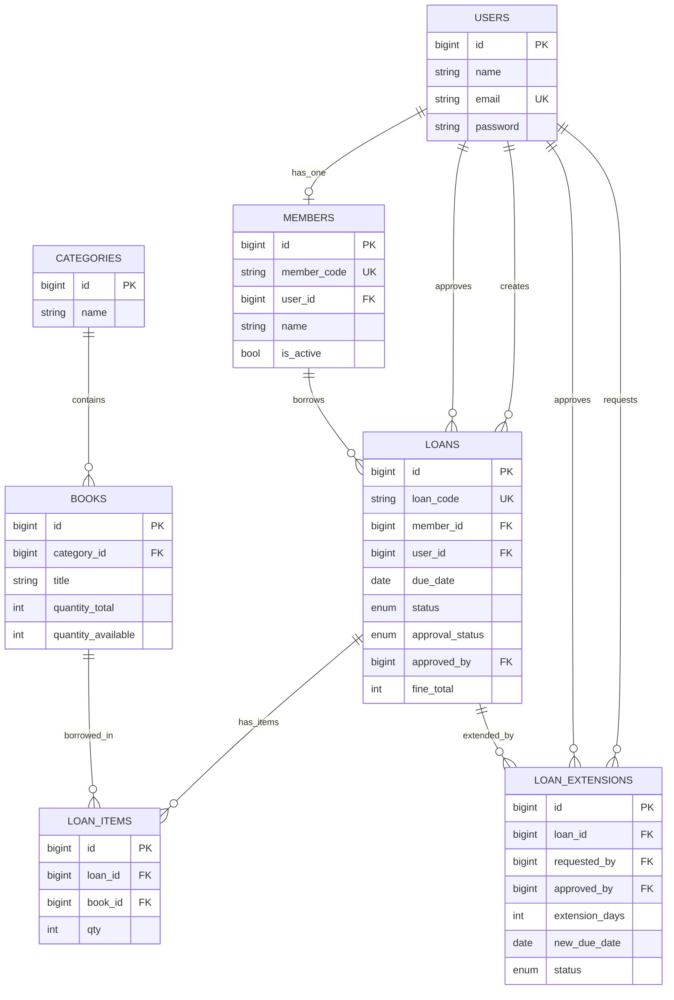
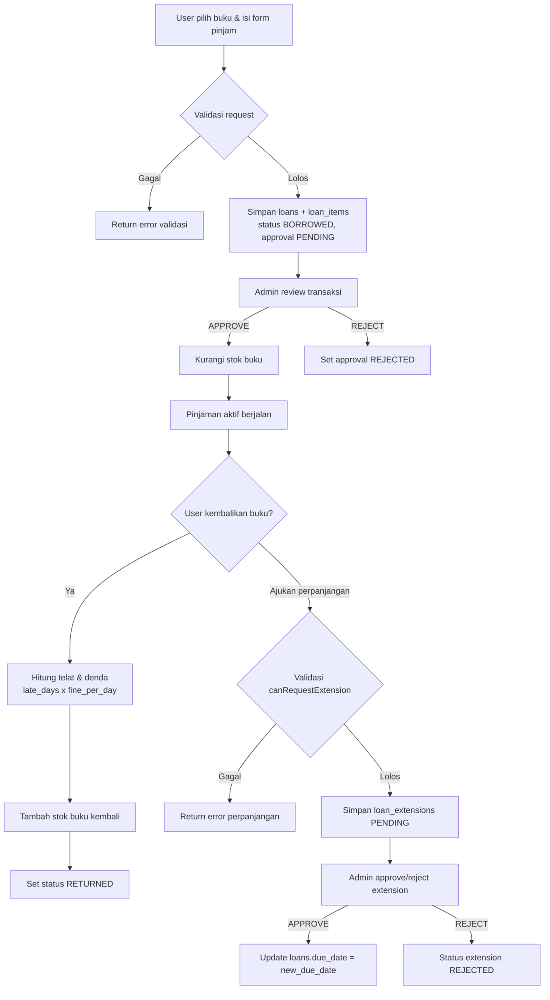

# Sistem Informasi Perpustakaan (Laravel)

Dokumentasi ini menjelaskan **alur sistem**, **desain database**, **model**, **controller**, **library yang digunakan**, dan **fitur utama** pada project `perpus`.

---

## 1. Gambaran Umum

Aplikasi ini adalah sistem perpustakaan berbasis Laravel dengan 2 peran utama:

-   **Admin**: mengelola master data, persetujuan peminjaman/perpanjangan, laporan PDF, serta konfigurasi aplikasi.
-   **User (anggota)**: registrasi/login, melihat katalog, meminjam buku, mengembalikan buku, dan mengajukan perpanjangan.

Konsep utama sistem peminjaman:

1. User membuat transaksi peminjaman.
2. Status approval awal: `PENDING`.
3. Admin `APPROVE` atau `REJECT`.
4. Stok buku **hanya dikurangi saat APPROVE**.
5. Saat pengembalian, stok dikembalikan dan denda dihitung jika terlambat.

---

## 2. Tech Stack & Library

### Backend

-   **Laravel Framework 12**
-   **PHP 8.2+**
-   **MySQL/MariaDB**

### Library Composer (Utama)

-   `spatie/laravel-permission`

    -   Manajemen Role & Permission (RBAC).
    -   Digunakan pada middleware seperti `permission:books.index`, `permission:users.edit`, dll.

-   `yajra/laravel-datatables-oracle`

    -   Server-side DataTables (JSON response untuk tabel interaktif).
    -   Dipakai pada modul Users, Roles, Permissions, Categories, Books, Members, Loans.

-   `maatwebsite/excel`

    -   Export template import buku.
    -   Import data buku dari file Excel (`xlsx/xls`) dengan validasi header dan validasi per-baris.

-   `barryvdh/laravel-dompdf`

    -   Export laporan transaksi peminjaman dalam format PDF.

-   `laravel/ui`

    -   Dukungan scaffolding UI/auth berbasis Bootstrap pada ekosistem Laravel.

-   `laravel/tinker`
    -   Tool debugging/interaksi data dari CLI.

### Frontend Build Tools

-   `vite` + `laravel-vite-plugin`
-   `bootstrap` + `@popperjs/core`
-   `tailwindcss`, `postcss`, `autoprefixer`, `sass`
-   `axios`

### Library Dev

-   `phpunit/phpunit` (testing)
-   `laravel/pint` (formatter)
-   `fruitcake/laravel-debugbar` (debug lokal)

---

## 3. Arsitektur Singkat

Pola yang dipakai mengikuti MVC Laravel:

-   **Model (`app/Models`)**

    -   Menangani representasi tabel, relasi, fillable, cast, dan helper domain tertentu (misal generate kode).

-   **Controller (`app/Http/Controllers`)**

    -   Menangani alur request, validasi, authorization role/permission, transaksi database, dan response view/JSON.

-   **Migration (`database/migrations`)**
    -   Mendefinisikan skema tabel, foreign key, enum status, unique key, default value.

---

## 4. Desain Database (Tabel & Relasi)

## 4.1 Entitas Inti

### `users`

-   Data akun login.
-   Kolom utama: `name`, `email (unique)`, `password`.

### `members`

-   Profil anggota perpustakaan.
-   Relasi 1:1 ke `users` melalui `user_id`.
-   Kolom penting:
    -   `member_code (unique)`
    -   `class`, `type` (`student|teacher`), `phone`, `address`
    -   `is_active` (default `true`)

### `categories`

-   Master kategori buku (`name`).

### `books`

-   Data buku dan stok.
-   FK: `category_id -> categories.id`.
-   Kolom penting:
    -   bibliografi: `isbn`, `title`, `author`, `publisher`, `year`
    -   lokasi: `rack_location`
    -   stok: `quantity_total`, `quantity_available`
    -   media: `cover_path`

### `loans`

-   Header transaksi peminjaman.
-   FK:
    -   `member_id -> members.id`
    -   `user_id -> users.id` (pemilik transaksi)
    -   `approved_by -> users.id` (admin approver, nullable)
-   Kolom penting:
    -   `loan_code (unique)`
    -   tanggal: `loaned_at`, `due_date`, `returned_at`
    -   status transaksi: `status` (`BORROWED|RETURNED`)
    -   status persetujuan: `approval_status` (`PENDING|APPROVED|REJECTED`)
    -   `approved_at`, `approval_note`, `fine_total`

### `loan_items`

-   Detail item buku dalam satu transaksi peminjaman.
-   FK:
    -   `loan_id -> loans.id`
    -   `book_id -> books.id`
-   Kolom: `qty`.

### `loan_extensions`

-   Request perpanjangan masa pinjam.
-   FK:
    -   `loan_id -> loans.id`
    -   `requested_by -> users.id`
    -   `approved_by -> users.id` (nullable)
-   Kolom penting:
    -   `extension_days`
    -   `new_due_date`
    -   `status` (`PENDING|APPROVED|REJECTED`)
    -   `reason`, `admin_note`, `approved_at`

### `setting_apps`

-   Konfigurasi aplikasi (single row setting).
-   Kolom:
    -   `name_app`, `short_cut_app`, `image`
    -   `fine_per_day` (default 1000)
    -   `extension_days` (default 7)

---

## 4.2 Tabel RBAC (Spatie Permission)

Library `spatie/laravel-permission` membuat tabel:

-   `permissions`
-   `roles`
-   `model_has_permissions`
-   `model_has_roles`
-   `role_has_permissions`

Seeder default membuat role:

-   `admin`
-   `user`

Admin mendapat seluruh permission, user mendapat permission terbatas sesuai kebutuhan modul user.

---

## 4.3 Ringkasan Relasi

-   `User` **hasOne** `Member`
-   `Member` **belongsTo** `User`
-   `Category` **hasMany** `Book`
-   `Book` **belongsTo** `Category`
-   `Member` **hasMany** `Loan`
-   `Loan` **belongsTo** `Member`
-   `Loan` **belongsTo** `User` (creator)
-   `Loan` **belongsTo** `User` (approvedBy via `approved_by`)
-   `Loan` **hasMany** `LoanItem`
-   `LoanItem` **belongsTo** `Loan`
-   `LoanItem` **belongsTo** `Book`
-   `Loan` **hasMany** `LoanExtension`
-   `LoanExtension` **belongsTo** `Loan`
-   `LoanExtension` **belongsTo** `User` (requestedBy)
-   `LoanExtension` **belongsTo** `User` (approvedBy)

## 4.4 Diagram ERD (Mermaid)

---

## 5. Desain Model (Ringkas per Model)

### `App\Models\User`

-   Extend `Authenticatable`.
-   Trait: `HasRoles` (Spatie), `HasFactory`, `Notifiable`.
-   Relasi: `member()`.

### `App\Models\Member`

-   Fillable profil anggota.
-   Relasi: `user()`, `loans()`.
-   Logic domain: `generateNextMemberCode()` menghasilkan format `MBR-0001`.

### `App\Models\Category`

-   Master kategori.
-   Relasi: `books()`.

### `App\Models\Book`

-   Fillable bibliografi + stok.
-   Relasi: `category()`, `loanItems()`.

### `App\Models\Loan`

-   Fillable transaksi + approval.
-   Cast date/datetime.
-   Relasi: `member()`, `user()`, `approvedBy()`, `loanItems()`, `extensions()`.
-   Logic domain: `generateLoanCode()` dengan format `LN-0001`.

### `App\Models\LoanItem`

-   Detail buku dalam transaksi.
-   Relasi: `loan()`, `book()`.

### `App\Models\LoanExtension`

-   Data request perpanjangan.
-   Relasi: `loan()`, `requestedBy()`, `approvedBy()`.
-   Logic domain: `canRequestExtension($loanId)` dengan aturan:
    -   pinjaman harus `BORROWED`
    -   masih dalam window keterlambatan maksimum
    -   maksimal 2 kali extension disetujui per transaksi

### `App\Models\SettingApp`

-   Menyimpan konfigurasi global (nama app, logo, denda/hari, default extension days).

> Catatan: `Transaction` model ada di repository namun belum menjadi bagian alur utama perpustakaan saat ini.

---

## 6. Desain Controller & Tanggung Jawab

### `AuthController`

-   Login (`authenticate`) dengan validasi email/password.
-   Register (`register`):
    -   buat `User`
    -   assign role `user`
    -   buat `Member`
    -   dibungkus `DB::transaction()`
-   Logout dan reset session.

### `HomeController`

-   Dashboard dinamis berdasar role:
    -   `admin`: statistik sistem (buku, member, pinjaman, denda, approval, stok menipis, dll)
    -   `user`: ringkasan pinjaman aktif dan histori pinjaman pribadi

### `PermissionsController`, `RoleController`, `UserController`

-   CRUD RBAC (permission, role, user).
-   Integrasi DataTables untuk listing.
-   `UserController` mengelola assign role user.

### `CategoryController`

-   CRUD kategori buku.
-   Proteksi middleware permission dan listing DataTables.

### `BookController`

-   CRUD buku + upload cover.
-   Katalog buku untuk role `user` (`catalog`).
-   Import buku via Excel (`import`) dengan:
    -   validasi tipe file
    -   validasi header template
    -   validasi setiap baris
    -   transaksi DB saat insert
-   Export template import (`downloadImportTemplate`).

### `MemberController`

-   Menampilkan data member (read-only di modul ini).

### `LoanController`

-   `index`: daftar pinjaman (admin semua, user milik sendiri).
-   `create/store`: user membuat pinjaman (status approval `PENDING`).
-   `approve/reject`: admin proses persetujuan.
-   `returnLoan`: proses pengembalian + hitung denda + restore stok.
-   `exportPdf`: export laporan PDF dengan filter status, approval, dan rentang tanggal.
-   `destroy`: hapus pinjaman `PENDING` (admin only).

### `LoanExtensionController`

-   User:
    -   list request sendiri (`index`)
    -   form request (`create`)
    -   submit request (`store`)
-   Admin:
    -   list request pending (`adminIndex`)
    -   approve/reject request
-   Saat approve extension: `due_date` pada `loans` diperbarui.

### `SettingAppController`

-   Manajemen pengaturan aplikasi (nama, shortcut, logo, denda/hari, default extension).
-   Aturan data tunggal (single setting row).

### `ErrorTestController`

-   Endpoint testing halaman error sesuai kode HTTP (khusus saat `APP_DEBUG=true`).

---

## 7. Alur Bisnis Utama

## 7.1 Alur Registrasi

1. User isi form register.
2. Sistem validasi input.
3. Sistem membuat akun `users`.
4. Sistem assign role `user`.
5. Sistem membuat data `members` otomatis.
6. User login otomatis dan diarahkan ke `/home`.

## 7.2 Alur Peminjaman Buku

1. User memilih buku (katalog) dan membuat transaksi.
2. Sistem validasi:
    - member aktif
    - maksimal 5 pinjaman aktif
    - tidak ada duplikasi judul dalam satu transaksi
    - stok tersedia
3. Sistem simpan `loans` (`approval_status=PENDING`) + `loan_items`.
4. Admin review:
    - **APPROVE**: stok buku dikurangi sesuai `qty`.
    - **REJECT**: tidak ada perubahan stok.

## 7.3 Alur Pengembalian Buku

1. Pengembalian hanya untuk pinjaman `APPROVED` dan `BORROWED`.
2. Sistem hitung keterlambatan terhadap `due_date`.
3. Denda dihitung: `late_days * fine_per_day`.
4. Stok buku dikembalikan (`quantity_available` bertambah).
5. Status pinjaman menjadi `RETURNED`.

## 7.4 Alur Perpanjangan Peminjaman

1. User ajukan extension pada pinjaman miliknya.
2. Sistem cek kelayakan via `LoanExtension::canRequestExtension()`.
3. Request disimpan `PENDING`.
4. Admin `APPROVE/REJECT`:
    - jika approve, `loans.due_date` diupdate ke `new_due_date`.

## 7.5 Alur Laporan PDF

1. Admin/user memanggil endpoint export PDF.
2. Filter opsional:
    - status transaksi (`BORROWED/RETURNED`)
    - status approval (`PENDING/APPROVED/REJECTED`)
    - rentang tanggal pinjam
3. Sistem generate PDF via DomPDF.

## 7.6 Diagram Alur Proses (Mermaid)

---

## 8. Fitur Aplikasi (Checklist)

-   [x] Autentikasi login/register/logout.
-   [x] Role & Permission berbasis Spatie.
-   [x] Dashboard admin dan dashboard user.
-   [x] CRUD Users, Roles, Permissions.
-   [x] CRUD Kategori buku.
-   [x] CRUD Buku + upload cover.
-   [x] Katalog buku untuk user.
-   [x] Import buku dari Excel + template import.
-   [x] Manajemen data member.
-   [x] Transaksi peminjaman multi-item.
-   [x] Approval pinjaman oleh admin.
-   [x] Pengembalian buku + perhitungan denda.
-   [x] Perpanjangan peminjaman + approval admin.
-   [x] Export laporan pinjaman ke PDF.
-   [x] Pengaturan aplikasi (logo, nama, denda/hari, default extension).

---

## 9. Route Utama

### Public

-   `/login`, `/register`

### Protected (`auth`)

-   `/home`
-   `/settings`
-   `/catalog`
-   Resource: `/users`, `/roles`, `/permissions`, `/categories`, `/books`
-   `/members`
-   `/loans` + action approve/reject/return/export pdf
-   `/loan-extensions` + admin endpoint approval

---

## 10. Seeder Default

Seeder yang dijalankan:

-   `PermissionTableSeeder`
-   `RoleTableSeeder`
-   `UserTableSeeder`

Default akun admin:

-   Email: `admin@gmail.com`
-   Password: `123456`

---

## 11. Instalasi & Menjalankan Project

## 11.1 Prasyarat

-   PHP 8.2+
-   Composer 2+
-   Node.js 18+
-   MySQL/MariaDB

## 12. Catatan Implementasi Penting

-   Stok buku tidak langsung berkurang saat user membuat transaksi, melainkan saat admin approve.
-   Semua operasi kritikal (register + pembuatan member, import buku, approve pinjaman) menggunakan validasi dan/atau transaksi database.
-   Nilai denda per hari dan default durasi perpanjangan bersumber dari tabel `setting_apps`.
