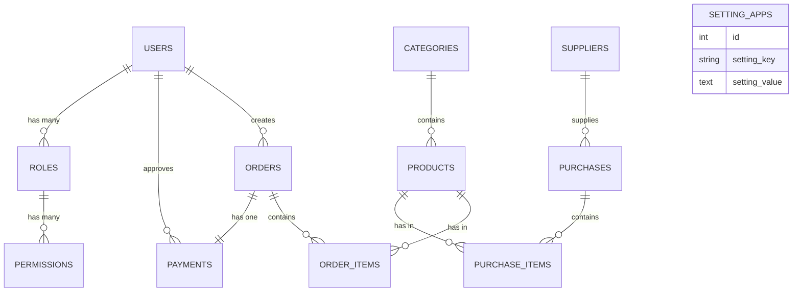

# Sistem Informasi Point of Sale (POS) - Smart Toko (Laravel)

Dokumentasi ini menjelaskan **alur sistem**, **desain database**, **model**, **controller**, **library yang digunakan**, dan **fitur utama** pada project `smart-toko`.

---

## 1. Gambaran Umum

Aplikasi Smart Toko adalah sistem **Point of Sale (POS)** berbasis Laravel yang dirancang untuk mengelola:

-   **Manajemen Produk**: CRUD produk dengan kategori, harga, dan stok
-   **Manajemen Pembelian**: Transaksi pembelian dari supplier dengan tracking stok
-   **Kasir (POS)**: Interface kasir yang user-friendly dengan keranjang belanja real-time
-   **Manajemen Pembayaran**: Dukungan metode pembayaran (Tunai & Transfer Bank)
-   **Laporan Penjualan**: Dashboard laporan dengan chart dan export PDF
-   **Manajemen User & Role**: RBAC (Role-Based Access Control) berbasis Spatie Permission
-   **Pengaturan Aplikasi**: Konfigurasi global seperti nama toko, logo, dll

### Konsep Utama Sistem

Sistem Smart Toko mengikuti alur bisnis POS tradisional dengan tambahan fitur approval pembayaran:

```
Produk → Pembelian → Kasir → Keranjang Belanja → Checkout → Pembayaran → Laporan
```

---

## 2. Tech Stack & Library

### Backend

-   **Laravel Framework 11**
-   **PHP 8+**
-   **MySQL/MariaDB**

### Library Composer (Utama)

#### `spatie/laravel-permission`

-   Manajemen Role & Permission (RBAC).
-   Tabel: `permissions`, `roles`, `model_has_permissions`, `model_has_roles`, `role_has_permissions`.
-   Digunakan pada middleware seperti `permission:products.index`, `permission:orders.create`, dll.
-   Default roles: `admin`, `user`.

#### `yajra/laravel-datatables-oracle`

-   Server-side DataTables untuk tabel interaktif dengan JSON response.
-   Dipakai pada: Users, Roles, Permissions, Categories, Products, Suppliers, Purchases, Orders.
-   Fitur: Search, Sort, Pagination, Custom Columns.

#### `barryvdh/laravel-dompdf`

-   Export laporan transaksi penjualan ke PDF.
-   Digunakan untuk: Daily Report, Hourly Report, Sales Report.

### Frontend Build Tools

-   **Vite** + `laravel-vite-plugin`
-   **Bootstrap 4.6** + `@popperjs/core`
-   **jQuery 3.6**
-   **Chart.js 3.9.1** (untuk dashboard reports)
-   **FontAwesome 5**
-   **SweetAlert2** (notifikasi interaktif)
-   **Axios** (AJAX requests)

### Library Dev

-   `phpunit/phpunit` (testing)
-   `laravel/debugbar` (debug lokal)
-   `laravel/pint` (formatter)

---

## 3. Arsitektur Singkat

Pola yang dipakai mengikuti **MVC (Model-View-Controller)** Laravel:

### Model (`app/Models`)

-   Representasi tabel database
-   Relasi antar model
-   Fillable array & attribute casting
-   Helper methods (e.g., generate invoice number)

### Controller (`app/Http/Controllers`)

-   Menangani alur request & response
-   Validasi input & authorization
-   Transaksi database & business logic
-   Response view atau JSON (untuk AJAX)

### Migration (`database/migrations`)

-   Mendefinisikan skema tabel
-   Foreign key & constraint
-   Enum status & default values
-   Indexing untuk performa

### Views (`resources/views`)

-   Blade template untuk UI
-   Modal bootstrap untuk CRUD
-   Form handling dengan CSRF protection
-   DataTables widget untuk tabel

### Routes (`routes/web.php`)

-   Resource controllers untuk CRUD
-   Custom routes untuk aksi khusus (e.g., `/orders/{order}/confirm-payment`)
-   Grouping dengan middleware auth & permission

---

## 4. Desain Database (Tabel & Relasi)

### 4.1 Tabel Inti Sistem

#### `users` (Pengguna Sistem)

```
- id (Primary Key)
- name (string)
- email (string, unique)
- email_verified_at (timestamp, nullable)
- password (string)
- remember_token (string, nullable)
- created_at, updated_at (timestamps)
```

**Relasi**: HasMany `orders` (sebagai creator), HasMany `payments` (sebagai approvedBy).

#### `categories` (Kategori Produk)

```
- id (Primary Key)
- name (string)
- slug (string, unique)
- description (text, nullable)
- status (enum: active, inactive)
- created_at, updated_at (timestamps)
```

**Relasi**: HasMany `products`.

#### `products` (Produk Toko)

```
- id (Primary Key)
- category_id (Foreign Key → categories.id)
- name (string, unique)
- price (decimal: 10,2)
- stock (integer, default: 0)
- image (string, nullable)
- status (enum: active, inactive)
- created_at, updated_at (timestamps)
```

**Relasi**: BelongsTo `category`, HasMany `order_items`, HasMany `purchase_items`.

#### `suppliers` (Supplier Pembelian)

```
- id (Primary Key)
- name (string)
- phone (string, nullable)
- email (string, nullable)
- address (text, nullable)
- city (string, nullable)
- status (enum: active, inactive)
- created_at, updated_at (timestamps)
```

**Relasi**: HasMany `purchases`.

#### `purchases` (Transaksi Pembelian)

```
- id (Primary Key)
- supplier_id (Foreign Key → suppliers.id)
- purchase_date (date)
- purchase_number (string, unique)
- total_amount (decimal: 12,2)
- notes (text, nullable)
- status (enum: pending, received)
- created_at, updated_at (timestamps)
```

**Relasi**: BelongsTo `supplier`, HasMany `purchase_items`.

#### `purchase_items` (Detail Item Pembelian)

```
- id (Primary Key)
- purchase_id (Foreign Key → purchases.id)
- product_id (Foreign Key → products.id)
- quantity (integer)
- price (decimal: 10,2)
- subtotal (decimal: 12,2)
- created_at, updated_at (timestamps)
```

**Relasi**: BelongsTo `purchase`, BelongsTo `product`.

#### `orders` (Transaksi Penjualan)

```
- id (Primary Key)
- user_id (Foreign Key → users.id, creator)
- invoice_number (string, unique)
- total_amount (decimal: 12,2)
- status (enum: pending, completed, cancelled)
- notes (text, nullable)
- created_at, updated_at (timestamps)
```

**Relasi**: BelongsTo `user`, HasMany `order_items`, HasOne `payment`.

#### `order_items` (Detail Item Penjualan)

```
- id (Primary Key)
- order_id (Foreign Key → orders.id)
- product_id (Foreign Key → products.id)
- quantity (integer)
- price (decimal: 10,2)
- subtotal (decimal: 12,2)
- created_at, updated_at (timestamps)
```

**Relasi**: BelongsTo `order`, BelongsTo `product`.

#### `payments` (Info Pembayaran Penjualan)

```
- id (Primary Key)
- order_id (Foreign Key → orders.id, unique)
- payment_method (enum: cash, transfer)
- payment_status (enum: pending, paid)
- paid_amount (decimal: 12,2, nullable)
- change_amount (decimal: 12,2, nullable)
- approved_by (integer, Foreign Key → users.id, nullable)
- approved_at (timestamp, nullable)
- created_at, updated_at (timestamps)
```

**Relasi**: BelongsTo `order`, BelongsTo `user` (approvedBy).

#### `setting_apps` (Pengaturan Aplikasi Global)

```
- id (Primary Key)
- setting_key (string, unique)
- setting_value (text, nullable)
- created_at, updated_at (timestamps)
```

**Contoh data**: `app_name`, `app_logo`, `cashier_name`, dll.

### 4.2 Tabel RBAC (Spatie Permission)

Library `spatie/laravel-permission` otomatis membuat:

-   `permissions` - Daftar permission (e.g., `products.index`, `orders.create`)
-   `roles` - Role (e.g., `admin`, `user`)
-   `model_has_permissions` - Relasi users dengan permission langsung
-   `model_has_roles` - Relasi users dengan roles
-   `role_has_permissions` - Relasi roles dengan permission

**Default Roles:**

-   `admin` - Semua akses
-   `user` - Akses terbatas (kasir, lihat laporan)

**Default Permissions** (dibuat oleh seeder):

-   `users.index`, `users.create`, `users.edit`, `users.delete`
-   `roles.index`, `roles.create`, `roles.edit`, `roles.delete`
-   `permissions.index`
-   `categories.index`, `categories.create`, `categories.edit`, `categories.delete`
-   `products.index`, `products.create`, `products.edit`, `products.delete`
-   `suppliers.index`, `suppliers.create`, `suppliers.edit`, `suppliers.delete`
-   `purchases.index`, `purchases.create`, `purchases.edit`, `purchases.delete`
-   `orders.index`, `orders.create`, `orders.edit`, `orders.delete`
-   `settings.index`, `settings.edit`
-   `reports.index`

### 4.3 Ringkasan Relasi

```
User
  ├─ HasMany orders (creator)
  ├─ HasMany payments (approvedBy)
  ├─ ManyToMany roles
  └─ ManyToMany permissions

Category
  └─ HasMany products

Product
  ├─ BelongsTo category
  ├─ HasMany order_items
  └─ HasMany purchase_items

Supplier
  └─ HasMany purchases

Purchase
  ├─ BelongsTo supplier
  └─ HasMany purchase_items

PurchaseItem
  ├─ BelongsTo purchase
  └─ BelongsTo product

Order
  ├─ BelongsTo user (creator)
  ├─ HasMany order_items
  └─ HasOne payment

OrderItem
  ├─ BelongsTo order
  └─ BelongsTo product

Payment
  ├─ BelongsTo order
  └─ BelongsTo user (approvedBy)
```

### 4.4 Diagram ERD (Mermaid)



---

## 5. Desain Model (Detail per Model)

### Model `User` (`app/Models/User.php`)

```php
protected $fillable = ['name', 'email', 'password'];
protected $hidden = ['password', 'remember_token'];

// Relation
public function orders() { return $this->hasMany(Order::class); }
public function payments() { return $this->hasMany(Payment::class, 'approved_by'); }

// Permission traits (dari Spatie)
// Methods: hasPermissionTo(), hasRole(), assign roles/permissions
```

### Model `Category` (`app/Models/Category.php`)

```php
protected $fillable = ['name', 'slug', 'description', 'status'];

public function products() { return $this->hasMany(Product::class); }
```

### Model `Product` (`app/Models/Product.php`)

```php
protected $fillable = ['category_id', 'name', 'price', 'stock', 'image', 'status'];

public function category() { return $this->belongsTo(Category::class); }
public function orderItems() { return $this->hasMany(OrderItem::class); }
public function purchaseItems() { return $this->hasMany(PurchaseItem::class); }
```

### Model `Supplier` (`app/Models/Supplier.php`)

```php
protected $fillable = ['name', 'phone', 'email', 'address', 'city', 'status'];

public function purchases() { return $this->hasMany(Purchase::class); }
```

### Model `Purchase` (`app/Models/Purchase.php`)

```php
protected $fillable = ['supplier_id', 'purchase_date', 'purchase_number', 'total_amount', 'notes', 'status'];

public function supplier() { return $this->belongsTo(Supplier::class); }
public function items() { return $this->hasMany(PurchaseItem::class); }
```

### Model `PurchaseItem` (`app/Models/PurchaseItem.php`)

```php
protected $fillable = ['purchase_id', 'product_id', 'quantity', 'price', 'subtotal'];

public function purchase() { return $this->belongsTo(Purchase::class); }
public function product() { return $this->belongsTo(Product::class); }
```

### Model `Order` (`app/Models/Order.php`)

```php
protected $fillable = ['user_id', 'invoice_number', 'total_amount', 'status', 'notes'];

public function user() { return $this->belongsTo(User::class); }
public function items() { return $this->hasMany(OrderItem::class); }
public function payment() { return $this->hasOne(Payment::class); }

// Helper method
public static function generateInvoiceNumber() {
    $date = now()->format('Ymd');
    $count = Order::whereDate('created_at', now())->count();
    return 'INV-' . $date . '-' . str_pad($count + 1, 4, '0', STR_PAD_LEFT);
}
```

### Model `OrderItem` (`app/Models/OrderItem.php`)

```php
protected $fillable = ['order_id', 'product_id', 'quantity', 'price', 'subtotal'];

public function order() { return $this->belongsTo(Order::class); }
public function product() { return $this->belongsTo(Product::class); }
```

### Model `Payment` (`app/Models/Payment.php`)

```php
protected $fillable = ['order_id', 'payment_method', 'payment_status', 'paid_amount', 'change_amount', 'approved_by', 'approved_at'];
protected $casts = ['approved_at' => 'datetime'];

public function order() { return $this->belongsTo(Order::class); }
public function approvedBy() { return $this->belongsTo(User::class, 'approved_by'); }
```

### Model `SettingApp` (`app/Models/SettingApp.php`)

```php
protected $table = 'setting_apps';
protected $fillable = ['setting_key', 'setting_value'];
```

---

## 6. Desain Controller & Tanggung Jawab

### `UserController` - Manajemen User

| Method      | Tanggung Jawab                        |
| ----------- | ------------------------------------- |
| `index()`   | Tampil daftar users dengan DataTables |
| `create()`  | Tampil form buat user                 |
| `store()`   | Validasi & simpan user baru           |
| `edit()`    | Tampil form edit user                 |
| `update()`  | Validasi & update user                |
| `destroy()` | Hapus user & revoke semua role        |

**Middleware**: `permission:users.index|create|edit|delete`

---

### `CategoryController` - Manajemen Kategori Produk

| Method      | Tanggung Jawab               |
| ----------- | ---------------------------- |
| `index()`   | DataTables kategori          |
| `store()`   | Buat kategori (modal AJAX)   |
| `update()`  | Update kategori (modal AJAX) |
| `destroy()` | Hapus kategori               |

**Middleware**: `permission:categories.*`

---

### `ProductController` - Manajemen Produk

| Method      | Tanggung Jawab                                                          |
| ----------- | ----------------------------------------------------------------------- |
| `index()`   | DataTables produk dengan cover image preview                            |
| `create()`  | Form buat produk (modal)                                                |
| `store()`   | Validasi & simpan produk + upload image ke `/storage/uploads/products/` |
| `edit()`    | Form edit produk                                                        |
| `update()`  | Update produk & handle image replacement                                |
| `destroy()` | Hapus produk & file image lama                                          |

**Validasi**:

-   `category_id`: required, exists in categories
-   `name`: required, unique on products
-   `price`: required, numeric, min 0
-   `stock`: required, integer, min 0
-   `image`: nullable, image mimes, max 2MB
-   `status`: required, in (active/inactive)

**Image Storage**: Produk image disimpan di `public/storage/uploads/products/` dengan naming `{timestamp}-{original_filename}`.

---

### `SupplierController` - Manajemen Supplier

| Method      | Tanggung Jawab      |
| ----------- | ------------------- |
| `index()`   | DataTables supplier |
| `store()`   | Buat supplier       |
| `update()`  | Update supplier     |
| `destroy()` | Hapus supplier      |

---

### `PurchaseController` - Manajemen Pembelian dari Supplier

| Method      | Tanggung Jawab                                                   |
| ----------- | ---------------------------------------------------------------- |
| `index()`   | DataTables pembelian dengan purchase_number                      |
| `create()`  | Form buat pembelian dengan item selection                        |
| `store()`   | Validasi & simpan purchase + purchase_items + update stok produk |
| `show()`    | Detail pembelian                                                 |
| `destroy()` | Hapus pembelian & restore stok                                   |

**Business Logic**: Stok produk **bertambah** saat purchase di-approve (atau saat create, tergantung implementasi).

---

### `OrderController` - Manajemen Penjualan & Kasir

| Method             | Tanggung Jawab                                                       |
| ------------------ | -------------------------------------------------------------------- |
| `pos()`            | Tampil interface kasir dengan product grid                           |
| `addToCart()`      | AJAX POST: tambah item ke session cart                               |
| `removeFromCart()` | AJAX POST: hapus item dari session cart                              |
| `checkout()`       | Simpan order + order_items + payment dalam DB transaction            |
| `receipt()`        | Tampil receipt dengan payment status                                 |
| `index()`          | DataTables orders + status                                           |
| `confirmPayment()` | PUT endpoint: admin approve transfer payment (payment_status → paid) |

**Session Cart Structure**:

```php
session('cart') = [
    [
        'product_id' => 1,
        'name' => 'Air Mineral 1.5L',
        'price' => 5000,
        'quantity' => 2,
        'subtotal' => 10000
    ],
    // ...
];
```

**Payment Methods**:

-   `cash` → Pembayaran langsung, `payment_status` = `paid`
-   `transfer` → Pembayaran pending, `payment_status` = `pending`, butuh approval admin

---

### `ReportController` - Laporan & Dashboard

| Method                 | Tanggung Jawab                                              |
| ---------------------- | ----------------------------------------------------------- |
| `dashboard()`          | Dashboard dengan chart revenue, top products, recent orders |
| `dailyReport()`        | Laporan harian: total transaksi, revenue                    |
| `hourlyReport()`       | Breakdown per jam                                           |
| `monthlySalesReport()` | Chart penjualan per bulan                                   |
| `exportPdf()`          | Export laporan ke PDF dengan filter                         |

**Fitur Report**:

-   Filter by date range
-   Chart.js 3.9.1 untuk visualisasi
-   Export PDF via DomPDF

---

### `SettingController` - Pengaturan Aplikasi

| Method     | Tanggung Jawab         |
| ---------- | ---------------------- |
| `index()`  | Tampil form pengaturan |
| `update()` | Update setting_apps    |

**Contoh setting**: `app_name`, `app_logo`, `cashier_name`, `tax_rate`, dll.

---

## 7. Alur Bisnis Utama

### 7.1 Alur Login & Autentikasi

```
User visit /login
    ↓
Input email & password
    ↓
Validasi credentials
    ↓
Session created + redirect to /home atau dashboard
```

---

### 7.2 Alur Manajemen Produk

```
Admin visit /products
    ↓
Lihat list produk via DataTables
    ↓
Klik Create / Edit / Delete modal
    ↓
Form validation:
    - Category harus ada
    - Nama produk unik
    - Harga & stok numeric
    - Image optional, max 2MB
    ↓
Simpan / Update / Hapus produk
    ↓
Redirect dengan success message
```

---

### 7.3 Alur Pembelian dari Supplier

```
Admin visit /purchases
    ↓
Klik Create Purchase
    ↓
Select Supplier
    ↓
Add multiple items (Product + Quantity + Price)
    ↓
System hitung total
    ↓
Simpan Purchase
    ↓
Update stok produk (+quantity untuk masing-masing item)
    ↓
Generate purchase_number (e.g., PO-20260323-0001)
```

---

### 7.4 Alur Kasir (POS) - Flowchart Penjualan

```mermaid
flowchart TD
    A["Kasir buka /orders/pos"] --> B["Tampil product grid dari DB"]
    B --> C["Kasir search/filter produk"]
    C --> D["Kasir klik produk → modal edit qty"]
    D --> E["Submit qty"]
    E --> F["AJAX POST /orders/add-to-cart"]
    F --> G["Server validasi product_id & qty"]
    G --> G1{Valid?}
    G1 -->|No| G2["Return JSON error"]
    G1 -->|Yes| G3["Update session cart"]
    G3 --> G4["Return JSON cart updated"]
    G4 --> H["Frontend update cart sidebar"]
    H --> I{Lanjut belanja?}
    I -->|Yes| D
    I -->|No| J["Kasir review cart"]
    J --> K["Select payment method"]
    K --> K1{Cash atau Transfer?}
    K1 -->|Cash| K2["Input paid_amount"]
    K2 --> K3["System hitung change"]
    K1 -->|Transfer| K4["Auto-fill paid_amount = total"]
    K3 --> L["Klik Checkout"]
    K4 --> L
    L --> M["POST /orders/checkout"]
    M --> N["Server validasi payment"]
    N --> O["DB Transaction begin"]
    O --> P["Create Order"]
    P --> Q["Create OrderItems"]
    Q --> R["Create Payment"]
    R --> R1{Payment method?}
    R1 -->|Cash| R2["payment_status = paid"]
    R1 -->|Transfer| R3["payment_status = pending"]
    R2 --> S["Decrease product stock"]
    R3 --> S
    S --> T["Transaction commit"]
    T --> U["Clear session cart"]
    U --> V["Redirect /orders/{order}/receipt"]
    V --> W["Show receipt"]
    W --> W1{Transfer pending?}
    W1 -->|Yes| W2["Show 'Waiting approval' badge"]
    W1 -->|No| W3["Show 'Paid' badge"]
    W2 --> X["Admin review /orders"]
    X --> X1["See 'Confirm Payment' button"]
    X1 --> X2["Click button → PUT /orders/{order}/confirm-payment"]
    X2 --> X3["Update payment_status → paid"]
    X3 --> X4["Update approved_by & approved_at"]
```



---

### 7.5 Alur Pembayaran Transfer (Payment Confirmation)

```
1. Kasir pilih payment method = "Transfer" pada POS
2. Sistem auto-fill paid_amount = total_amount
3. Kasir submit checkout
4. Payment di-buat dengan payment_status = "pending"
5. Receipt ditampilkan dengan badge "Waiting for approval"

6. Admin/owner klik "Konfirmasi Pembayaran" di orders list
7. Admin lihat payment details
8. Admin klik "Approve" button
9. PUT /orders/{order}/confirm-payment
10. Payment.payment_status → "paid"
11. Update Payment.approved_by = auth()->id()
12. Update Payment.approved_at = now()
13. Redirect dengan success message
```

---

### 7.6 Alur Export Laporan PDF

```
User klik Export Report (e.g., Daily Report)
    ↓
Optional filters:
    - Date range
    - Status filter (completed/cancelled)
    - Report type (daily/hourly/monthly)
    ↓
Backend query data Order + Payment
    ↓
Hitung: Total transaksi, Revenue, Best seller, etc
    ↓
Return Blade view untuk PDF
    ↓
DomPDF compile Blade → PDF binary
    ↓
Download file PDF
```

---

## 8. Fitur Aplikasi (Checklist)

-   [x] **Autentikasi**: Login, Register, Logout, Password Reset
-   [x] **Role & Permission**: Berbasis Spatie (RBAC)
-   [x] **Dashboard**: Overview revenue, top products, recent orders
-   [x] **Manajemen User**: CRUD user dengan assign role & permission
-   [x] **Manajemen Role**: CRUD role dengan assign permission
-   [x] **Manajemen Kategori**: CRUD kategori produk
-   [x] **Manajemen Produk**: CRUD produk dengan image upload & stok tracking
-   [x] **Manajemen Supplier**: CRUD supplier
-   [x] **Manajemen Pembelian**: Create purchase order, auto-update stok
-   [x] **Interface Kasir (POS)**:
    -   Grid produk dengan search filter
    -   Real-time cart (AJAX-based)
    -   Keranjang dengan qty adjustment via modal
    -   Payment method selection (Cash/Transfer)
    -   Auto-format Rupiah currency
    -   Smart UI: Hide certain fields based on payment method
-   [x] **Checkout & Order**: Create order + order items + payment atomically
-   [x] **Payment Confirmation**: Admin approval untuk transfer payment
-   [x] **Receipt**: Tampil receipt dengan print-friendly design
-   [x] **Laporan Penjualan**:
    -   Daily Report
    -   Hourly Breakdown
    -   Monthly Sales Chart
    -   PDF Export
-   [x] **Pengaturan Aplikasi**: Logo, nama toko, configurasi global
-   [x] **DataTables**: Semua list view dengan server-side processing
-   [x] **Modal Bootstrap**: Consistent modal UI untuk CRUD

---

## 9. Route Utama

### Public Routes

```php
/login              - Login page
/register           - Register page
/forgot-password    - Forgot password
/reset-password     - Reset password (verify token)
```

### Protected Routes (`auth` middleware)

#### Home & Dashboard

```php
/home               - Home/dashboard
```

#### Resource CRUD

```php
/users              - User management (index, create, store, edit, update, destroy)
/roles              - Role management
/permissions        - Permission listing
/categories         - Category management
/products           - Product management
/suppliers          - Supplier management
/purchases          - Purchase management
```

#### Orders & POS

```php
GET  /orders/pos                      - POS interface
POST /orders/add-to-cart              - AJAX add item to cart
POST /orders/remove-from-cart         - AJAX remove item from cart
POST /orders/checkout                 - Create order & payment
GET  /orders/{order}/receipt          - Show receipt
GET  /orders                          - Orders list
PUT  /orders/{order}/confirm-payment  - Admin approve transfer payment
```

#### Reports

```php
GET  /reports                       - Reports dashboard
GET  /reports/daily                 - Daily report
GET  /reports/hourly                - Hourly breakdown
GET  /reports/monthly               - Monthly sales chart
POST /reports/export-pdf            - Export report to PDF
```

#### Settings

```php
GET  /settings                      - Settings page
PUT  /settings                      - Update settings
```

---

## 10. Seeder Default

Seeder yang dijalankan saat `php artisan migrate:fresh --seed`:

### `PermissionTableSeeder`

Membuat permission untuk setiap module: `users.*`, `roles.*`, `categories.*`, `products.*`, dll.

### `RoleTableSeeder`

Membuat role: `admin`, `user`.

-   `admin` → assign semua permission
-   `user` → assign permission terbatas

### `UserTableSeeder`

Membuat default user:

-   **Admin Account**
    -   Name: `Admin`
    -   Email: `admin@gmail.com`
    -   Password: `123456`
    -   Role: `admin`

### `CategorySeeder`

Membuat kategori default:

-   Makanan & Minuman
-   Elektronik
-   Fashion
-   Kecantikan
-   Rumah Tangga

### `SupplierSeeder`

Membuat beberapa supplier dummy.

### `ProductSeeder`

Membuat 15 produk sample (tanpa barcode) di berbagai kategori dengan stok & harga.

---

## 11. Instalasi & Setup Project

### 11.1 Prasyarat

-   PHP 8.0+
-   Composer 2+
-   Node.js 18+
-   MySQL 5.7+ atau MariaDB

### 11.2 Langkah Instalasi

```bash
# 1. Clone repository
git clone <repo-url>
cd smart-toko

# 2. Install dependencies PHP
composer install

# 3. Install dependencies Node.js
npm install

# 4. Copy .env
cp .env.example .env

# 5. Generate APP_KEY
php artisan key:generate

# 6. Konfigurasi database di .env
DB_HOST=127.0.0.1
DB_PORT=3306
DB_DATABASE=smart_toko
DB_USERNAME=root
DB_PASSWORD=

# 7. Jalankan migration & seeding
php artisan migrate:fresh --seed

# 8. Buat storage symlink (untuk image upload)
php artisan storage:link

# 9. Build frontend assets (Vite)
npm run build

# 10. Untuk development, jalankan Vite dev server
npm run dev

# 11. Jalankan server Laravel
php artisan serve

# 12. Akses aplikasi
http://localhost:8000
```

### 11.3 Login Default

```
Email: admin@gmail.com
Password: 123456
```

---

## 12. Struktur Folder Penting

```
smart-toko/
├── app/
│   ├── Http/
│   │   ├── Controllers/
│   │   │   ├── UserController.php
│   │   │   ├── RoleController.php
│   │   │   ├── CategoryController.php
│   │   │   ├── ProductController.php
│   │   │   ├── SupplierController.php
│   │   │   ├── PurchaseController.php
│   │   │   ├── OrderController.php
│   │   │   ├── ReportController.php
│   │   │   └── SettingController.php
│   │   ├── Middleware/
│   │   └── Requests/
│   └── Models/
│       ├── User.php
│       ├── Category.php
│       ├── Product.php
│       ├── Supplier.php
│       ├── Purchase.php
│       ├── PurchaseItem.php
│       ├── Order.php
│       ├── OrderItem.php
│       ├── Payment.php
│       └── SettingApp.php
├── database/
│   ├── migrations/
│   │   ├── 0001_01_01_000000_create_users_table.php
│   │   ├── 2026_03_23_000001_create_categories_table.php
│   │   ├── 2026_03_23_000002_create_suppliers_table.php
│   │   ├── 2026_03_23_000003_create_products_table.php
│   │   ├── 2026_03_23_000004_create_orders_table.php
│   │   ├── 2026_03_23_000005_create_order_items_table.php
│   │   ├── 2026_03_23_000006_create_payments_table.php
│   │   ├── 2026_03_23_000007_create_purchases_table.php
│   │   └── 2026_03_23_000008_create_purchase_items_table.php
│   └── seeders/
│       ├── PermissionTableSeeder.php
│       ├── RoleTableSeeder.php
│       ├── UserTableSeeder.php
│       ├── CategorySeeder.php
│       ├── SupplierSeeder.php
│       ├── ProductSeeder.php
│       └── DatabaseSeeder.php
├── resources/
│   ├── views/
│   │   ├── layouts/
│   │   │   ├── app.blade.php
│   │   │   └── sidebar.blade.php
│   │   ├── users/
│   │   ├── roles/
│   │   ├── categories/
│   │   ├── products/
│   │   ├── suppliers/
│   │   ├── purchases/
│   │   ├── orders/
│   │   │   ├── pos.blade.php (POS interface)
│   │   │   ├── receipt.blade.php
│   │   │   ├── index.blade.php
│   │   │   └── modals/
│   │   ├── reports/
│   │   └── settings/
│   ├── css/
│   │   ├── app.css
│   │   └── pos.css (POS styling)
│   ├── js/
│   │   ├── app.js
│   │   └── bootstrap.js
│   └── views/
├── routes/
│   ├── web.php (Main routes)
│   └── api.php
├── public/
│   ├── asset/
│   │   ├── css/
│   │   ├── js/
│   │   └── vendor/
│   └── storage/
│       └── uploads/
│           └── products/ (Product images)
├── storage/
│   ├── app/
│   │   ├── public/
│   │   └── private/
│   └── logs/
├── .env.example
├── composer.json
├── package.json
├── vite.config.js
└── phpunit.xml
```

---

## 13. Catatan Implementasi Penting

### 13.1 Manajemen Stok

-   **Pembelian**: Stok produk **berkurang** saat item di-`add-to-cart`, **bertambah** saat pembelian tersimpan di database.
-   **Penjualan**: Stok produk **berkurang** saat order di-checkout (tidak saat add-to-cart, hanya session).

### 13.2 Session Cart

-   Cart disimpan dalam **Laravel session** (dalam-memory, bukan database).
-   Structure: Array of items dengan `product_id`, `name`, `price`, `quantity`, `subtotal`.
-   Diperbarui via AJAX POST endpoints: `/orders/add-to-cart`, `/orders/remove-from-cart`.
-   Dihapus otomatis setelah checkout berhasil.

### 13.3 Validasi & Authorization

-   Semua action check permission via middleware: `permission:resource.action`.
-   Validasi input dilakukan di controller dengan `validate()` atau Form Request.
-   Authorization check via Gate::check() atau `$user->can()`.

### 13.4 Transaksi Database

-   **Checkout** menggunakan DB transaction untuk atomicity:
    ```php
    DB::transaction(function () {
        // Create Order
        // Create OrderItems
        // Create Payment
        // Decrease stock
    });
    ```

### 13.5 Image Upload

-   Produk image disimpan di `public/storage/uploads/products/`.
-   Naming: `{timestamp}-{original_filename}` (e.g., `1711234567-product.jpg`).
-   Validasi: max 2MB, mimes: jpeg, png, jpg, gif.
-   Hapus file lama saat update.

### 13.6 Payment Methods

-   **Cash**: Pembayaran langsung, `payment_status = 'paid'` immediately.
-   **Transfer**: Pembayaran pending, `payment_status = 'pending'`, admin harus approve.

### 13.7 Invoice Number Generation

```php
// Format: INV-YYYYMMDD-0001
Order::generateInvoiceNumber()
```

---

## 14. Frontend JavaScript Key Sections (POS)

File: `resources/views/orders/pos.blade.php`

### Section 1: State & Data

-   `cart` object: Array items dengan product_id, name, price, quantity, subtotal
-   `totalPrice`: Calculated from cart items

### Section 2: Helper Functions

-   `formatRupiah(number)`: Ubah 5000 → "Rp 5.000"
-   `extractNumber(string)`: Ubah "Rp 5.000" → 5000

### Section 3: Server Communication (AJAX)

-   `addToCart(productId, qty)`: POST to `/orders/add-to-cart`
-   `removeFromCart(productId)`: POST to `/orders/remove-from-cart`

### Section 4: UI Updates

-   `updateCartSidebar()`: Refresh sidebar cart display
-   `updateCartModal()`: Refresh modal cart items
-   `updateCartDisplay()`: General cart visual update

### Section 5: Event Handlers

-   Click add product → Open modal qty
-   Submit modal qty → Call addToCart via AJAX
-   Remove button → Call removeFromCart via AJAX
-   Payment method change → Hide/show fields

### Section 6: Payment Logic

-   `handlePaymentMethodChange()`: Toggle UI based on cash/transfer
-   `handleCheckoutSubmit()`: Validate & POST checkout

---

## 15. CSS External File (`pos.css`)

Key styles:

-   `.pos-container`: Bootstrap grid layout kasir
-   `.products-grid`: Auto-fill product cards
-   `.product-card`: Individual product styling
-   `.cart-sidebar`: Right sidebar cart area
-   `.payment-section`: Payment method & amount inputs
-   `.modal-body`: Scrollable modal dengan max-height

---

## 16. Troubleshooting & FAQ

### Q: Error "SQLSTATE[HY000]: General error: 1030"

**A**: Pastikan folder `storage/` writable: `chmod -R 775 storage/`

### Q: Image tidak ditampilkan di product list

**A**: Jalankan `php artisan storage:link` untuk membuat symlink ke `public/storage`.

### Q: Cart items hilang setelah reload page

**A**: Normal! Cart disimpan di session, bukan database. Untuk persist, simpan ke DB.

### Q: Permission denied saat access resource

**A**: Check user role & permission via `php artisan tinker` → `Auth::user()->roles()`.

### Q: Payment still pending, butuh admin approve

**A**: Admin buka `/orders` → lihat "Konfirmasi Pembayaran" button → klik approve.


# Tutorial Transaksi POS - Smart Toko

## 📋 Table of Contents

1. [Penjelasan Alur Transaksi](#penjelasan-alur-transaksi)
2. [Database Schema](#database-schema)
3. [Routes](#routes)
4. [Controller](#controller)
5. [Frontend - HTML Structure](#frontend---html-structure)
6. [Frontend - JavaScript Logic](#frontend---javascript-logic)
7. [API Endpoints](#api-endpoints)
8. [Flow Diagram](#flow-diagram)
9. [Implementation Steps](#implementation-steps)

---

## Penjelasan Alur Transaksi

### 🔄 Proses Transaksi POS

Sistem transaksi POS di Smart Toko menggunakan alur berikut:

1. **Loading Halaman POS**

    - User (Kasir) mengakses `/orders/pos`
    - Controller menampilkan daftar produk yang aktif
    - Cart disimpan di JavaScript object (bukan session)

2. **Menambahkan Produk ke Keranjang**

    - Kasir klik produk
    - AJAX request ke `/orders/add-to-cart`
    - Backend validasi: cek stock produk
    - Response: return data produk
    - Frontend update JS object `cart`

3. **Manajemen Keranjang**

    - Ubah quantity dari tiap item
    - Hapus item dari keranjang
    - Lihat detail keranjang di modal
    - Real-time calculation total

4. **Proses Checkout**

    - Pilih metode pembayaran (Tunai/Transfer)
    - Input jumlah bayar (untuk tunai)
    - Cart items di-serialize menjadi JSON
    - Submit form ke `/orders/checkout`

5. **Backend Processing**

    - Parse JSON cart items
    - Validasi pembayaran
    - Database transaction:
        - Create Order
        - Create OrderItems
        - Update Product Stock
        - Create Payment Record
    - Jika sukses: redirect ke receipt
    - Jika error: rollback & show error message

6. **Receipt**
    - Tampilkan invoice & detail transaksi
    - Opsi print receipt

### 💾 Data Flow

```
Frontend (JavaScript)
    ↓
[addToCart AJAX] → API /orders/add-to-cart → Validasi Stock
    ↓
    Update JS Object (cart)
    ↓
[Checkout Form] → API /orders/checkout → Validasi Payment
    ↓
Database Transactions
    ├─ Create Order
    ├─ Create OrderItems
    ├─ Update Stock
    └─ Create Payment
    ↓
Redirect Receipt
```

---

## Database Schema

### Orders Table

```sql
CREATE TABLE orders (
    id BIGINT UNSIGNED PRIMARY KEY,
    invoice_number VARCHAR(50) UNIQUE,
    customer_id BIGINT UNSIGNED NULL,
    total DECIMAL(15, 2),
    payment_method ENUM('cash', 'transfer'),
    payment_status ENUM('pending', 'paid', 'failed'),
    order_status ENUM('pending', 'completed', 'cancelled'),
    created_by BIGINT UNSIGNED,
    created_at TIMESTAMP,
    updated_at TIMESTAMP
);
```

### OrderItems Table

```sql
CREATE TABLE order_items (
    id BIGINT UNSIGNED PRIMARY KEY,
    order_id BIGINT UNSIGNED,
    product_id BIGINT UNSIGNED,
    qty INT,
    price DECIMAL(12, 2),
    subtotal DECIMAL(15, 2),
    created_at TIMESTAMP,
    updated_at TIMESTAMP,

    FOREIGN KEY (order_id) REFERENCES orders(id),
    FOREIGN KEY (product_id) REFERENCES products(id)
);
```

### Payments Table

```sql
CREATE TABLE payments (
    id BIGINT UNSIGNED PRIMARY KEY,
    order_id BIGINT UNSIGNED,
    method VARCHAR(50),
    paid_amount DECIMAL(15, 2),
    change DECIMAL(15, 2),
    paid_at TIMESTAMP,
    created_at TIMESTAMP,
    updated_at TIMESTAMP,

    FOREIGN KEY (order_id) REFERENCES orders(id)
);
```

---

## Routes

### Web Routes Configuration (`routes/web.php`)

```php
Route::middleware(['auth', 'verified'])->group(function () {
    // POS Routes
    Route::get('/orders/pos', [App\Http\Controllers\OrderController::class, 'pos'])
        ->name('orders.pos');

    Route::post('/orders/add-to-cart', [App\Http\Controllers\OrderController::class, 'addToCart'])
        ->name('orders.addToCart');

    Route::post('/orders/remove-from-cart', [App\Http\Controllers\OrderController::class, 'removeFromCart'])
        ->name('orders.removeFromCart');

    Route::post('/orders/checkout', [App\Http\Controllers\OrderController::class, 'checkout'])
        ->name('orders.checkout');

    Route::get('/orders/{id}/receipt', [App\Http\Controllers\OrderController::class, 'receipt'])
        ->name('orders.receipt');

    Route::get('/orders/{id}/print', [App\Http\Controllers\OrderController::class, 'printReceipt'])
        ->name('orders.print');
});
```

---

## Controller

### OrderController.php

```php
<?php

namespace App\Http\Controllers;

use App\Models\Order;
use App\Models\OrderItem;
use App\Models\Payment;
use App\Models\Product;
use Illuminate\Http\Request;
use Illuminate\View\View;
use Illuminate\Http\JsonResponse;
use Illuminate\Support\Facades\DB;

class OrderController extends Controller
{
    public function __construct()
    {
        $this->middleware('permission:orders.create', ['only' => ['pos', 'addToCart', 'checkout']]);
        $this->middleware('permission:orders.index', ['only' => ['index']]);
    }

    /**
     * Display POS interface for Kasir
     *
     * @return View
     */
    public function pos(): View
    {
        $products = Product::where('status', 'active')->get();
        return view('orders.pos', compact('products'));
    }

    /**
     * Add product to cart (AJAX)
     *
     * Request:
     *   - product_id: int (required, exists in products)
     *   - qty: int (required, min 1)
     *
     * Response:
     *   - success: bool
     *   - message: string
     *   - product: array (if success)
     *
     * @param Request $request
     * @return JsonResponse
     */
    public function addToCart(Request $request): JsonResponse
    {
        // Validasi input
        $this->validate($request, [
            'product_id' => 'required|exists:products,id',
            'qty' => 'required|integer|min:1'
        ]);

        // Ambil data produk
        $product = Product::findOrFail($request->product_id);

        // Cek stok
        if ($product->stock < $request->qty) {
            return response()->json([
                'success' => false,
                'message' => 'Stok tidak cukup'
            ], 400);
        }

        // Return product data untuk di-update di frontend
        return response()->json([
            'success' => true,
            'message' => 'Produk ditambahkan ke keranjang',
            'product' => [
                'product_id' => $product->id,
                'name' => $product->name,
                'price' => $product->price,
                'image' => $product->image,
                'qty' => $request->qty,
                'subtotal' => $product->price * $request->qty
            ]
        ]);
    }

    /**
     * Remove product from cart (AJAX)
     *
     * Request:
     *   - product_id: int (required, exists in products)
     *
     * Response:
     *   - success: bool
     *   - message: string
     *
     * @param Request $request
     * @return JsonResponse
     */
    public function removeFromCart(Request $request): JsonResponse
    {
        // Validasi input
        $this->validate($request, [
            'product_id' => 'required|exists:products,id'
        ]);

        // Backend hanya konfirmasi, logika remove ada di frontend
        return response()->json([
            'success' => true,
            'message' => 'Produk dihapus dari keranjang'
        ]);
    }

    /**
     * Process checkout
     *
     * Request:
     *   - payment_method: string (cash|transfer)
     *   - paid_amount: int
     *   - cart_items: JSON string
     *
     * Proses:
     *   1. Validasi input
     *   2. Parse JSON cart items
     *   3. Kalkulasi total
     *   4. Validasi pembayaran
     *   5. Database transaction:
     *      - Create Order
     *      - Create OrderItems
     *      - Update Product Stock
     *      - Create Payment Record
     *   6. Redirect to receipt
     *
     * @param Request $request
     * @return mixed
     */
    public function checkout(Request $request)
    {
        // Validasi input
        $this->validate($request, [
            'payment_method' => 'required|in:cash,transfer',
            'paid_amount' => 'required|numeric|min:0',
            'cart_items' => 'required|json'
        ]);

        // Parse JSON cart items
        $cartItems = json_decode($request->cart_items, true);

        // Cek keranjang tidak kosong
        if (empty($cartItems)) {
            return back()->with('error', 'Keranjang kosong!');
        }

        try {
            // Mulai transaction
            DB::beginTransaction();

            // Kalkulasi total
            $total = collect($cartItems)->sum('subtotal');
            $paid_amount = (int) $request->paid_amount;
            $change = $paid_amount - $total;

            // Validasi pembayaran tunai
            if ($request->payment_method === 'cash' && $paid_amount < $total) {
                return back()->with('error', 'Jumlah pembayaran kurang!');
            }

            // Create Order
            $order = Order::create([
                'invoice_number' => $this->generateInvoiceNumber(),
                'customer_id' => null,
                'total' => $total,
                'payment_method' => $request->payment_method,
                'payment_status' => $request->payment_method === 'cash' ? 'paid' : 'pending',
                'order_status' => 'completed',
                'created_by' => auth()->id(),
            ]);

            // Create Order Items & Update Stock
            foreach ($cartItems as $item) {
                // Create OrderItem
                OrderItem::create([
                    'order_id' => $order->id,
                    'product_id' => $item['product_id'],
                    'qty' => $item['qty'],
                    'price' => $item['price'],
                    'subtotal' => $item['subtotal'],
                ]);

                // Update product stock
                $product = Product::find($item['product_id']);
                $product->update(['stock' => $product->stock - $item['qty']]);
            }

            // Create Payment Record
            Payment::create([
                'order_id' => $order->id,
                'method' => $request->payment_method,
                'paid_amount' => $paid_amount,
                'change' => $change,
                'paid_at' => now(),
            ]);

            // Commit transaction
            DB::commit();

            // Redirect to receipt
            return redirect()->route('orders.receipt', $order->id)
                ->with('success', 'Transaksi berhasil! Invoice: ' . $order->invoice_number);

        } catch (\Exception $e) {
            // Rollback jika error
            DB::rollback();
            return back()->with('error', 'Transaksi gagal: ' . $e->getMessage());
        }
    }

    /**
     * Show receipt
     *
     * @param int $id Order ID
     * @return View
     */
    public function receipt($id): View
    {
        $order = Order::with('items.product', 'payments')->findOrFail($id);
        return view('orders.receipt', compact('order'));
    }

    /**
     * Print receipt
     *
     * @param int $id Order ID
     * @return View
     */
    public function printReceipt($id)
    {
        $order = Order::with('items.product', 'payments')->findOrFail($id);
        return view('orders.print-receipt', compact('order'));
    }

    /**
     * Generate unique invoice number
     * Format: INV-YYYYMMDD-XXXX
     * Example: INV-20260327-0001
     *
     * @return string
     */
    private function generateInvoiceNumber(): string
    {
        $date = now()->format('Ymd');
        $count = Order::whereDate('created_at', now()->toDateString())->count();
        return 'INV-' . $date . '-' . str_pad($count + 1, 4, '0', STR_PAD_LEFT);
    }
}
```

---

## Frontend - HTML Structure

### Checkout Form Section

```blade
<!-- Cart Sidebar -->
<div class="col-12 col-lg-3">
    <div class="cart-sidebar">
        <h6 class="font-weight-bold mb-3">Keranjang</h6>

        <!-- Cart Items Display -->
        <div class="cart-items" id="cartItems">
            <p class="text-muted text-center" id="emptyCart">Keranjang kosong</p>
        </div>

        <!-- Cart Summary -->
        <div class="cart-summary">
            <div class="summary-row">
                <span>Items:</span>
                <span id="totalItems">0</span>
            </div>
            <div class="summary-row total">
                <span>Total:</span>
                <span id="totalAmount">Rp 0</span>
            </div>
        </div>

        <!-- Checkout Form -->
        <form method="POST" action="{{ route('orders.checkout') }}" id="checkoutForm">
            @csrf
            <!-- Hidden input untuk cart items JSON -->
            <input type="hidden" id="cartDataInput" name="cart_items" value="">

            <div class="payment-section">
                <!-- Payment Method -->
                <div class="form-group mb-2">
                    <label for="paymentMethod" class="small font-weight-bold">
                        Metode Pembayaran
                    </label>
                    <select name="payment_method" id="paymentMethod"
                            class="form-control form-control-sm" required>
                        <option value="">-- Pilih --</option>
                        <option value="cash">Tunai</option>
                        <option value="transfer">Transfer Bank</option>
                    </select>
                </div>

                <!-- Paid Amount (untuk tunai) -->
                <div class="form-group mb-2" id="paidAmountGroup" style="display:none;">
                    <label for="paidAmount" class="small font-weight-bold">
                        Jumlah Bayar
                    </label>
                    <div class="input-group input-group-sm">
                        <span class="input-group-text bg-light">Rp</span>
                        <input type="text" name="paid_amount" id="paidAmount"
                               class="form-control form-control-sm"
                               placeholder="0" required>
                    </div>
                </div>

                <!-- Change (untuk tunai) -->
                <div class="form-group" id="changeGroup" style="display:none;">
                    <label class="small font-weight-bold">Kembalian</label>
                    <div class="input-group input-group-sm">
                        <span class="input-group-text bg-light">Rp</span>
                        <input type="text" id="change"
                               class="form-control" readonly
                               style="font-weight: bold;">
                    </div>
                </div>

                <!-- Checkout Button -->
                <button type="submit" class="btn btn-success btn-checkout"
                        id="checkoutBtn" disabled>
                    Proses Pembayaran
                </button>

                <!-- Detail Cart Modal -->
                <button type="button" class="btn btn-warning btn-sm w-100 mt-2"
                        data-toggle="modal" data-target="#modalCart">
                    <i class="fa fa-list"></i> Detail Keranjang
                </button>
            </div>
        </form>
    </div>
</div>
```

### Modal Detail Keranjang

```blade
<!-- Modal Detail Keranjang -->
<div class="modal fade" id="modalCart" tabindex="-1" role="dialog">
    <div class="modal-dialog modal-lg" role="document">
        <div class="modal-content">
            <div class="modal-header bg-primary text-white">
                <h5 class="modal-title">Detail Keranjang</h5>
                <button type="button" class="close text-white" data-dismiss="modal">
                    <span>&times;</span>
                </button>
            </div>
            <div class="modal-body">
                <div class="table-responsive">
                    <table class="table table-sm">
                        <thead class="bg-light">
                            <tr>
                                <th>Produk</th>
                                <th>Harga</th>
                                <th>Qty</th>
                                <th>Subtotal</th>
                                <th></th>
                            </tr>
                        </thead>
                        <tbody id="cartTableBody">
                            <!-- Populated by JavaScript -->
                        </tbody>
                    </table>
                </div>
            </div>
        </div>
    </div>
</div>
```

---

## Frontend - JavaScript Logic

### POS Script

```javascript
<script>
    // ============================================
    // STATE MANAGEMENT
    // ============================================
    let cart = {};           // Cart object
    let totalPrice = 0;      // Total price

    // ============================================
    // HELPER FUNCTIONS
    // ============================================

    /**
     * Format number to Rupiah format
     * @param {number} number
     * @return {string}
     */
    function formatRupiah(number) {
        return new Intl.NumberFormat('id-ID').format(number);
    }

    /**
     * Extract number from Rupiah string
     * @param {string} str
     * @return {number}
     */
    function extractNumber(str) {
        return parseInt(str.replace(/\D/g, '')) || 0;
    }

    // ============================================
    // CART OPERATIONS
    // ============================================

    /**
     * Add product to cart via AJAX
     *
     * @param {number} productId
     * @param {string} productName
     * @param {number} productPrice
     * @param {number} qty
     */
    function addToCart(productId, productName, productPrice, qty) {
        fetch('{{ route("orders.addToCart") }}', {
            method: 'POST',
            headers: {
                'Content-Type': 'application/json',
                'X-CSRF-TOKEN': '{{ csrf_token() }}'
            },
            body: JSON.stringify({
                product_id: productId,
                qty: qty
            })
        })
        .then(response => response.json())
        .then(data => {
            if (data.success) {
                const product = data.product;

                // Jika sudah ada di cart, tambah qty
                if (cart[product.product_id]) {
                    cart[product.product_id].qty += product.qty;
                    cart[product.product_id].subtotal =
                        cart[product.product_id].price * cart[product.product_id].qty;
                } else {
                    // Produk baru
                    cart[product.product_id] = product;
                }

                updateCartDisplay();
                showNotification('success', 'Produk ditambahkan ke keranjang');
            } else {
                showNotification('error', data.message || 'Gagal menambahkan produk');
            }
        })
        .catch(error => {
            console.error('Error:', error);
            showNotification('error', 'Gagal menambahkan produk');
        });
    }

    /**
     * Remove product from cart
     *
     * @param {number} productId
     */
    function removeFromCart(productId) {
        fetch('{{ route("orders.removeFromCart") }}', {
            method: 'POST',
            headers: {
                'Content-Type': 'application/json',
                'X-CSRF-TOKEN': '{{ csrf_token() }}'
            },
            body: JSON.stringify({
                product_id: productId
            })
        })
        .then(response => response.json())
        .then(data => {
            if (data.success) {
                delete cart[productId];
                updateCartDisplay();
                showNotification('success', 'Produk dihapus dari keranjang');
            }
        })
        .catch(error => {
            console.error('Error:', error);
            showNotification('error', 'Gagal menghapus produk');
        });
    }

    // ============================================
    // UPDATE DISPLAY
    // ============================================

    /**
     * Update semua tampilan cart
     */
    function updateCartDisplay() {
        updateCartSidebar();
        updateCartModal();
        updateSummary();
        updateCheckoutButton();
    }

    /**
     * Update cart di sidebar
     */
    function updateCartSidebar() {
        const cartDiv = document.getElementById('cartItems');

        if (Object.keys(cart).length === 0) {
            cartDiv.innerHTML = '<p class="text-muted text-center">Keranjang kosong</p>';
            return;
        }

        let html = '';
        Object.values(cart).forEach(item => {
            const subtotal = item.price * item.qty;
            html += `
                <div class="cart-item">
                    <div class="cart-item-name">${item.name}</div>
                    <div class="cart-item-qty">${item.qty}x @ Rp ${formatRupiah(item.price)}</div>
                    <div class="cart-item-subtotal">Rp ${formatRupiah(subtotal)}</div>
                    <div class="cart-item-remove" onclick="removeFromCart(${item.product_id})">
                        <i class="fa fa-trash"></i> Hapus
                    </div>
                </div>
            `;
        });

        cartDiv.innerHTML = html;
    }

    /**
     * Update cart di modal
     */
    function updateCartModal() {
        const tableBody = document.getElementById('cartTableBody');

        if (Object.keys(cart).length === 0) {
            tableBody.innerHTML = '<tr><td colspan="5" class="text-center text-muted">Keranjang kosong</td></tr>';
            return;
        }

        let html = '';
        Object.values(cart).forEach(item => {
            const subtotal = item.price * item.qty;
            html += `
                <tr>
                    <td>${item.name}</td>
                    <td>Rp ${formatRupiah(item.price)}</td>
                    <td>
                        <input type="number" value="${item.qty}" min="1"
                            onchange="handleQtyChange(${item.product_id}, this.value)"
                            class="form-control form-control-sm" style="width: 60px;">
                    </td>
                    <td>Rp ${formatRupiah(subtotal)}</td>
                    <td>
                        <button class="btn btn-sm btn-danger"
                            onclick="removeFromCart(${item.product_id})">
                            <i class="fa fa-trash"></i>
                        </button>
                    </td>
                </tr>
            `;
        });

        tableBody.innerHTML = html;
    }

    /**
     * Update cart summary
     */
    function updateSummary() {
        let totalItems = 0;
        totalPrice = 0;

        Object.values(cart).forEach(item => {
            totalItems += item.qty;
            totalPrice += (item.price * item.qty);
        });

        document.getElementById('totalItems').textContent = totalItems;
        document.getElementById('totalAmount').textContent = 'Rp ' + formatRupiah(totalPrice);
    }

    /**
     * Update checkout button state
     */
    function updateCheckoutButton() {
        const hasItems = Object.keys(cart).length > 0;
        const paymentMethod = document.getElementById('paymentMethod').value;

        if (!hasItems) {
            document.getElementById('checkoutBtn').disabled = true;
            return;
        }

        if (paymentMethod === 'cash') {
            const paidAmount = extractNumber(document.getElementById('paidAmount').value);
            document.getElementById('checkoutBtn').disabled = (paidAmount < totalPrice);
        } else if (paymentMethod === 'transfer') {
            document.getElementById('checkoutBtn').disabled = false;
        }
    }

    // ============================================
    // FORM HANDLERS
    // ============================================

    /**
     * Handle paid amount input
     */
    function handlePaidAmountInput(event) {
        const input = event.target;
        let inputValue = input.value.replace(/\D/g, '');

        input.value = formatRupiah(inputValue || 0);

        const paidAmount = parseInt(inputValue) || 0;
        const change = paidAmount - totalPrice;

        document.getElementById('change').value = formatRupiah(change >= 0 ? change : 0);
        updateCheckoutButton();
    }

    /**
     * Handle payment method change
     */
    function handlePaymentMethodChange(event) {
        const method = event.target.value;
        const paidAmountGroup = document.getElementById('paidAmountGroup');
        const changeGroup = document.getElementById('changeGroup');
        const paidAmountInput = document.getElementById('paidAmount');

        if (method === 'transfer') {
            paidAmountGroup.style.display = 'none';
            changeGroup.style.display = 'none';
            paidAmountInput.value = formatRupiah(totalPrice);
        } else if (method === 'cash') {
            paidAmountGroup.style.display = 'block';
            changeGroup.style.display = 'block';
            paidAmountInput.value = '';
            document.getElementById('change').value = '';
        }

        updateCheckoutButton();
    }

    /**
     * Handle quantity change in modal
     */
    function handleQtyChange(productId, newQty) {
        const newQtyVal = parseInt(newQty);

        if (newQtyVal <= 0) {
            removeFromCart(productId);
            return;
        }

        if (cart[productId]) {
            const item = cart[productId];
            const currentQty = item.qty;
            const qtyDiff = newQtyVal - currentQty;

            if (qtyDiff > 0) {
                addToCart(item.product_id, item.name, item.price, qtyDiff);
            } else if (qtyDiff < 0) {
                removeFromCart(productId);
                setTimeout(() => {
                    addToCart(item.product_id, item.name, item.price, newQtyVal);
                }, 300);
            }
        }
    }

    /**
     * Handle product search
     */
    function handleProductSearch(event) {
        const query = event.target.value.toLowerCase();
        document.querySelectorAll('.product-card').forEach(card => {
            const productName = card.dataset.productName.toLowerCase();
            const isMatch = productName.includes(query);
            card.style.display = isMatch ? 'block' : 'none';
        });
    }

    /**
     * Handle checkout form submit
     */
    function handleCheckoutSubmit(event) {
        if (Object.keys(cart).length === 0) {
            event.preventDefault();
            showNotification('error', 'Keranjang kosong!');
            return;
        }

        const paidAmountInput = document.getElementById('paidAmount');
        const cartDataInput = document.getElementById('cartDataInput');

        // Kirim pure number
        paidAmountInput.value = extractNumber(paidAmountInput.value);

        // Kirim cart items as JSON
        cartDataInput.value = JSON.stringify(Object.values(cart));
    }

    /**
     * Show notification
     */
    function showNotification(type, message) {
        const alertClass = type === 'success' ? 'alert-success' : 'alert-danger';
        const alertHtml = `
            <div class="alert ${alertClass} alert-dismissible fade show" role="alert"
                style="position: fixed; top: 20px; right: 20px; z-index: 9999; min-width: 300px;">
                ${message}
                <button type="button" class="close" data-dismiss="alert" aria-label="Close">
                    <span aria-hidden="true">&times;</span>
                </button>
            </div>
        `;
        document.body.insertAdjacentHTML('afterbegin', alertHtml);

        setTimeout(() => {
            const alerts = document.querySelectorAll('.alert-dismissible');
            alerts.forEach(alert => alert.remove());
        }, 3000);
    }

    // ============================================
    // INITIALIZATION
    // ============================================

    /**
     * Initialize event listeners
     */
    function initializeEventListeners() {
        // Product cards
        document.querySelectorAll('.product-card').forEach(card => {
            card.addEventListener('click', function() {
                addToCart(
                    this.dataset.productId,
                    this.dataset.productName,
                    parseFloat(this.dataset.productPrice),
                    1
                );
            });
        });

        // Form inputs
        document.getElementById('paidAmount').addEventListener('input', handlePaidAmountInput);
        document.getElementById('paymentMethod').addEventListener('change', handlePaymentMethodChange);
        document.getElementById('productSearch').addEventListener('keyup', handleProductSearch);
        document.getElementById('checkoutForm').addEventListener('submit', handleCheckoutSubmit);
    }

    // Initialize on document ready
    window.addEventListener('DOMContentLoaded', function() {
        initializeEventListeners();
        updateCartDisplay();
    });
</script>
```

---

## API Endpoints

### 1. Add to Cart

**Endpoint:** `POST /orders/add-to-cart`

**Request:**

```json
{
    "product_id": 1,
    "qty": 2
}
```

**Success Response (200):**

```json
{
    "success": true,
    "message": "Produk ditambahkan ke keranjang",
    "product": {
        "product_id": 1,
        "name": "Produk A",
        "price": 50000,
        "image": "product.jpg",
        "qty": 2,
        "subtotal": 100000
    }
}
```

**Error Response (400):**

```json
{
    "success": false,
    "message": "Stok tidak cukup"
}
```

### 2. Remove from Cart

**Endpoint:** `POST /orders/remove-from-cart`

**Request:**

```json
{
    "product_id": 1
}
```

**Response:**

```json
{
    "success": true,
    "message": "Produk dihapus dari keranjang"
}
```

### 3. Checkout

**Endpoint:** `POST /orders/checkout`

**Request:**

```json
{
    "payment_method": "cash",
    "paid_amount": 150000,
    "cart_items": "[{\"product_id\":1,\"name\":\"Produk A\",\"price\":50000,\"qty\":2,\"subtotal\":100000}]"
}
```

**Success Response (Redirect):**

-   Redirect to `/orders/{order_id}/receipt`
-   Flash message: "Transaksi berhasil! Invoice: INV-20260327-0001"

**Error Response (Redirect back):**

-   Flash message: "Transaksi gagal: [error message]"

---

## Flow Diagram

### Transaction Flow

```
┌─────────────────────────────────────────────────────────────────┐
│                     POS TRANSACTION FLOW                         │
└─────────────────────────────────────────────────────────────────┘

1. LOAD POS PAGE
   │
   ├─→ GET /orders/pos
   │   └─→ Controller: pos()
   │       └─→ Tampilkan products
   │

2. ADD PRODUCTS
   │
   ├─→ Click Product Card
   │   └─→ JavaScript: addToCart()
   │       └─→ AJAX POST /orders/add-to-cart
   │           ├─→ Controller: addToCart()
   │            ├─→ Validasi Stock
   │           └─→ Response: Product Data
   │               └─→ Update JS Object (cart)
   │                   └─→ Render UI (sidebar, modal)
   │

3. MANAGE CART
   │
   ├─→ Edit Quantity / Remove Item
   │   └─→ Update JS Object
   │       └─→ Render UI
   │

4. PAYMENT SETUP
   │
   ├─→ Select Payment Method
   │   ├─→ CASH → Show Paid Amount Input
   │   └─→ TRANSFER → Auto set to total
   │
   ├─→ Input Paid Amount (for cash)
   │   ├─→ Calculate Change
   │   └─→ Enable/Disable Checkout Button
   │

5. CHECKOUT
   │
   ├─→ Click "Proses Pembayaran"
   │   ├─→ JavaScript: handleCheckoutSubmit()
   │    ├─→ Serialize cart JSON
   │   └─→ Submit Form
   │       └─→ POST /orders/checkout
   │           │
   │           └─→ Controller: checkout()
   │               │
   │               ├─→ Parse JSON cart_items
   │               ├─→ Calculate Total
   │               ├─→ Validate Payment
   │               │
   │               ├─→ DB::beginTransaction()
   │               │   ├─→ Create Order
   │               │   ├─→ Create OrderItems
   │               │   ├─→ Update Product Stock
   │               │   └─→ Create Payment
   │               │
   │               ├─→ DB::commit() ✓
   │               │   └─→ Redirect /orders/{id}/receipt
   │               │
   │               └─→ DB::rollback() ✗
   │                   └─→ Redirect back + Error message
   │

6. RECEIPT
   │
   └─→ Show Receipt & Invoice
       └─→ Option: Print Receipt
```

---

## Implementation Steps

### Step 1: Setup Routes

Tambahkan ke `routes/web.php`:

```php
Route::middleware(['auth', 'verified'])->group(function () {
    Route::get('/orders/pos', [OrderController::class, 'pos'])->name('orders.pos');
    Route::post('/orders/add-to-cart', [OrderController::class, 'addToCart'])->name('orders.addToCart');
    Route::post('/orders/remove-from-cart', [OrderController::class, 'removeFromCart'])->name('orders.removeFromCart');
    Route::post('/orders/checkout', [OrderController::class, 'checkout'])->name('orders.checkout');
    Route::get('/orders/{id}/receipt', [OrderController::class, 'receipt'])->name('orders.receipt');
});
```

### Step 2: Setup Models

Create/update models:

```bash
# Models yang diperlukan
- Order
- OrderItem
- Payment
- Product
```

### Step 3: Create Controller

Copy code dari section [Controller](#controller) ke `app/Http/Controllers/OrderController.php`

### Step 4: Create Blade Views

1. **resources/views/orders/pos.blade.php** - POS interface
2. **resources/views/orders/receipt.blade.php** - Receipt display

### Step 5: Setup CSS

Buat/update `public/asset/css/pos.css` dengan styling untuk:

-   `.pos-container`
-   `.products-grid`
-   `.product-card`
-   `.cart-sidebar`
-   `.cart-items`
-   `.cart-summary`
-   `.payment-section`

### Step 6: Testing

1. Login as Kasir
2. Access `/orders/pos`
3. Click products to add to cart
4. Verify cart displays correctly
5. Test payment methods
6. Test checkout with valid payment
7. Verify receipt displays
8. Check database for Order, OrderItem, Payment records

### Step 7: Verification Checklist

-   [ ] Products displayed correctly
-   [ ] Add to cart works (AJAX)
-   [ ] Remove from cart works
-   [ ] Cart total calculated correctly
-   [ ] Payment method selection works
-   [ ] Paid amount input validated (cash)
-   [ ] Change calculated correctly
-   [ ] Checkout button enabled/disabled properly
-   [ ] Checkout process succeeds
-   [ ] Invoice number generated correctly
-   [ ] Stock updated in database
-   [ ] Order/OrderItems/Payment created
-   [ ] Receipt displays invoice
-   [ ] Print receipt works
-   [ ] Error handling works

---

## Troubleshooting

### Issue: Checkout button always disabled

**Solution:** Check payment method selection and amount validation logic

### Issue: Stock not updated

**Solution:** Ensure `Product::find()` is working and stock field exists

### Issue: CSRF token error

**Solution:** Verify `@csrf` token in form and header in AJAX requests

### Issue: JSON parsing error

**Solution:** Check cart_items JSON format before submission

---

## Security Considerations

1. **Stock Validation** - Always validate in backend, not just frontend
2. **Amount Validation** - Validate paid_amount matches total for cash
3. **Authorization** - Verify user has permission to create orders
4. **Data Validation** - Validate all request inputs
5. **Database Transaction** - Use transactions to prevent inconsistent data
6. **CSRF Protection** - Include CSRF token in all POST requests


# File-File untuk Implementasi Transaksi POS

Dokumen ini berisi file-file individual yang dapat langsung digunakan untuk implementasi.

---

## 📁 File Structure

```
smart-toko/
├── app/
│   └── Http/Controllers/
│       └── OrderController.php ← Gunakan code dari sini
├── routes/
│   └── web.php ← Tambahkan routes dari sini
├── resources/views/orders/
│   └── pos.blade.php ← Gunakan template dari sini
└── public/asset/css/
    └── pos.css ← Gunakan styling dari sini
```

---

## 🔧 File 1: routes/web.php

### Bagian yang perlu ditambahkan:

```php
<?php

use Illuminate\Support\Facades\Route;
use App\Http\Controllers\OrderController;

Route::middleware(['auth', 'verified'])->group(function () {

    // ============================================
    // POS ROUTES
    // ============================================

    // Display POS Interface
    Route::get('/orders/pos', [OrderController::class, 'pos'])
        ->name('orders.pos');

    // Add product to cart (AJAX)
    Route::post('/orders/add-to-cart', [OrderController::class, 'addToCart'])
        ->name('orders.addToCart');

    // Remove product from cart (AJAX)
    Route::post('/orders/remove-from-cart', [OrderController::class, 'removeFromCart'])
        ->name('orders.removeFromCart');

    // Process checkout
    Route::post('/orders/checkout', [OrderController::class, 'checkout'])
        ->name('orders.checkout');

    // Display receipt
    Route::get('/orders/{id}/receipt', [OrderController::class, 'receipt'])
        ->name('orders.receipt');

    // Print receipt
    Route::get('/orders/{id}/print', [OrderController::class, 'printReceipt'])
        ->name('orders.print');

});
```

---

## 🎮 File 2: app/Http/Controllers/OrderController.php

Lihat di TUTORIAL_TRANSAKSI_POS.md untuk full controller code.

Highlights:

-   **pos()** - Return POS view dengan products
-   **addToCart()** - AJAX endpoint validate stock & return product data
-   **removeFromCart()** - AJAX endpoint confirm deletion
-   **checkout()** - Main transaction processing dengan DB transaction
-   **receipt()** - Display invoice
-   **printReceipt()** - Print invoice
-   **generateInvoiceNumber()** - Generate unique invoice per day

---

## 🎨 File 3: resources/views/orders/pos.blade.php

### Struktur Dasar:

```blade
@extends('layouts.admin')

@section('title', 'POS - Kasir')

@push('styles')
    <link rel="stylesheet" href="{{ asset('asset/css/pos.css') }}">
@endpush

@section('content')

    <!-- Header -->
    <div class="d-flex justify-content-between align-items-center mb-3">
        <h4 class="text-dark">POS - Kasir</h4>
        <div>
            <span class="badge bg-label-info">{{ auth()->user()->name }}</span>
        </div>
    </div>

    <!-- Main Container -->
    <div class="pos-container">
        <div class="row">

            <!-- Products Section (75% width) -->
            <div class="col-12 col-lg-9 mb-4 mb-lg-0">
                <div class="mb-3">
                    <input type="text" id="productSearch" class="form-control"
                           placeholder="Cari produk...">
                </div>

                <div class="products-grid" id="productsGrid">
                    @foreach ($products as $product)
                        <div class="product-card"
                             data-product-id="{{ $product->id }}"
                             data-product-name="{{ $product->name }}"
                             data-product-price="{{ $product->price }}"
                             data-product-image="{{ $product->image }}">
                            @if ($product->image)
                                image) }}"
                                     alt="{{ $product->name }}"
                                     class="product-image">
                            @else
                                <div class="product-image bg-light d-flex align-items-center justify-content-center">
                                    <i class="fas fa-image text-muted"></i>
                                </div>
                            @endif
                            <div class="product-name" title="{{ $product->name }}">
                                {{ $product->name }}
                            </div>
                            <div class="product-price">
                                Rp {{ number_format($product->price, 0, ',', '.') }}
                            </div>
                            <small class="text-muted">Stock: {{ $product->stock }}</small>
                        </div>
                    @endforeach
                </div>
            </div>

            <!-- Cart Section (25% width) -->
            <div class="col-12 col-lg-3">
                <div class="cart-sidebar">
                    <h6 class="font-weight-bold mb-3">Keranjang</h6>

                    <div class="cart-items" id="cartItems">
                        <p class="text-muted text-center">Keranjang kosong</p>
                    </div>

                    <div class="cart-summary">
                        <div class="summary-row">
                            <span>Items:</span>
                            <span id="totalItems">0</span>
                        </div>
                        <div class="summary-row total">
                            <span>Total:</span>
                            <span id="totalAmount">Rp 0</span>
                        </div>
                    </div>

                    <form method="POST" action="{{ route('orders.checkout') }}"
                          id="checkoutForm">
                        @csrf
                        <input type="hidden" id="cartDataInput" name="cart_items" value="">

                        <div class="payment-section">
                            <!-- Payment Method -->
                            <div class="form-group mb-2">
                                <label for="paymentMethod" class="small font-weight-bold">
                                    Metode Pembayaran
                                </label>
                                <select name="payment_method" id="paymentMethod"
                                        class="form-control form-control-sm" required>
                                    <option value="">-- Pilih --</option>
                                    <option value="cash">Tunai</option>
                                    <option value="transfer">Transfer Bank</option>
                                </select>
                            </div>

                            <!-- Paid Amount (for cash) -->
                            <div class="form-group mb-2" id="paidAmountGroup" style="display:none;">
                                <label for="paidAmount" class="small font-weight-bold">
                                    Jumlah Bayar
                                </label>
                                <div class="input-group input-group-sm">
                                    <span class="input-group-text bg-light">Rp</span>
                                    <input type="text" name="paid_amount" id="paidAmount"
                                           class="form-control form-control-sm"
                                           placeholder="0" required>
                                </div>
                            </div>

                            <!-- Change (for cash) -->
                            <div class="form-group" id="changeGroup" style="display:none;">
                                <label class="small font-weight-bold">Kembalian</label>
                                <div class="input-group input-group-sm">
                                    <span class="input-group-text bg-light">Rp</span>
                                    <input type="text" id="change"
                                           class="form-control" readonly
                                           style="font-weight: bold;">
                                </div>
                            </div>

                            <!-- Checkout Button -->
                            <button type="submit" class="btn btn-success btn-checkout"
                                    id="checkoutBtn" disabled>
                                Proses Pembayaran
                            </button>

                            <!-- Detail Modal -->
                            <button type="button" class="btn btn-warning btn-sm w-100 mt-2"
                                    data-toggle="modal" data-target="#modalCart">
                                <i class="fa fa-list"></i> Detail Keranjang
                            </button>
                        </div>
                    </form>
                </div>
            </div>
        </div>
    </div>

    <!-- Modal Detail Keranjang -->
    <div class="modal fade" id="modalCart" tabindex="-1" role="dialog">
        <div class="modal-dialog modal-lg" role="document">
            <div class="modal-content">
                <div class="modal-header bg-primary text-white">
                    <h5 class="modal-title">Detail Keranjang</h5>
                    <button type="button" class="close text-white" data-dismiss="modal">
                        <span>&times;</span>
                    </button>
                </div>
                <div class="modal-body">
                    <div class="table-responsive">
                        <table class="table table-sm">
                            <thead class="bg-light">
                                <tr>
                                    <th>Produk</th>
                                    <th>Harga</th>
                                    <th>Qty</th>
                                    <th>Subtotal</th>
                                    <th></th>
                                </tr>
                            </thead>
                            <tbody id="cartTableBody"></tbody>
                        </table>
                    </div>
                </div>
            </div>
        </div>
    </div>

@endsection

@push('scripts')
    <!-- Lihat TUTORIAL_TRANSAKSI_POS.md untuk full JavaScript code -->
@endpush
```

---

## 💄 File 4: public/asset/css/pos.css

### Essential CSS Classes:

```css
/* ==================== POS LAYOUT ==================== */
.pos-container {
    min-height: calc(100vh - 180px);
}

/* ==================== PRODUCTS GRID ==================== */
.products-grid {
    display: grid;
    grid-template-columns: repeat(auto-fill, minmax(140px, 1fr));
    gap: 15px;
    overflow-y: auto;
    padding: 15px;
    background: #f5f5f5;
    border-radius: 8px;
    max-height: calc(100vh - 280px);
}

/* Product Card */
.product-card {
    background: white;
    border: 1px solid #ddd;
    border-radius: 8px;
    padding: 10px;
    cursor: pointer;
    transition: all 0.3s;
    text-align: center;
}

.product-card:hover {
    border-color: #007bff;
    box-shadow: 0 0 10px rgba(0, 123, 255, 0.2);
    transform: translateY(-2px);
}

.product-image {
    width: 100%;
    height: 110px;
    object-fit: cover;
    border-radius: 5px;
    margin-bottom: 8px;
}

.product-name {
    font-size: 13px;
    font-weight: 600;
    margin-bottom: 4px;
    overflow: hidden;
    text-overflow: ellipsis;
    white-space: nowrap;
}

.product-price {
    color: #28a745;
    font-weight: bold;
    font-size: 14px;
}

/* ==================== CART SIDEBAR ==================== */
.cart-sidebar {
    background: white;
    border-radius: 8px;
    padding: 15px;
    display: flex;
    flex-direction: column;
    box-shadow: 0 2px 8px rgba(0, 0, 0, 0.1);
    height: fit-content;
    position: sticky;
    top: 15px;
}

/* Cart Items */
.cart-items {
    flex: 1;
    overflow-y: auto;
    border: 1px solid #ddd;
    border-radius: 8px;
    padding: 10px;
    margin-bottom: 15px;
    background: #f9f9f9;
    max-height: 300px;
}

.cart-item {
    background: white;
    padding: 10px;
    margin-bottom: 8px;
    border-radius: 5px;
    border-left: 3px solid #007bff;
}

.cart-item-name {
    font-size: 12px;
    font-weight: bold;
    margin-bottom: 3px;
}

.cart-item-qty {
    font-size: 11px;
    color: #666;
    margin-bottom: 3px;
}

.cart-item-subtotal {
    font-size: 12px;
    color: #28a745;
    font-weight: bold;
    margin-bottom: 5px;
}

.cart-item-remove {
    font-size: 11px;
    color: #dc3545;
    cursor: pointer;
}

.cart-item-remove:hover {
    text-decoration: underline;
}

/* ==================== CART SUMMARY ==================== */
.cart-summary {
    background: #f0f0f0;
    padding: 12px;
    border-radius: 5px;
    margin-bottom: 15px;
}

.summary-row {
    display: flex;
    justify-content: space-between;
    margin-bottom: 6px;
    font-size: 12px;
}

.summary-row.total {
    font-weight: bold;
    font-size: 16px;
    border-top: 1px solid #ddd;
    padding-top: 6px;
    color: #28a745;
}

/* ==================== PAYMENT SECTION ==================== */
.payment-section {
    border-top: 1px solid #ddd;
    padding-top: 12px;
}

.form-group {
    margin-bottom: 10px;
}

.form-group label {
    font-weight: 600;
    font-size: 12px;
    margin-bottom: 4px;
    display: block;
}

.form-group input,
.form-group select {
    font-size: 13px !important;
}

.btn-checkout {
    width: 100%;
    margin-top: 5px;
    font-size: 13px;
    font-weight: bold;
}

.btn-checkout:disabled {
    opacity: 0.6;
    cursor: not-allowed;
}

/* ==================== RESPONSIVE ==================== */
@media (max-width: 768px) {
    .pos-container {
        min-height: auto;
    }

    .cart-sidebar {
        position: static;
        margin-top: 20px;
    }

    .products-grid {
        grid-template-columns: repeat(auto-fill, minmax(110px, 1fr));
        max-height: none;
    }
}

@media (max-width: 480px) {
    .products-grid {
        grid-template-columns: repeat(3, 1fr);
        gap: 10px;
    }

    .product-image {
        height: 80px;
    }

    .product-name {
        font-size: 11px;
    }
}
```

---

## 🔌 Models Reference

### Order Model

```php
namespace App\Models;

class Order extends Model {
    protected $fillable = [
        'invoice_number',
        'customer_id',
        'total',
        'payment_method',
        'payment_status',
        'order_status',
        'created_by'
    ];

    public function items() {
        return $this->hasMany(OrderItem::class);
    }

    public function payment() {
        return $this->hasOne(Payment::class);
    }
}
```

### OrderItem Model

```php
namespace App\Models;

class OrderItem extends Model {
    protected $fillable = [
        'order_id',
        'product_id',
        'qty',
        'price',
        'subtotal'
    ];

    public function product() {
        return $this->belongsTo(Product::class);
    }
}
```

### Payment Model

```php
namespace App\Models;

class Payment extends Model {
    protected $fillable = [
        'order_id',
        'method',
        'paid_amount',
        'change',
        'paid_at'
    ];
}
```

---

## ✅ Implementation Checklist

-   [ ] Routes ditambahkan ke `routes/web.php`
-   [ ] OrderController dibuat dengan semua methods
-   [ ] Models dibuat (Order, OrderItem, Payment)
-   [ ] Migrations dibuat dan di-run
-   [ ] `pos.blade.php` dibuat dengan form & layout
-   [ ] JavaScript code ditambahkan ke view
-   [ ] CSS file dibuat dengan styling
-   [ ] Test add to cart
-   [ ] Test remove from cart
-   [ ] Test checkout dengan cash
-   [ ] Test checkout dengan transfer
-   [ ] Test receipt display
-   [ ] Verify database records created
-   [ ] Test error handling

---

## 🐛 Common Issues & Solutions

### Issue: CSRF Token Missing

**Solution:** Pastikan `@csrf` ada di form dan header di AJAX

### Issue: Cart tidak update

**Solution:** Check JavaScript console untuk errors

### Issue: Stock tidak berkurang

**Solution:** Verify stock field exists di products table

### Issue: Transaksi gagal

**Solution:** Check database transaction logs dan validation errors
