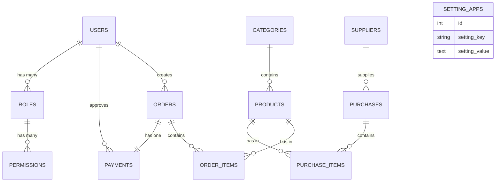

# Sistem Informasi Point of Sale (POS) - Smart Toko (Laravel)

Dokumentasi ini menjelaskan **alur sistem**, **desain database**, **model**, **controller**, **library yang digunakan**, dan **fitur utama** pada project `smart-toko`.

---

## 1. Gambaran Umum

Aplikasi Smart Toko adalah sistem **Point of Sale (POS)** berbasis Laravel yang dirancang untuk mengelola:

-   **Manajemen Produk**: CRUD produk dengan kategori, harga, dan stok
-   **Manajemen Pembelian**: Transaksi pembelian dari supplier dengan tracking stok
-   **Kasir (POS)**: Interface kasir yang user-friendly dengan keranjang belanja real-time
-   **Manajemen Pembayaran**: Dukungan metode pembayaran (Tunai & Transfer Bank)
-   **Laporan Penjualan**: Dashboard laporan dengan chart dan export PDF
-   **Manajemen User & Role**: RBAC (Role-Based Access Control) berbasis Spatie Permission
-   **Pengaturan Aplikasi**: Konfigurasi global seperti nama toko, logo, dll

### Konsep Utama Sistem

Sistem Smart Toko mengikuti alur bisnis POS tradisional dengan tambahan fitur approval pembayaran:

```
Produk → Pembelian → Kasir → Keranjang Belanja → Checkout → Pembayaran → Laporan
```

---

## 2. Tech Stack & Library

### Backend

-   **Laravel Framework 11**
-   **PHP 8+**
-   **MySQL/MariaDB**

### Library Composer (Utama)

#### `spatie/laravel-permission`

-   Manajemen Role & Permission (RBAC).
-   Tabel: `permissions`, `roles`, `model_has_permissions`, `model_has_roles`, `role_has_permissions`.
-   Digunakan pada middleware seperti `permission:products.index`, `permission:orders.create`, dll.
-   Default roles: `admin`, `user`.

#### `yajra/laravel-datatables-oracle`

-   Server-side DataTables untuk tabel interaktif dengan JSON response.
-   Dipakai pada: Users, Roles, Permissions, Categories, Products, Suppliers, Purchases, Orders.
-   Fitur: Search, Sort, Pagination, Custom Columns.

#### `barryvdh/laravel-dompdf`

-   Export laporan transaksi penjualan ke PDF.
-   Digunakan untuk: Daily Report, Hourly Report, Sales Report.

### Frontend Build Tools

-   **Vite** + `laravel-vite-plugin`
-   **Bootstrap 4.6** + `@popperjs/core`
-   **jQuery 3.6**
-   **Chart.js 3.9.1** (untuk dashboard reports)
-   **FontAwesome 5**
-   **SweetAlert2** (notifikasi interaktif)
-   **Axios** (AJAX requests)

### Library Dev

-   `phpunit/phpunit` (testing)
-   `laravel/debugbar` (debug lokal)
-   `laravel/pint` (formatter)

---

## 3. Arsitektur Singkat

Pola yang dipakai mengikuti **MVC (Model-View-Controller)** Laravel:

### Model (`app/Models`)

-   Representasi tabel database
-   Relasi antar model
-   Fillable array & attribute casting
-   Helper methods (e.g., generate invoice number)

### Controller (`app/Http/Controllers`)

-   Menangani alur request & response
-   Validasi input & authorization
-   Transaksi database & business logic
-   Response view atau JSON (untuk AJAX)

### Migration (`database/migrations`)

-   Mendefinisikan skema tabel
-   Foreign key & constraint
-   Enum status & default values
-   Indexing untuk performa

### Views (`resources/views`)

-   Blade template untuk UI
-   Modal bootstrap untuk CRUD
-   Form handling dengan CSRF protection
-   DataTables widget untuk tabel

### Routes (`routes/web.php`)

-   Resource controllers untuk CRUD
-   Custom routes untuk aksi khusus (e.g., `/orders/{order}/confirm-payment`)
-   Grouping dengan middleware auth & permission

---

## 4. Desain Database (Tabel & Relasi)

### 4.1 Tabel Inti Sistem

#### `users` (Pengguna Sistem)

```
- id (Primary Key)
- name (string)
- email (string, unique)
- email_verified_at (timestamp, nullable)
- password (string)
- remember_token (string, nullable)
- created_at, updated_at (timestamps)
```

**Relasi**: HasMany `orders` (sebagai creator), HasMany `payments` (sebagai approvedBy).

#### `categories` (Kategori Produk)

```
- id (Primary Key)
- name (string)
- slug (string, unique)
- description (text, nullable)
- status (enum: active, inactive)
- created_at, updated_at (timestamps)
```

**Relasi**: HasMany `products`.

#### `products` (Produk Toko)

```
- id (Primary Key)
- category_id (Foreign Key → categories.id)
- name (string, unique)
- price (decimal: 10,2)
- stock (integer, default: 0)
- image (string, nullable)
- status (enum: active, inactive)
- created_at, updated_at (timestamps)
```

**Relasi**: BelongsTo `category`, HasMany `order_items`, HasMany `purchase_items`.

#### `suppliers` (Supplier Pembelian)

```
- id (Primary Key)
- name (string)
- phone (string, nullable)
- email (string, nullable)
- address (text, nullable)
- city (string, nullable)
- status (enum: active, inactive)
- created_at, updated_at (timestamps)
```

**Relasi**: HasMany `purchases`.

#### `purchases` (Transaksi Pembelian)

```
- id (Primary Key)
- supplier_id (Foreign Key → suppliers.id)
- purchase_date (date)
- purchase_number (string, unique)
- total_amount (decimal: 12,2)
- notes (text, nullable)
- status (enum: pending, received)
- created_at, updated_at (timestamps)
```

**Relasi**: BelongsTo `supplier`, HasMany `purchase_items`.

#### `purchase_items` (Detail Item Pembelian)

```
- id (Primary Key)
- purchase_id (Foreign Key → purchases.id)
- product_id (Foreign Key → products.id)
- quantity (integer)
- price (decimal: 10,2)
- subtotal (decimal: 12,2)
- created_at, updated_at (timestamps)
```

**Relasi**: BelongsTo `purchase`, BelongsTo `product`.

#### `orders` (Transaksi Penjualan)

```
- id (Primary Key)
- user_id (Foreign Key → users.id, creator)
- invoice_number (string, unique)
- total_amount (decimal: 12,2)
- status (enum: pending, completed, cancelled)
- notes (text, nullable)
- created_at, updated_at (timestamps)
```

**Relasi**: BelongsTo `user`, HasMany `order_items`, HasOne `payment`.

#### `order_items` (Detail Item Penjualan)

```
- id (Primary Key)
- order_id (Foreign Key → orders.id)
- product_id (Foreign Key → products.id)
- quantity (integer)
- price (decimal: 10,2)
- subtotal (decimal: 12,2)
- created_at, updated_at (timestamps)
```

**Relasi**: BelongsTo `order`, BelongsTo `product`.

#### `payments` (Info Pembayaran Penjualan)

```
- id (Primary Key)
- order_id (Foreign Key → orders.id, unique)
- payment_method (enum: cash, transfer)
- payment_status (enum: pending, paid)
- paid_amount (decimal: 12,2, nullable)
- change_amount (decimal: 12,2, nullable)
- approved_by (integer, Foreign Key → users.id, nullable)
- approved_at (timestamp, nullable)
- created_at, updated_at (timestamps)
```

**Relasi**: BelongsTo `order`, BelongsTo `user` (approvedBy).

#### `setting_apps` (Pengaturan Aplikasi Global)

```
- id (Primary Key)
- setting_key (string, unique)
- setting_value (text, nullable)
- created_at, updated_at (timestamps)
```

**Contoh data**: `app_name`, `app_logo`, `cashier_name`, dll.

### 4.2 Tabel RBAC (Spatie Permission)

Library `spatie/laravel-permission` otomatis membuat:

-   `permissions` - Daftar permission (e.g., `products.index`, `orders.create`)
-   `roles` - Role (e.g., `admin`, `user`)
-   `model_has_permissions` - Relasi users dengan permission langsung
-   `model_has_roles` - Relasi users dengan roles
-   `role_has_permissions` - Relasi roles dengan permission

**Default Roles:**

-   `admin` - Semua akses
-   `user` - Akses terbatas (kasir, lihat laporan)

**Default Permissions** (dibuat oleh seeder):

-   `users.index`, `users.create`, `users.edit`, `users.delete`
-   `roles.index`, `roles.create`, `roles.edit`, `roles.delete`
-   `permissions.index`
-   `categories.index`, `categories.create`, `categories.edit`, `categories.delete`
-   `products.index`, `products.create`, `products.edit`, `products.delete`
-   `suppliers.index`, `suppliers.create`, `suppliers.edit`, `suppliers.delete`
-   `purchases.index`, `purchases.create`, `purchases.edit`, `purchases.delete`
-   `orders.index`, `orders.create`, `orders.edit`, `orders.delete`
-   `settings.index`, `settings.edit`
-   `reports.index`

### 4.3 Ringkasan Relasi

```
User
  ├─ HasMany orders (creator)
  ├─ HasMany payments (approvedBy)
  ├─ ManyToMany roles
  └─ ManyToMany permissions

Category
  └─ HasMany products

Product
  ├─ BelongsTo category
  ├─ HasMany order_items
  └─ HasMany purchase_items

Supplier
  └─ HasMany purchases

Purchase
  ├─ BelongsTo supplier
  └─ HasMany purchase_items

PurchaseItem
  ├─ BelongsTo purchase
  └─ BelongsTo product

Order
  ├─ BelongsTo user (creator)
  ├─ HasMany order_items
  └─ HasOne payment

OrderItem
  ├─ BelongsTo order
  └─ BelongsTo product

Payment
  ├─ BelongsTo order
  └─ BelongsTo user (approvedBy)
```

### 4.4 Diagram ERD (Mermaid)



---

## 5. Desain Model (Detail per Model)

### Model `User` (`app/Models/User.php`)

```php
protected $fillable = ['name', 'email', 'password'];
protected $hidden = ['password', 'remember_token'];

// Relation
public function orders() { return $this->hasMany(Order::class); }
public function payments() { return $this->hasMany(Payment::class, 'approved_by'); }

// Permission traits (dari Spatie)
// Methods: hasPermissionTo(), hasRole(), assign roles/permissions
```

### Model `Category` (`app/Models/Category.php`)

```php
protected $fillable = ['name', 'slug', 'description', 'status'];

public function products() { return $this->hasMany(Product::class); }
```

### Model `Product` (`app/Models/Product.php`)

```php
protected $fillable = ['category_id', 'name', 'price', 'stock', 'image', 'status'];

public function category() { return $this->belongsTo(Category::class); }
public function orderItems() { return $this->hasMany(OrderItem::class); }
public function purchaseItems() { return $this->hasMany(PurchaseItem::class); }
```

### Model `Supplier` (`app/Models/Supplier.php`)

```php
protected $fillable = ['name', 'phone', 'email', 'address', 'city', 'status'];

public function purchases() { return $this->hasMany(Purchase::class); }
```

### Model `Purchase` (`app/Models/Purchase.php`)

```php
protected $fillable = ['supplier_id', 'purchase_date', 'purchase_number', 'total_amount', 'notes', 'status'];

public function supplier() { return $this->belongsTo(Supplier::class); }
public function items() { return $this->hasMany(PurchaseItem::class); }
```

### Model `PurchaseItem` (`app/Models/PurchaseItem.php`)

```php
protected $fillable = ['purchase_id', 'product_id', 'quantity', 'price', 'subtotal'];

public function purchase() { return $this->belongsTo(Purchase::class); }
public function product() { return $this->belongsTo(Product::class); }
```

### Model `Order` (`app/Models/Order.php`)

```php
protected $fillable = ['user_id', 'invoice_number', 'total_amount', 'status', 'notes'];

public function user() { return $this->belongsTo(User::class); }
public function items() { return $this->hasMany(OrderItem::class); }
public function payment() { return $this->hasOne(Payment::class); }

// Helper method
public static function generateInvoiceNumber() {
    $date = now()->format('Ymd');
    $count = Order::whereDate('created_at', now())->count();
    return 'INV-' . $date . '-' . str_pad($count + 1, 4, '0', STR_PAD_LEFT);
}
```

### Model `OrderItem` (`app/Models/OrderItem.php`)

```php
protected $fillable = ['order_id', 'product_id', 'quantity', 'price', 'subtotal'];

public function order() { return $this->belongsTo(Order::class); }
public function product() { return $this->belongsTo(Product::class); }
```

### Model `Payment` (`app/Models/Payment.php`)

```php
protected $fillable = ['order_id', 'payment_method', 'payment_status', 'paid_amount', 'change_amount', 'approved_by', 'approved_at'];
protected $casts = ['approved_at' => 'datetime'];

public function order() { return $this->belongsTo(Order::class); }
public function approvedBy() { return $this->belongsTo(User::class, 'approved_by'); }
```

### Model `SettingApp` (`app/Models/SettingApp.php`)

```php
protected $table = 'setting_apps';
protected $fillable = ['setting_key', 'setting_value'];
```

---

## 6. Desain Controller & Tanggung Jawab

### `UserController` - Manajemen User

| Method      | Tanggung Jawab                        |
| ----------- | ------------------------------------- |
| `index()`   | Tampil daftar users dengan DataTables |
| `create()`  | Tampil form buat user                 |
| `store()`   | Validasi & simpan user baru           |
| `edit()`    | Tampil form edit user                 |
| `update()`  | Validasi & update user                |
| `destroy()` | Hapus user & revoke semua role        |

**Middleware**: `permission:users.index|create|edit|delete`

---

### `CategoryController` - Manajemen Kategori Produk

| Method      | Tanggung Jawab               |
| ----------- | ---------------------------- |
| `index()`   | DataTables kategori          |
| `store()`   | Buat kategori (modal AJAX)   |
| `update()`  | Update kategori (modal AJAX) |
| `destroy()` | Hapus kategori               |

**Middleware**: `permission:categories.*`

---

### `ProductController` - Manajemen Produk

| Method      | Tanggung Jawab                                                          |
| ----------- | ----------------------------------------------------------------------- |
| `index()`   | DataTables produk dengan cover image preview                            |
| `create()`  | Form buat produk (modal)                                                |
| `store()`   | Validasi & simpan produk + upload image ke `/storage/uploads/products/` |
| `edit()`    | Form edit produk                                                        |
| `update()`  | Update produk & handle image replacement                                |
| `destroy()` | Hapus produk & file image lama                                          |

**Validasi**:

-   `category_id`: required, exists in categories
-   `name`: required, unique on products
-   `price`: required, numeric, min 0
-   `stock`: required, integer, min 0
-   `image`: nullable, image mimes, max 2MB
-   `status`: required, in (active/inactive)

**Image Storage**: Produk image disimpan di `public/storage/uploads/products/` dengan naming `{timestamp}-{original_filename}`.

---

### `SupplierController` - Manajemen Supplier

| Method      | Tanggung Jawab      |
| ----------- | ------------------- |
| `index()`   | DataTables supplier |
| `store()`   | Buat supplier       |
| `update()`  | Update supplier     |
| `destroy()` | Hapus supplier      |

---

### `PurchaseController` - Manajemen Pembelian dari Supplier

| Method      | Tanggung Jawab                                                   |
| ----------- | ---------------------------------------------------------------- |
| `index()`   | DataTables pembelian dengan purchase_number                      |
| `create()`  | Form buat pembelian dengan item selection                        |
| `store()`   | Validasi & simpan purchase + purchase_items + update stok produk |
| `show()`    | Detail pembelian                                                 |
| `destroy()` | Hapus pembelian & restore stok                                   |

**Business Logic**: Stok produk **bertambah** saat purchase di-approve (atau saat create, tergantung implementasi).

---

### `OrderController` - Manajemen Penjualan & Kasir

| Method             | Tanggung Jawab                                                       |
| ------------------ | -------------------------------------------------------------------- |
| `pos()`            | Tampil interface kasir dengan product grid                           |
| `addToCart()`      | AJAX POST: tambah item ke session cart                               |
| `removeFromCart()` | AJAX POST: hapus item dari session cart                              |
| `checkout()`       | Simpan order + order_items + payment dalam DB transaction            |
| `receipt()`        | Tampil receipt dengan payment status                                 |
| `index()`          | DataTables orders + status                                           |
| `confirmPayment()` | PUT endpoint: admin approve transfer payment (payment_status → paid) |

**Session Cart Structure**:

```php
session('cart') = [
    [
        'product_id' => 1,
        'name' => 'Air Mineral 1.5L',
        'price' => 5000,
        'quantity' => 2,
        'subtotal' => 10000
    ],
    // ...
];
```

**Payment Methods**:

-   `cash` → Pembayaran langsung, `payment_status` = `paid`
-   `transfer` → Pembayaran pending, `payment_status` = `pending`, butuh approval admin

---

### `ReportController` - Laporan & Dashboard

| Method                 | Tanggung Jawab                                              |
| ---------------------- | ----------------------------------------------------------- |
| `dashboard()`          | Dashboard dengan chart revenue, top products, recent orders |
| `dailyReport()`        | Laporan harian: total transaksi, revenue                    |
| `hourlyReport()`       | Breakdown per jam                                           |
| `monthlySalesReport()` | Chart penjualan per bulan                                   |
| `exportPdf()`          | Export laporan ke PDF dengan filter                         |

**Fitur Report**:

-   Filter by date range
-   Chart.js 3.9.1 untuk visualisasi
-   Export PDF via DomPDF

---

### `SettingController` - Pengaturan Aplikasi

| Method     | Tanggung Jawab         |
| ---------- | ---------------------- |
| `index()`  | Tampil form pengaturan |
| `update()` | Update setting_apps    |

**Contoh setting**: `app_name`, `app_logo`, `cashier_name`, `tax_rate`, dll.

---

## 7. Alur Bisnis Utama

### 7.1 Alur Login & Autentikasi

```
User visit /login
    ↓
Input email & password
    ↓
Validasi credentials
    ↓
Session created + redirect to /home atau dashboard
```

---

### 7.2 Alur Manajemen Produk

```
Admin visit /products
    ↓
Lihat list produk via DataTables
    ↓
Klik Create / Edit / Delete modal
    ↓
Form validation:
    - Category harus ada
    - Nama produk unik
    - Harga & stok numeric
    - Image optional, max 2MB
    ↓
Simpan / Update / Hapus produk
    ↓
Redirect dengan success message
```

---

### 7.3 Alur Pembelian dari Supplier

```
Admin visit /purchases
    ↓
Klik Create Purchase
    ↓
Select Supplier
    ↓
Add multiple items (Product + Quantity + Price)
    ↓
System hitung total
    ↓
Simpan Purchase
    ↓
Update stok produk (+quantity untuk masing-masing item)
    ↓
Generate purchase_number (e.g., PO-20260323-0001)
```

---

### 7.4 Alur Kasir (POS) - Flowchart Penjualan

```mermaid
flowchart TD
    A["Kasir buka /orders/pos"] --> B["Tampil product grid dari DB"]
    B --> C["Kasir search/filter produk"]
    C --> D["Kasir klik produk → modal edit qty"]
    D --> E["Submit qty"]
    E --> F["AJAX POST /orders/add-to-cart"]
    F --> G["Server validasi product_id & qty"]
    G --> G1{Valid?}
    G1 -->|No| G2["Return JSON error"]
    G1 -->|Yes| G3["Update session cart"]
    G3 --> G4["Return JSON cart updated"]
    G4 --> H["Frontend update cart sidebar"]
    H --> I{Lanjut belanja?}
    I -->|Yes| D
    I -->|No| J["Kasir review cart"]
    J --> K["Select payment method"]
    K --> K1{Cash atau Transfer?}
    K1 -->|Cash| K2["Input paid_amount"]
    K2 --> K3["System hitung change"]
    K1 -->|Transfer| K4["Auto-fill paid_amount = total"]
    K3 --> L["Klik Checkout"]
    K4 --> L
    L --> M["POST /orders/checkout"]
    M --> N["Server validasi payment"]
    N --> O["DB Transaction begin"]
    O --> P["Create Order"]
    P --> Q["Create OrderItems"]
    Q --> R["Create Payment"]
    R --> R1{Payment method?}
    R1 -->|Cash| R2["payment_status = paid"]
    R1 -->|Transfer| R3["payment_status = pending"]
    R2 --> S["Decrease product stock"]
    R3 --> S
    S --> T["Transaction commit"]
    T --> U["Clear session cart"]
    U --> V["Redirect /orders/{order}/receipt"]
    V --> W["Show receipt"]
    W --> W1{Transfer pending?}
    W1 -->|Yes| W2["Show 'Waiting approval' badge"]
    W1 -->|No| W3["Show 'Paid' badge"]
    W2 --> X["Admin review /orders"]
    X --> X1["See 'Confirm Payment' button"]
    X1 --> X2["Click button → PUT /orders/{order}/confirm-payment"]
    X2 --> X3["Update payment_status → paid"]
    X3 --> X4["Update approved_by & approved_at"]
```



---

### 7.5 Alur Pembayaran Transfer (Payment Confirmation)

```
1. Kasir pilih payment method = "Transfer" pada POS
2. Sistem auto-fill paid_amount = total_amount
3. Kasir submit checkout
4. Payment di-buat dengan payment_status = "pending"
5. Receipt ditampilkan dengan badge "Waiting for approval"

6. Admin/owner klik "Konfirmasi Pembayaran" di orders list
7. Admin lihat payment details
8. Admin klik "Approve" button
9. PUT /orders/{order}/confirm-payment
10. Payment.payment_status → "paid"
11. Update Payment.approved_by = auth()->id()
12. Update Payment.approved_at = now()
13. Redirect dengan success message
```

---

### 7.6 Alur Export Laporan PDF

```
User klik Export Report (e.g., Daily Report)
    ↓
Optional filters:
    - Date range
    - Status filter (completed/cancelled)
    - Report type (daily/hourly/monthly)
    ↓
Backend query data Order + Payment
    ↓
Hitung: Total transaksi, Revenue, Best seller, etc
    ↓
Return Blade view untuk PDF
    ↓
DomPDF compile Blade → PDF binary
    ↓
Download file PDF
```

---

## 8. Fitur Aplikasi (Checklist)

-   [x] **Autentikasi**: Login, Register, Logout, Password Reset
-   [x] **Role & Permission**: Berbasis Spatie (RBAC)
-   [x] **Dashboard**: Overview revenue, top products, recent orders
-   [x] **Manajemen User**: CRUD user dengan assign role & permission
-   [x] **Manajemen Role**: CRUD role dengan assign permission
-   [x] **Manajemen Kategori**: CRUD kategori produk
-   [x] **Manajemen Produk**: CRUD produk dengan image upload & stok tracking
-   [x] **Manajemen Supplier**: CRUD supplier
-   [x] **Manajemen Pembelian**: Create purchase order, auto-update stok
-   [x] **Interface Kasir (POS)**:
    -   Grid produk dengan search filter
    -   Real-time cart (AJAX-based)
    -   Keranjang dengan qty adjustment via modal
    -   Payment method selection (Cash/Transfer)
    -   Auto-format Rupiah currency
    -   Smart UI: Hide certain fields based on payment method
-   [x] **Checkout & Order**: Create order + order items + payment atomically
-   [x] **Payment Confirmation**: Admin approval untuk transfer payment
-   [x] **Receipt**: Tampil receipt dengan print-friendly design
-   [x] **Laporan Penjualan**:
    -   Daily Report
    -   Hourly Breakdown
    -   Monthly Sales Chart
    -   PDF Export
-   [x] **Pengaturan Aplikasi**: Logo, nama toko, configurasi global
-   [x] **DataTables**: Semua list view dengan server-side processing
-   [x] **Modal Bootstrap**: Consistent modal UI untuk CRUD

---

## 9. Route Utama

### Public Routes

```php
/login              - Login page
/register           - Register page
/forgot-password    - Forgot password
/reset-password     - Reset password (verify token)
```

### Protected Routes (`auth` middleware)

#### Home & Dashboard

```php
/home               - Home/dashboard
```

#### Resource CRUD

```php
/users              - User management (index, create, store, edit, update, destroy)
/roles              - Role management
/permissions        - Permission listing
/categories         - Category management
/products           - Product management
/suppliers          - Supplier management
/purchases          - Purchase management
```

#### Orders & POS

```php
GET  /orders/pos                      - POS interface
POST /orders/add-to-cart              - AJAX add item to cart
POST /orders/remove-from-cart         - AJAX remove item from cart
POST /orders/checkout                 - Create order & payment
GET  /orders/{order}/receipt          - Show receipt
GET  /orders                          - Orders list
PUT  /orders/{order}/confirm-payment  - Admin approve transfer payment
```

#### Reports

```php
GET  /reports                       - Reports dashboard
GET  /reports/daily                 - Daily report
GET  /reports/hourly                - Hourly breakdown
GET  /reports/monthly               - Monthly sales chart
POST /reports/export-pdf            - Export report to PDF
```

#### Settings

```php
GET  /settings                      - Settings page
PUT  /settings                      - Update settings
```

---

## 10. Seeder Default

Seeder yang dijalankan saat `php artisan migrate:fresh --seed`:

### `PermissionTableSeeder`

Membuat permission untuk setiap module: `users.*`, `roles.*`, `categories.*`, `products.*`, dll.

### `RoleTableSeeder`

Membuat role: `admin`, `user`.

-   `admin` → assign semua permission
-   `user` → assign permission terbatas

### `UserTableSeeder`

Membuat default user:

-   **Admin Account**
    -   Name: `Admin`
    -   Email: `admin@gmail.com`
    -   Password: `123456`
    -   Role: `admin`

### `CategorySeeder`

Membuat kategori default:

-   Makanan & Minuman
-   Elektronik
-   Fashion
-   Kecantikan
-   Rumah Tangga

### `SupplierSeeder`

Membuat beberapa supplier dummy.

### `ProductSeeder`

Membuat 15 produk sample (tanpa barcode) di berbagai kategori dengan stok & harga.

---

## 11. Instalasi & Setup Project

### 11.1 Prasyarat

-   PHP 8.0+
-   Composer 2+
-   Node.js 18+
-   MySQL 5.7+ atau MariaDB

### 11.2 Langkah Instalasi

```bash
# 1. Clone repository
git clone <repo-url>
cd smart-toko

# 2. Install dependencies PHP
composer install

# 3. Install dependencies Node.js
npm install

# 4. Copy .env
cp .env.example .env

# 5. Generate APP_KEY
php artisan key:generate

# 6. Konfigurasi database di .env
DB_HOST=127.0.0.1
DB_PORT=3306
DB_DATABASE=smart_toko
DB_USERNAME=root
DB_PASSWORD=

# 7. Jalankan migration & seeding
php artisan migrate:fresh --seed

# 8. Buat storage symlink (untuk image upload)
php artisan storage:link

# 9. Build frontend assets (Vite)
npm run build

# 10. Untuk development, jalankan Vite dev server
npm run dev

# 11. Jalankan server Laravel
php artisan serve

# 12. Akses aplikasi
http://localhost:8000
```

### 11.3 Login Default

```
Email: admin@gmail.com
Password: 123456
```

---

## 12. Struktur Folder Penting

```
smart-toko/
├── app/
│   ├── Http/
│   │   ├── Controllers/
│   │   │   ├── UserController.php
│   │   │   ├── RoleController.php
│   │   │   ├── CategoryController.php
│   │   │   ├── ProductController.php
│   │   │   ├── SupplierController.php
│   │   │   ├── PurchaseController.php
│   │   │   ├── OrderController.php
│   │   │   ├── ReportController.php
│   │   │   └── SettingController.php
│   │   ├── Middleware/
│   │   └── Requests/
│   └── Models/
│       ├── User.php
│       ├── Category.php
│       ├── Product.php
│       ├── Supplier.php
│       ├── Purchase.php
│       ├── PurchaseItem.php
│       ├── Order.php
│       ├── OrderItem.php
│       ├── Payment.php
│       └── SettingApp.php
├── database/
│   ├── migrations/
│   │   ├── 0001_01_01_000000_create_users_table.php
│   │   ├── 2026_03_23_000001_create_categories_table.php
│   │   ├── 2026_03_23_000002_create_suppliers_table.php
│   │   ├── 2026_03_23_000003_create_products_table.php
│   │   ├── 2026_03_23_000004_create_orders_table.php
│   │   ├── 2026_03_23_000005_create_order_items_table.php
│   │   ├── 2026_03_23_000006_create_payments_table.php
│   │   ├── 2026_03_23_000007_create_purchases_table.php
│   │   └── 2026_03_23_000008_create_purchase_items_table.php
│   └── seeders/
│       ├── PermissionTableSeeder.php
│       ├── RoleTableSeeder.php
│       ├── UserTableSeeder.php
│       ├── CategorySeeder.php
│       ├── SupplierSeeder.php
│       ├── ProductSeeder.php
│       └── DatabaseSeeder.php
├── resources/
│   ├── views/
│   │   ├── layouts/
│   │   │   ├── app.blade.php
│   │   │   └── sidebar.blade.php
│   │   ├── users/
│   │   ├── roles/
│   │   ├── categories/
│   │   ├── products/
│   │   ├── suppliers/
│   │   ├── purchases/
│   │   ├── orders/
│   │   │   ├── pos.blade.php (POS interface)
│   │   │   ├── receipt.blade.php
│   │   │   ├── index.blade.php
│   │   │   └── modals/
│   │   ├── reports/
│   │   └── settings/
│   ├── css/
│   │   ├── app.css
│   │   └── pos.css (POS styling)
│   ├── js/
│   │   ├── app.js
│   │   └── bootstrap.js
│   └── views/
├── routes/
│   ├── web.php (Main routes)
│   └── api.php
├── public/
│   ├── asset/
│   │   ├── css/
│   │   ├── js/
│   │   └── vendor/
│   └── storage/
│       └── uploads/
│           └── products/ (Product images)
├── storage/
│   ├── app/
│   │   ├── public/
│   │   └── private/
│   └── logs/
├── .env.example
├── composer.json
├── package.json
├── vite.config.js
└── phpunit.xml
```

---

## 13. Catatan Implementasi Penting

### 13.1 Manajemen Stok

-   **Pembelian**: Stok produk **berkurang** saat item di-`add-to-cart`, **bertambah** saat pembelian tersimpan di database.
-   **Penjualan**: Stok produk **berkurang** saat order di-checkout (tidak saat add-to-cart, hanya session).

### 13.2 Session Cart

-   Cart disimpan dalam **Laravel session** (dalam-memory, bukan database).
-   Structure: Array of items dengan `product_id`, `name`, `price`, `quantity`, `subtotal`.
-   Diperbarui via AJAX POST endpoints: `/orders/add-to-cart`, `/orders/remove-from-cart`.
-   Dihapus otomatis setelah checkout berhasil.

### 13.3 Validasi & Authorization

-   Semua action check permission via middleware: `permission:resource.action`.
-   Validasi input dilakukan di controller dengan `validate()` atau Form Request.
-   Authorization check via Gate::check() atau `$user->can()`.

### 13.4 Transaksi Database

-   **Checkout** menggunakan DB transaction untuk atomicity:
    ```php
    DB::transaction(function () {
        // Create Order
        // Create OrderItems
        // Create Payment
        // Decrease stock
    });
    ```

### 13.5 Image Upload

-   Produk image disimpan di `public/storage/uploads/products/`.
-   Naming: `{timestamp}-{original_filename}` (e.g., `1711234567-product.jpg`).
-   Validasi: max 2MB, mimes: jpeg, png, jpg, gif.
-   Hapus file lama saat update.

### 13.6 Payment Methods

-   **Cash**: Pembayaran langsung, `payment_status = 'paid'` immediately.
-   **Transfer**: Pembayaran pending, `payment_status = 'pending'`, admin harus approve.

### 13.7 Invoice Number Generation

```php
// Format: INV-YYYYMMDD-0001
Order::generateInvoiceNumber()
```

---

## 14. Frontend JavaScript Key Sections (POS)

File: `resources/views/orders/pos.blade.php`

### Section 1: State & Data

-   `cart` object: Array items dengan product_id, name, price, quantity, subtotal
-   `totalPrice`: Calculated from cart items

### Section 2: Helper Functions

-   `formatRupiah(number)`: Ubah 5000 → "Rp 5.000"
-   `extractNumber(string)`: Ubah "Rp 5.000" → 5000

### Section 3: Server Communication (AJAX)

-   `addToCart(productId, qty)`: POST to `/orders/add-to-cart`
-   `removeFromCart(productId)`: POST to `/orders/remove-from-cart`

### Section 4: UI Updates

-   `updateCartSidebar()`: Refresh sidebar cart display
-   `updateCartModal()`: Refresh modal cart items
-   `updateCartDisplay()`: General cart visual update

### Section 5: Event Handlers

-   Click add product → Open modal qty
-   Submit modal qty → Call addToCart via AJAX
-   Remove button → Call removeFromCart via AJAX
-   Payment method change → Hide/show fields

### Section 6: Payment Logic

-   `handlePaymentMethodChange()`: Toggle UI based on cash/transfer
-   `handleCheckoutSubmit()`: Validate & POST checkout

---

## 15. CSS External File (`pos.css`)

Key styles:

-   `.pos-container`: Bootstrap grid layout kasir
-   `.products-grid`: Auto-fill product cards
-   `.product-card`: Individual product styling
-   `.cart-sidebar`: Right sidebar cart area
-   `.payment-section`: Payment method & amount inputs
-   `.modal-body`: Scrollable modal dengan max-height

---

## 16. Troubleshooting & FAQ

### Q: Error "SQLSTATE[HY000]: General error: 1030"

**A**: Pastikan folder `storage/` writable: `chmod -R 775 storage/`

### Q: Image tidak ditampilkan di product list

**A**: Jalankan `php artisan storage:link` untuk membuat symlink ke `public/storage`.

### Q: Cart items hilang setelah reload page

**A**: Normal! Cart disimpan di session, bukan database. Untuk persist, simpan ke DB.

### Q: Permission denied saat access resource

**A**: Check user role & permission via `php artisan tinker` → `Auth::user()->roles()`.

### Q: Payment still pending, butuh admin approve

**A**: Admin buka `/orders` → lihat "Konfirmasi Pembayaran" button → klik approve.